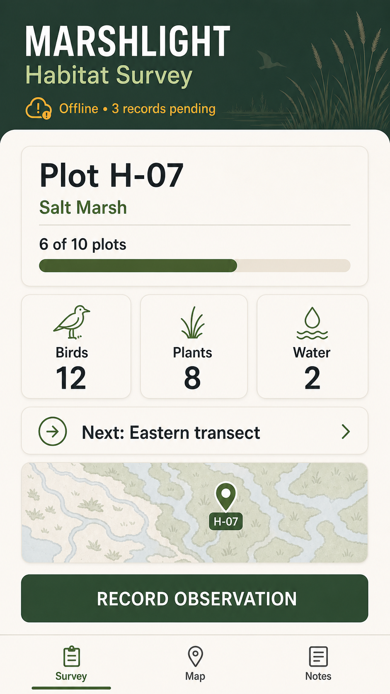
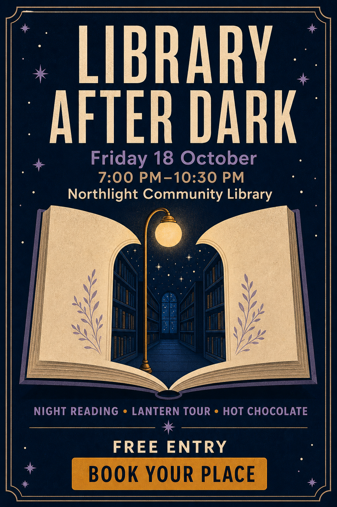
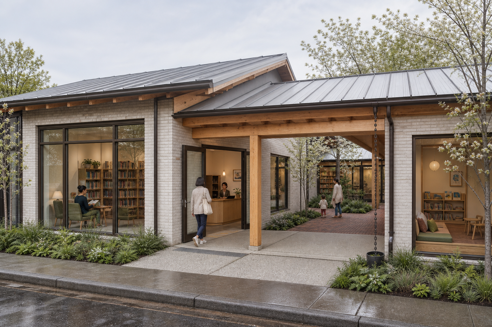
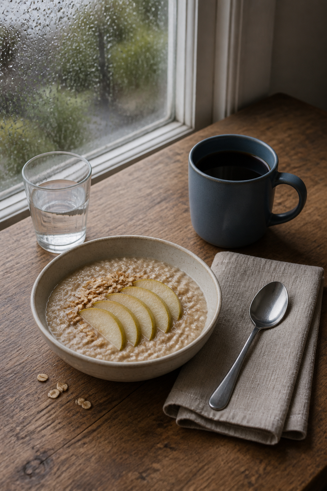
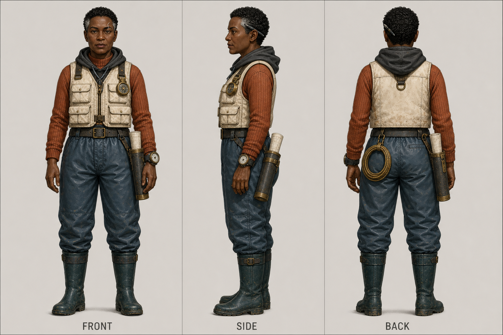
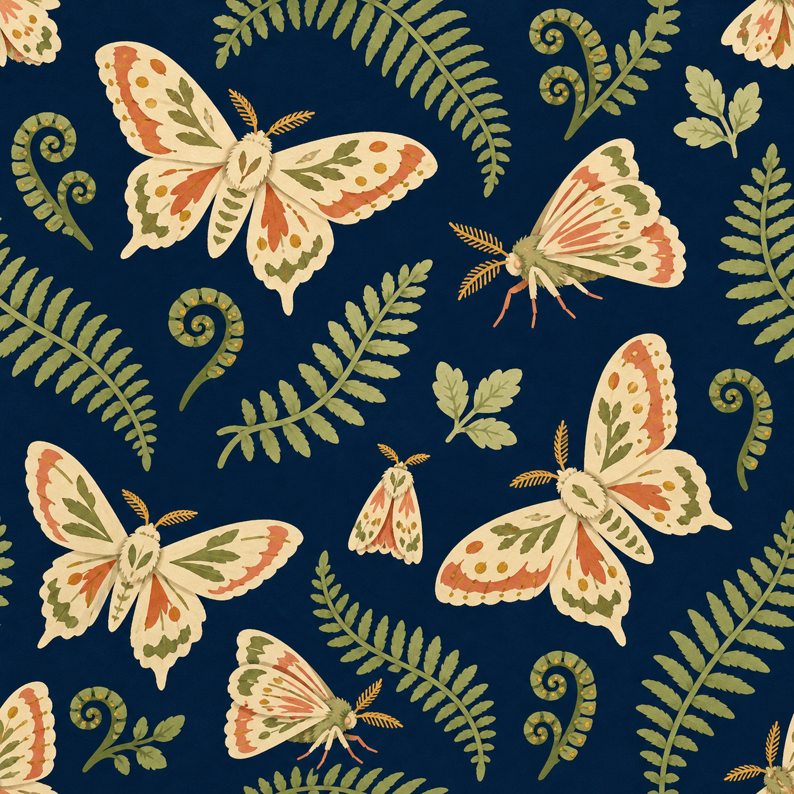
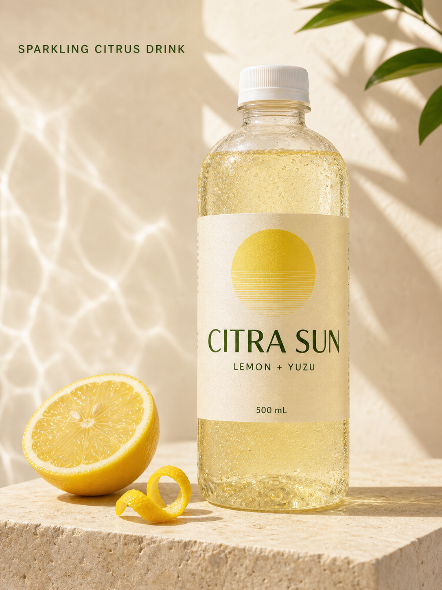
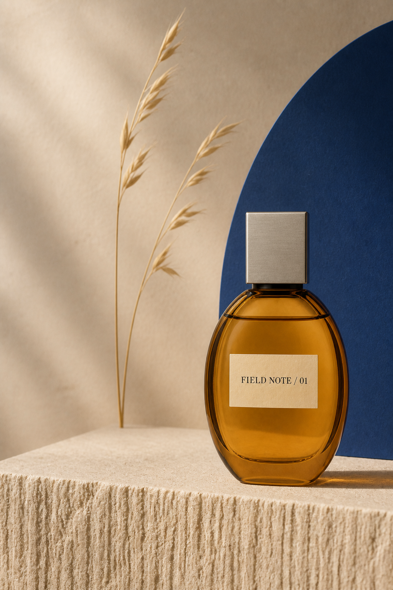
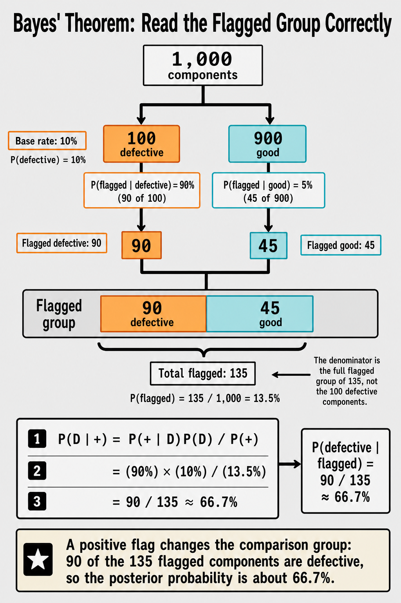
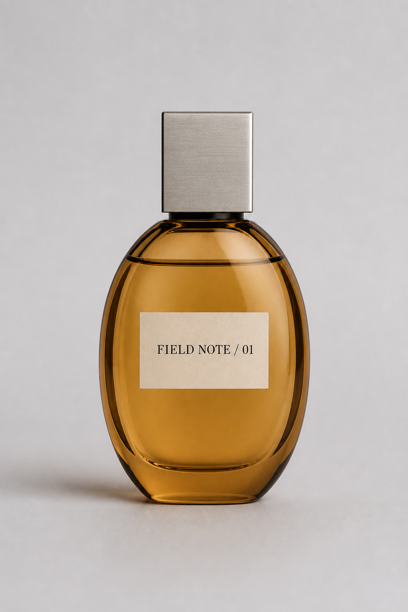

# Awesome Image Prompts

541 copy-ready Prompt Cards and 16 deeper Recipes for generating and editing images across 13 categories.

Use a Prompt Card when you want a strong starting prompt quickly. Use a Recipe when the result depends on structured inputs, exact text or layout, reference preservation, inspection, repair, or evidence. Both routes are static, inspectable, and available to humans and agents without a website or hosted generator.

The Card corpus matches the pinned upstream snapshot in total prompt count and per-category distribution. It does not claim the same Card-level image gallery, template count, or style and scene facets. See [Coverage](docs/COVERAGE.md) for the exact boundary.

> Status: all 16 Recipes are drafts. Each has one retained illustrative output from the Codex built-in image generation tool, not GPT Image 2 API evidence, repeatability proof, promotion, or an automatically publish-ready asset. The built-in surface did not expose its exact model or hidden request settings, and the linked run records disclose visible prompt-fidelity misses.

## Choose a layer

| If you need                           | Start with                                                             | What you get                                                                                                      |
| ------------------------------------- | ---------------------------------------------------------------------- | ----------------------------------------------------------------------------------------------------------------- |
| A prompt you can adapt in a minute    | [Prompt Card index](prompt-cards/README.md)                            | Task fit, required inputs, variables, copy-ready prompt, negative constraints, and a quick check                  |
| A production-oriented workflow        | [Recipe index](skills/image-recipe-library/references/recipe-index.md) | Structured brief, execution profiles, Critical Invariants, rubric, repair guidance, final QA, and evidence status |
| Provenance for upstream-informed work | [Source Archive](sources/)                                             | Pinned links, checksums, attribution, and rights posture without copied upstream prompts or images                |

A Prompt Card is not a shortened Recipe and does not inherit evidence from a linked Recipe. If the task becomes production-critical, move to the nearest Recipe.

## Browse all categories

| Category                   | Prompt Cards | Draft Recipes | Flagship workflow                                                                                    |
| -------------------------- | -----------: | ------------: | ---------------------------------------------------------------------------------------------------- |
| UI & Interfaces            |           73 |             1 | [Habitat Survey Mobile Dashboard](recipes/habitat-survey-mobile-dashboard/RECIPE.md)                 |
| Charts & Infographics      |           53 |             2 | [Fictional Metro Route Map](recipes/fictional-metro-route-map/RECIPE.md)                             |
| Posters & Typography       |           90 |             1 | [Library After Dark Event Poster](recipes/library-after-dark-event-poster/RECIPE.md)                 |
| Products & E-commerce      |           42 |             3 | [Modular Desk Lamp Listing Hero](recipes/modular-desk-lamp-listing-hero/RECIPE.md)                   |
| Brand & Logos              |           27 |             1 | [Vespercairn Observatory Logo](recipes/vespercairn-observatory-logo/RECIPE.md)                       |
| Architecture & Spaces      |           12 |             1 | [Courtyard Micro-Library](recipes/courtyard-micro-library/RECIPE.md)                                 |
| Photography & Realism      |           78 |             1 | [Rainy-Window Breakfast Still Life](recipes/rainy-window-breakfast-still-life/RECIPE.md)             |
| Illustration & Art         |           59 |             1 | [Paper-Cut Tidal Ecosystem](recipes/paper-cut-tidal-ecosystem/RECIPE.md)                             |
| Characters & People        |           31 |             1 | [Deep-Sea Cartographer Character Sheet](recipes/deep-sea-cartographer-character-sheet/RECIPE.md)     |
| Scenes & Storytelling      |           21 |             1 | [Lantern Ferry Departure](recipes/lantern-ferry-departure/RECIPE.md)                                 |
| History & Classical Themes |           16 |             1 | [Fictional Bronze Age Harbor Market](recipes/fictional-bronze-age-harbor-market/RECIPE.md)           |
| Documents & Publishing     |           11 |             1 | [Fictional Naturalist Field Guide Spread](recipes/fictional-naturalist-field-guide-spread/RECIPE.md) |
| Other Use Cases            |           28 |             1 | [Seamless Moth and Fern Pattern Tile](recipes/seamless-moth-fern-pattern-tile/RECIPE.md)             |

See [Coverage](docs/COVERAGE.md) for the exact comparison with the upstream collection, operation modes, and current evidence limits.

## Real examples

| Mobile interface | Event poster | Architecture |
| :---: | :---: | :---: |
| [](recipes/habitat-survey-mobile-dashboard/RECIPE.md) | [](recipes/library-after-dark-event-poster/RECIPE.md) | [](recipes/courtyard-micro-library/RECIPE.md) |
| [Run record](recipes/habitat-survey-mobile-dashboard/evidence.json) | [Run record](recipes/library-after-dark-event-poster/evidence.json) | [Run record](recipes/courtyard-micro-library/evidence.json) |

| Editorial photography | Character design | Surface pattern |
| :---: | :---: | :---: |
| [](recipes/rainy-window-breakfast-still-life/RECIPE.md) | [](recipes/deep-sea-cartographer-character-sheet/RECIPE.md) | [](recipes/seamless-moth-fern-pattern-tile/RECIPE.md) |
| [Run record](recipes/rainy-window-breakfast-still-life/evidence.json) | [Run record](recipes/deep-sea-cartographer-character-sheet/evidence.json) | [Run record](recipes/seamless-moth-fern-pattern-tile/evidence.json) |

These six examples show different output families. Every other new Recipe carries its own sample and run record.

## Original pilot examples

| Product advertisement | Reference product edit | Structured infographic |
| :---: | :---: | :---: |
| [](recipes/summer-citrus-product-ad/RECIPE.md) | [](recipes/reference-product-environment-edit/RECIPE.md) | [](recipes/structured-concept-infographic/RECIPE.md) |
| [Run record](recipes/summer-citrus-product-ad/evidence.json) | [Run records](recipes/reference-product-environment-edit/evidence.json) | [Run record](recipes/structured-concept-infographic/evidence.json) |

## Reference edit before and after

| Project-generated reference | Environment edit |
| :---: | :---: |
|  |  |

The reference is fictional and project-generated. The edit preserves one oval amber bottle, its rectangular cap, cream label, and exact `FIELD NOTE / 01` text while replacing the surrounding set.

## What the records contain

Every Prompt Card includes:

1. A narrow task fit and minimum required inputs.
2. A copy-ready prompt with declared variables.
3. Negative constraints and a short visual check.
4. A visible Placeholder Preview status.
5. Rights, provenance, and optional Recipe routing.

Every Recipe adds:

1. Structured Creative Brief fields and input preparation.
2. Conversational and GPT Image 2 API execution profiles.
3. Critical Invariants and a Production Candidate Rubric.
4. Targeted repair guidance and a final-QA handoff.
5. A linked evidence manifest with exact prompts, assets, checksums, inspection notes, and rights.

The [machine-readable catalog](catalog.json) routes tools and agents to the same canonical Markdown files. See the [Prompt Card format](docs/PROMPT_CARD_FORMAT.md) and [Recipe format](docs/RECIPE_FORMAT.md) for their separate contracts.

## Use with an agent

The packaged [`image-recipe-library` skill](skills/image-recipe-library/SKILL.md) first chooses the right layer, then loads only the selected Card or Recipe. It never duplicates canonical prompt text.

Discovery links are included for:

- Codex-style hosts: [`.agents/skills/image-recipe-library`](.agents/skills/image-recipe-library)
- Claude Code-style hosts: [`.claude/skills/image-recipe-library`](.claude/skills/image-recipe-library)

Host discovery and provider behavior still require independent validation. The shared folder layout alone is not a compatibility claim.

## Evidence boundary

All 541 Prompt Cards currently have Placeholder Previews. That means the prompt is available, but no Card-specific Generation Run supports it.

A Recipe marked `recorded` resolves to an exact prompt, local PNG, checksum, dimensions, inspection notes, and rights statement. It does not mean the Recipe is promoted. Promotion still requires four scored GPT Image 2 API runs across two materially different briefs plus one conversational smoke run. None of the illustrative built-in-tool samples count toward that gate.

Some retained samples miss an exact count, topology, or requested output dimension. Those misses remain visible in the linked run records rather than being treated as full rubric passes.

A passing Recipe output is a Production Candidate. Exact copy, claims, brand assets, accessibility, channel crop, export settings, and distribution rights still need final human approval before publication.

## Repository structure

```text
catalog.json                              Machine-readable Card and Recipe routes
prompt-cards/README.md                    Human-readable 541-Card index
prompt-cards/<category>/<card-id>.md      Canonical copy-ready Prompt Card
recipes/<recipe-id>/RECIPE.md             Canonical production workflow and prompt
recipes/<recipe-id>/recipe.json           Small Recipe routing record
recipes/<recipe-id>/evidence.json         Run metadata and evidence status
recipes/<recipe-id>/samples/              Exact prompts and local PNG assets
sources/                                  Pinned provenance records
docs/                                     Coverage and content-format documentation
skills/image-recipe-library/              Canonical agent skill
.agents/skills/                           Codex-style discovery path
.claude/skills/                           Claude Code-style discovery path
LICENSE                                   License for project-authored material
THIRD_PARTY_NOTICES.md                    Third-party and evidence rights boundary
script/check                              Dependency-free validation
```

## Validate

Run:

```bash
./script/check
```

The command validates category coverage, catalog records, Prompt Card structure, Recipe metadata, evidence records, sample assets and checksums, local links, skill frontmatter, and runtime discovery links. It never calls an image provider.

## Related resources

- [PromptCache](https://promptcache.live/) is a free prompt discovery tool with image, video, text, flow, and skill prompts, plus practical tips and tricks.
- This independently authored library was inspired by the original [freestylefly/awesome-gpt-image-2](https://github.com/freestylefly/awesome-gpt-image-2) collection.

## License

Project-authored code, Prompt Cards, Recipes, documentation, metadata, validation scripts, skill material, and expressly identified sample rights are covered by the [MIT License](LICENSE). Third-party links and any material without an item-level rights grant remain outside that license. See [THIRD_PARTY_NOTICES.md](THIRD_PARTY_NOTICES.md).

See [AGENTS.md](AGENTS.md) for repository-specific agent instructions.
