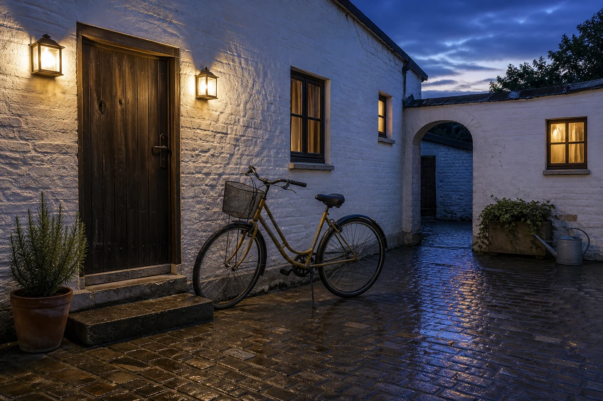

# Blue-Hour Bicycle Courtyard

## Use this when

Use this card for a quiet photoreal courtyard scene centered on one fictional or authorized bicycle at blue hour. Use a Recipe when bicycle identity or location fidelity must be preserved.

## Required inputs

- Bicycle type, color, geometry, accessories, and authorization.
- Courtyard architecture, surface, plants, and exact prop allowance.
- Blue-hour phase, practical lights, weather, camera view, and aspect ratio.

## Prompt

```text
SCENE
Create a photoreal {COURTYARD_DESCRIPTION} during {BLUE_HOUR_PHASE}, with {WEATHER_AND_SURFACES}.

SUBJECT
Show exactly one {BICYCLE_DESCRIPTION} bicycle resting {BICYCLE_PLACEMENT}, viewed from {CAMERA_VIEW}.

DETAILS
Include only {ARCHITECTURAL_DETAILS}, {PLANTING}, and {APPROVED_PROPS}. Balance cool ambient sky light with {PRACTICAL_LIGHTS}, keeping metal, rubber, paint, masonry, and wet surfaces physically coherent.

CONSTRAINTS
Preserve two wheels, one frame, plausible drivetrain and handlebar geometry, and grounded tire contact. No riders, extra bicycles, impossible spokes, duplicated pedals, floating wheels, cars, crowds, logos, signs, watermarks, or readable text.

OUTPUT INTENT
Return one atmospheric editorial photograph at {ASPECT_RATIO}, with the bicycle clearly legible inside a believable inhabited courtyard.
```

## Variables

- `{COURTYARD_DESCRIPTION}`: scale, walls, openings, and surface materials.
- `{BLUE_HOUR_PHASE}`: sky brightness, color, and remaining daylight.
- `{WEATHER_AND_SURFACES}`: dry, damp, or post-rain conditions.
- `{BICYCLE_DESCRIPTION}`: type, frame, color, tires, saddle, and allowed accessories.
- `{BICYCLE_PLACEMENT}`: leaned, parked, or stand-supported position.
- `{CAMERA_VIEW}`: angle, height, framing, and lens character.
- `{ARCHITECTURAL_DETAILS}`: approved doors, windows, stairs, or arcade elements.
- `{PLANTING}`: closed list of plants and containers.
- `{APPROVED_PROPS}`: closed secondary-object list, or `none`.
- `{PRACTICAL_LIGHTS}`: fixture locations, warmth, and intensity.
- `{ASPECT_RATIO}`: final width-to-height ratio.

## Negative constraints

- No malformed frame triangle, disconnected chain, extra wheels, or impossible steering.
- No staged fashion shoot, heavy fog, neon signs, excessive bloom, or cinematic rain.
- No real brand marks, license plates, posters, or readable addresses.

## Quick check

Trace the bicycle frame and drivetrain, count wheels and pedals, and verify the cool sky and warm fixtures produce consistent reflections and shadows.

## Rendered Sample



- Sample status: Rendered Sample.
- Generation surface: built-in image generation tool
- Generated at: `2026-08-30T23:00:55Z`
- Model: `not_exposed`
- Model version: `not_exposed`
- Seed: `not_exposed`
- Request parameters: `not_exposed`
- Request ID: `not_exposed`
- Exact prompt: [blue-hour-bicycle-courtyard.prompt.txt](samples/blue-hour-bicycle-courtyard/blue-hour-bicycle-courtyard.prompt.txt)
- Output dimensions: `1536 x 1024`
- Output SHA-256: `d4ae95d24a568dfcc9ce6d71c4f6477105dfa5a5f59cf2856e64231b812a5a5c`
- Profile ID: `null`
- Promotion evidence: `false`
- Human inspection: The accepted final shows one ochre step-through bicycle with two grounded wheels, basket, fenders, saddle, kickstand, and plausible drivetrain geometry in the wet courtyard.
- Known misses: A second dark door is visible through the arch even though the exact prompt allows only one; the bicycle, three windows, two lanterns, planters, and watering can otherwise remain coherent.
- Rights and provenance: The concept, exact prompt, accepted image, and public WebP derivative are project-authored. Lossless masters and rejected attempts are retained privately with checksums. The public derivative may be reused under this repository's license; this record is illustrative evidence only.
## Rights and provenance

Use a fictional setting and independently described or authorized bicycle. This Prompt Card is independently authored, has source posture `original`, and includes no third-party prompt or image.
