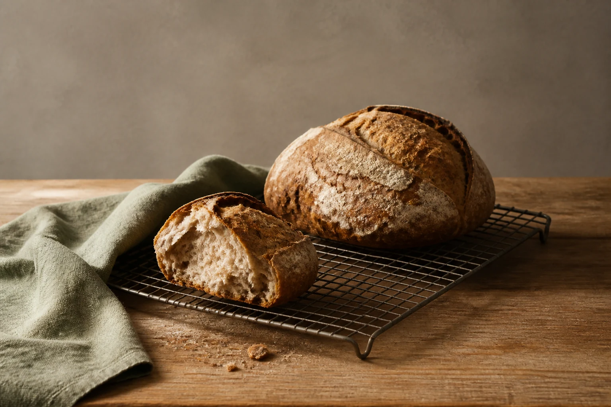

# Bread Cooling Rack

## Use this when

Use this card for two rustic fictional bakery loaves cooling on a wire rack. It is a fictional, public-domain, or authorized photographic concept, not documentary proof or Card-level generation evidence. Use a Recipe when identity, product geometry, continuity, or repeatability must be evaluated.

## Required inputs

- A fictional, public-domain, or authorized subject and project context.
- The exact subject details, setting, viewpoint, and allowed props.
- Lighting, color, camera-character, and output intent.
- The visual risks, claims, and content that must not appear.

## Prompt

```text
Create one food editorial photograph for {PROJECT_CONTEXT} depicting two rustic fictional bakery loaves cooling on a wire rack.

SUBJECT
Use {SUBJECT_DETAILS} exactly; do not infer identity, ownership, brand, or unseen facts.

SETTING AND COMPOSITION
Use {SETTING_DETAILS}. Follow {VIEWPOINT_AND_OUTPUT}. Place one whole loaf behind a torn edge piece with crumbs and a folded plain cloth leading across frame. Keep scale, reflections, depth, and edges plausible.

LIGHT AND REALISM
Use warm side light, crisp crust texture, no label, and no freshness, nutrition, or allergen claim. Apply {LIGHT_AND_COLOR} with natural tonal transitions and material response.

CONSTRAINTS
Do not present a fictional setup as documentary proof. Add no real brand, real-person likeness, medical or legal claim, signature, or watermark. Do not imitate a named living photographer. Avoid {MUST_AVOID}.

OUTPUT
Return one 3:2 photographic concept with credible optics and no unrequested collage.
```

## Variables

- `{PROJECT_CONTEXT}`: the fictional or authorized editorial, archive, or creative context
- `{SUBJECT_DETAILS}`: the exact approved subject, condition, materials, and distinguishing features
- `{SETTING_DETAILS}`: the approved location, surfaces, background, props, and weather
- `{VIEWPOINT_AND_OUTPUT}`: the camera viewpoint, lens character, depth treatment, crop, and intended output use
- `{LIGHT_AND_COLOR}`: the lighting direction, time, palette, contrast, and camera character
- `{MUST_AVOID}`: additional prohibited content, artifacts, or unsupported implications

## Negative constraints

- No real brand, inferred real-person likeness, medical or legal claim, signature, or watermark.
- No false documentary implication, copied living-photographer style, or invented provenance.
- Do not break the photographic plan: Place one whole loaf behind a torn edge piece with crumbs and a folded plain cloth leading across frame.

## Quick check

Confirm the image communicates two rustic fictional bakery loaves cooling on a wire rack. Check the assigned composition, then verify the specific direction: use warm side light, crisp crust texture, no label, and no freshness, nutrition, or allergen claim. Reject invented content, unsupported claims, or any mismatch between supplied inputs and the visible result.

## Rendered Sample



- Sample status: Rendered Sample.
- Generation surface: built-in image generation tool
- Generated at: `2026-08-30T23:07:26Z`
- Model: `not_exposed`
- Model version: `not_exposed`
- Seed: `not_exposed`
- Request parameters: `not_exposed`
- Request ID: `not_exposed`
- Exact prompt: [bread-cooling-rack.prompt.txt](samples/bread-cooling-rack/bread-cooling-rack.prompt.txt)
- Output dimensions: `1536 x 1024`
- Output SHA-256: `e9bb27d58f470d69b134b9789f7bb7adc30039d0d17fbe6904757e3f543fee5f`
- Profile ID: `null`
- Promotion evidence: `false`
- Human inspection: The accepted final shows one whole rustic loaf behind one torn loaf portion on a wire rack, with crumbs and a plain folded cloth under warm side light.
- Known misses: No material visible miss; crust, crumb, rack, and cloth read naturally without packaging, labels, or food claims.
- Rights and provenance: The concept, exact prompt, accepted image, and public WebP derivative are project-authored. Lossless masters and rejected attempts are retained privately with checksums. The public derivative may be reused under this repository's license; this record is illustrative evidence only.
## Rights and provenance

This Prompt Card is independently authored with `original` source posture. Use only fictional, public-domain, or properly authorized subjects, names, data, locations, and brand materials. It bundles no third-party prompt or image.
