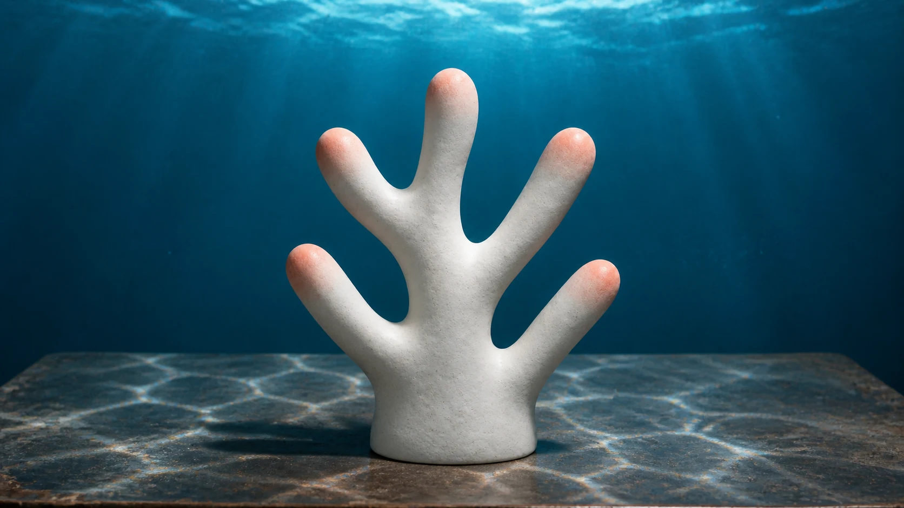

# Coral Ceramic Underwater Set

## Use this when

Use this card for an authorized coral-like ceramic sculpture photographed in a fictional underwater set. It is a fictional, public-domain, or authorized photographic concept, not documentary proof or Card-level generation evidence. Use a Recipe when identity, product geometry, continuity, or repeatability must be evaluated.

## Required inputs

- A fictional, public-domain, or authorized subject and project context.
- The exact subject details, setting, viewpoint, and allowed props.
- Lighting, color, camera-character, and output intent.
- The visual risks, claims, and content that must not appear.
- The attached input asset or assets, an authority statement, assigned roles, and preservation scope.

## Prompt

```text
Create one surreal studio photograph for {PROJECT_CONTEXT} depicting an authorized coral-like ceramic sculpture photographed in a fictional underwater set.

SUBJECT
Use {SUBJECT_DETAILS} exactly; do not infer identity, ownership, brand, or unseen facts.

SETTING AND COMPOSITION
Use {SETTING_DETAILS}. Follow {VIEWPOINT_AND_OUTPUT}. Assign one source to sculpture geometry and separate sources to water color and caustic-light reference, keeping identities distinct. Keep scale, reflections, depth, and edges plausible.

LIGHT AND REALISM
Preserve declared sculpture form, use controlled bubbles and caustics, and make the constructed setting clear without reef claims. Apply {LIGHT_AND_COLOR} with natural tonal transitions and material response.

AUTHORIZED IMAGE SET
Use only {IMAGE_SET}, a small set whose items are all authorized for this task. Follow {IMAGE_ROLES} so each image has one declared purpose, and preserve only {PRESERVE_FEATURES}. Do not merge identities, brands, provenance, or hidden details across the sources.

CONSTRAINTS
Do not present a fictional setup as documentary proof. Add no real brand, real-person likeness, medical or legal claim, signature, or watermark. Do not imitate a named living photographer. Avoid {MUST_AVOID}.

OUTPUT
Return one 16:9 photographic concept with credible optics and no unrequested collage.
```

## Variables

- `{PROJECT_CONTEXT}`: the fictional or authorized editorial, archive, or creative context
- `{SUBJECT_DETAILS}`: the exact approved subject, condition, materials, and distinguishing features
- `{SETTING_DETAILS}`: the approved location, surfaces, background, props, and weather
- `{VIEWPOINT_AND_OUTPUT}`: the camera viewpoint, lens character, depth treatment, crop, and intended output use
- `{LIGHT_AND_COLOR}`: the lighting direction, time, palette, contrast, and camera character
- `{MUST_AVOID}`: additional prohibited content, artifacts, or unsupported implications
- `{IMAGE_SET}`: the attached authorized image set
- `{IMAGE_ROLES}`: the explicit source role assigned to every image
- `{PRESERVE_FEATURES}`: the approved visual facts to retain from each source

## Negative constraints

- No real brand, inferred real-person likeness, medical or legal claim, signature, or watermark.
- No false documentary implication, copied living-photographer style, or invented provenance.
- Do not break the photographic plan: Assign one source to sculpture geometry and separate sources to water color and caustic-light reference, keeping identities distinct.

## Quick check

Confirm the image communicates an authorized coral-like ceramic sculpture photographed in a fictional underwater set. Check the assigned composition, then verify the specific direction: preserve declared sculpture form, use controlled bubbles and caustics, and make the constructed setting clear without reef claims. Reject invented content, unsupported claims, or any mismatch between supplied inputs and the visible result.

## Rendered Sample



- Sample status: Rendered Sample.
- Generation surface: built-in image generation tool
- Generated at: `2026-08-31T00:03:18Z`
- Model: `not_exposed`
- Model version: `not_exposed`
- Seed: `not_exposed`
- Request parameters: `not_exposed`
- Request ID: `not_exposed`
- Exact prompt: [coral-ceramic-underwater-set.prompt.txt](samples/coral-ceramic-underwater-set/coral-ceramic-underwater-set.prompt.txt)
- Output dimensions: `1672 x 941`
- Output SHA-256: `c66bb2a5fc33cbc7a9a2732d04a6763f99b0015c8d72dc63f15dd10709826be3`
- Profile ID: `null`
- Promotion evidence: `false`
- Human inspection: The accepted final preserves one chalk-white ceramic sculpture with exactly five rounded branches against a teal-to-cyan water field and diagonal caustics.
- Known misses: No controlled bubbles are visibly present; the constructed tabletop setting and five-branch sculpture remain clear.
- Rights and provenance: The concept, exact prompt, accepted image, and public WebP derivative are project-authored. Lossless masters and rejected attempts are retained privately with checksums. The public derivative may be reused under this repository's license; this record is illustrative evidence only.
- Supporting inputs:
  - [input-01-sculpture-geometry.webp](samples/coral-ceramic-underwater-set/input-01-sculpture-geometry.webp): project-authored fictional sculpture geometry input
  - [input-02-water-color.webp](samples/coral-ceramic-underwater-set/input-02-water-color.webp): project-authored fictional water color input
  - [input-03-caustic-light.webp](samples/coral-ceramic-underwater-set/input-03-caustic-light.webp): project-authored fictional caustic light input
## Rights and provenance

This Card is independently authored with `original` source posture. Every image in the set must be fictional, public-domain, project-owned, or otherwise authorized, with a recorded role and preservation scope. This Rendered Sample is illustrative evidence only; it does not establish reliable multi-image fidelity, continuity, or composition.
