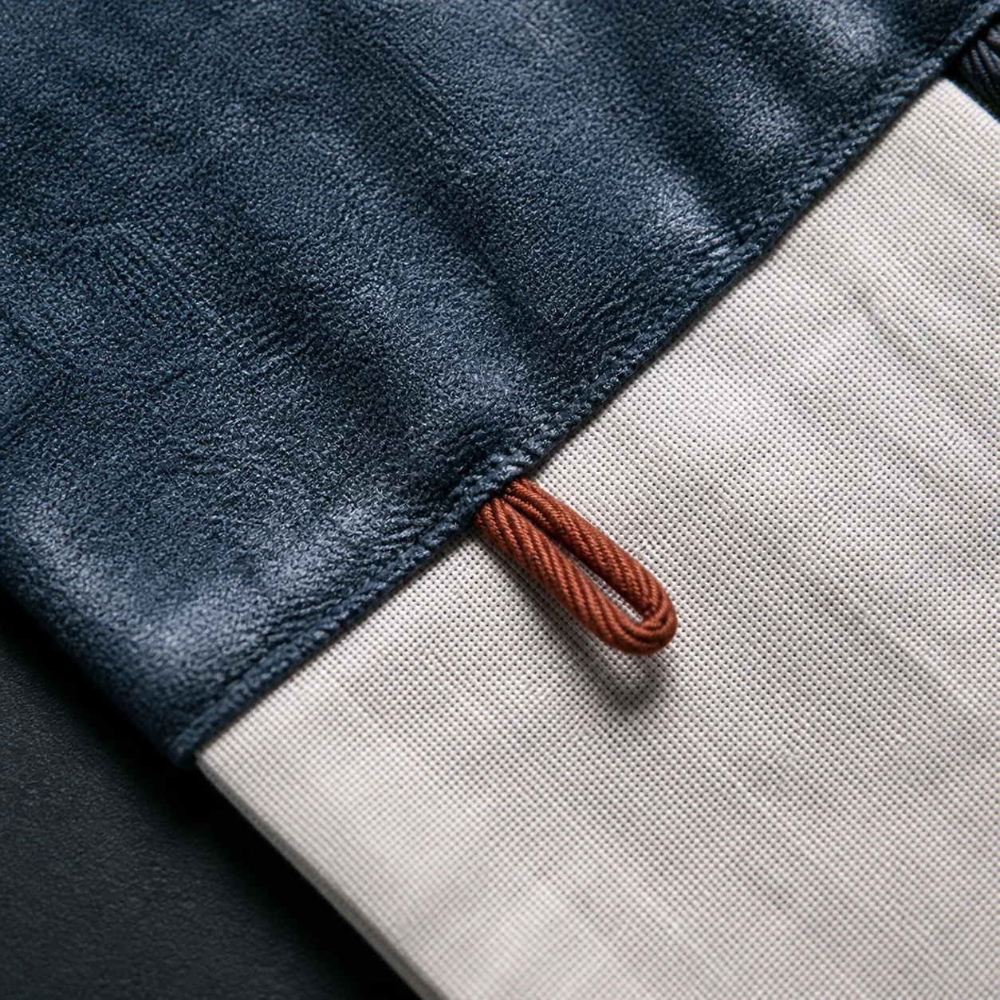

# Fictional Costume Seam

## Use this when

Use this card for the seam and fastening detail of an authorized original costume. It is a fictional, public-domain, or authorized photographic concept, not documentary proof or Card-level generation evidence. Use a Recipe when identity, product geometry, continuity, or repeatability must be evaluated.

## Required inputs

- A fictional, public-domain, or authorized subject and project context.
- The exact subject details, setting, viewpoint, and allowed props.
- Lighting, color, camera-character, and output intent.
- The visual risks, claims, and content that must not appear.
- The attached input asset or assets, an authority statement, assigned roles, and preservation scope.

## Prompt

```text
Create one textile macro photograph for {PROJECT_CONTEXT} depicting the seam and fastening detail of an authorized original costume.

SUBJECT
Use {SUBJECT_DETAILS} exactly; do not infer identity, ownership, brand, or unseen facts.

SETTING AND COMPOSITION
Use {SETTING_DETAILS}. Follow {VIEWPOINT_AND_OUTPUT}. Crop tightly across the seam intersection with one hand-finished loop and the fabric pile clearly visible. Keep scale, reflections, depth, and edges plausible.

LIGHT AND REALISM
Preserve declared construction details, use neutral raking light, and infer no performer, production, culture, or designer. Apply {LIGHT_AND_COLOR} with natural tonal transitions and material response.

AUTHORIZED REFERENCE INPUT
Use {REFERENCE_IMAGE} only after confirming authority to use it for this task. Preserve only {PRESERVE_FEATURES}; do not infer identity, ownership, authorship, brand affiliation, unseen geometry, or facts outside the supplied image.

CONSTRAINTS
Do not present a fictional setup as documentary proof. Add no real brand, real-person likeness, medical or legal claim, signature, or watermark. Do not imitate a named living photographer. Avoid {MUST_AVOID}.

OUTPUT
Return one 1:1 photographic concept with credible optics and no unrequested collage.
```

## Variables

- `{PROJECT_CONTEXT}`: the fictional or authorized editorial, archive, or creative context
- `{SUBJECT_DETAILS}`: the exact approved subject, condition, materials, and distinguishing features
- `{SETTING_DETAILS}`: the approved location, surfaces, background, props, and weather
- `{VIEWPOINT_AND_OUTPUT}`: the camera viewpoint, lens character, depth treatment, crop, and intended output use
- `{LIGHT_AND_COLOR}`: the lighting direction, time, palette, contrast, and camera character
- `{MUST_AVOID}`: additional prohibited content, artifacts, or unsupported implications
- `{REFERENCE_IMAGE}`: the attached authorized reference image and its declared role
- `{PRESERVE_FEATURES}`: the visible features that must remain stable without invented details

## Negative constraints

- No real brand, inferred real-person likeness, medical or legal claim, signature, or watermark.
- No false documentary implication, copied living-photographer style, or invented provenance.
- Do not break the photographic plan: Crop tightly across the seam intersection with one hand-finished loop and the fabric pile clearly visible.

## Quick check

Confirm the image communicates the seam and fastening detail of an authorized original costume. Check the assigned composition, then verify the specific direction: preserve declared construction details, use neutral raking light, and infer no performer, production, culture, or designer. Reject invented content, unsupported claims, or any mismatch between supplied inputs and the visible result.

## Rendered Sample



- Sample status: Rendered Sample.
- Generation surface: built-in image generation tool
- Generated at: `2026-08-31T00:09:28Z`
- Model: `not_exposed`
- Model version: `not_exposed`
- Seed: `not_exposed`
- Request parameters: `not_exposed`
- Request ID: `not_exposed`
- Exact prompt: [fictional-costume-seam.prompt.txt](samples/fictional-costume-seam/fictional-costume-seam.prompt.txt)
- Output dimensions: `1254 x 1254`
- Output SHA-256: `3de360c65bc105f8bcd10153aba2054119be9753ec65140bc2bec765e19649ac`
- Profile ID: `null`
- Promotion evidence: `false`
- Human inspection: The accepted macro tightly frames the blue-and-chalk seam intersection, one oxidized-copper hand-finished loop, and contrasting fabric pile under raking light.
- Known misses: No material visible miss; the construction detail carries no text, brand, performer, production, or cultural cue.
- Rights and provenance: The concept, exact prompt, accepted image, and public WebP derivative are project-authored. Lossless masters and rejected attempts are retained privately with checksums. The public derivative may be reused under this repository's license; this record is illustrative evidence only.
- Supporting inputs:
  - [input-01-seam-reference.webp](samples/fictional-costume-seam/input-01-seam-reference.webp): project-authored fictional seam reference input
## Rights and provenance

This Card is independently authored with `original` source posture. Use only a fictional, public-domain, project-owned, or otherwise authorized reference image. Record the authority and preservation scope before use. This Rendered Sample is illustrative evidence only; it does not establish reliable reference fidelity or identity preservation.
