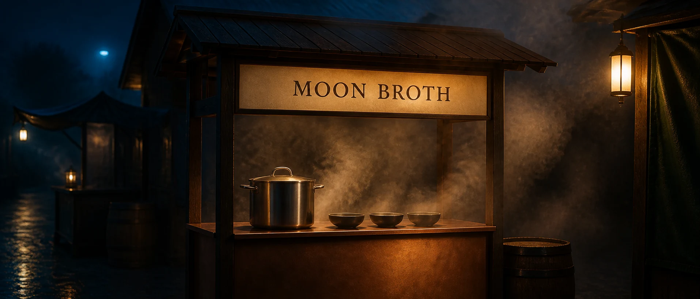

# Fictional Night Market Steam

## Use this when

Use this card for an invented night-market food stall seen through rising steam. It is a fictional, public-domain, or authorized photographic concept, not documentary proof or Card-level generation evidence. Use a Recipe when identity, product geometry, continuity, or repeatability must be evaluated.

## Required inputs

- A fictional, public-domain, or authorized subject and project context.
- The exact subject details, setting, viewpoint, and allowed props.
- Lighting, color, camera-character, and output intent.
- An exact-copy manifest for every readable word or character.
- The visual risks, claims, and content that must not appear.
- The attached input asset or assets, an authority statement, assigned roles, and preservation scope.

## Prompt

```text
Create one cinematic street photograph for {PROJECT_CONTEXT} depicting an invented night-market food stall seen through rising steam.

SUBJECT
Use {SUBJECT_DETAILS} exactly; do not infer identity, ownership, brand, or unseen facts.

EXACT COPY
Render only the exact readable text in {EXACT_COPY}; do not add, omit, paraphrase, or alter copy.

SETTING AND COMPOSITION
Use {SETTING_DETAILS}. Follow {VIEWPOINT_AND_OUTPUT}. Use separate authorized sources for unbranded stall structure, cookware, and color atmosphere without merging people or signage. Keep scale, reflections, depth, and edges plausible.

LIGHT AND REALISM
Keep the scene unoccupied, use warm steam against cool night, and make all visible menu copy fictional. Apply {LIGHT_AND_COLOR} with natural tonal transitions and material response.

AUTHORIZED IMAGE SET
Use only {IMAGE_SET}, a small set whose items are all authorized for this task. Follow {IMAGE_ROLES} so each image has one declared purpose, and preserve only {PRESERVE_FEATURES}. Do not merge identities, brands, provenance, or hidden details across the sources.

CONSTRAINTS
Do not present a fictional setup as documentary proof. Add no real brand, real-person likeness, medical or legal claim, signature, or watermark. Do not imitate a named living photographer. Avoid {MUST_AVOID}.

OUTPUT
Return one 21:9 photographic concept with credible optics and no unrequested collage.
```

## Variables

- `{PROJECT_CONTEXT}`: the fictional or authorized editorial, archive, or creative context
- `{SUBJECT_DETAILS}`: the exact approved subject, condition, materials, and distinguishing features
- `{SETTING_DETAILS}`: the approved location, surfaces, background, props, and weather
- `{VIEWPOINT_AND_OUTPUT}`: the camera viewpoint, lens character, depth treatment, crop, and intended output use
- `{LIGHT_AND_COLOR}`: the lighting direction, time, palette, contrast, and camera character
- `{EXACT_COPY}`: the complete approved text manifest, including exact spelling and punctuation
- `{MUST_AVOID}`: additional prohibited content, artifacts, or unsupported implications
- `{IMAGE_SET}`: the attached authorized image set
- `{IMAGE_ROLES}`: the explicit source role assigned to every image
- `{PRESERVE_FEATURES}`: the approved visual facts to retain from each source

## Negative constraints

- No real brand, inferred real-person likeness, medical or legal claim, signature, or watermark.
- No false documentary implication, copied living-photographer style, or invented provenance.
- Do not break the photographic plan: Use separate authorized sources for unbranded stall structure, cookware, and color atmosphere without merging people or signage.

## Quick check

Confirm the image communicates an invented night-market food stall seen through rising steam. Check the assigned composition, then verify the specific direction: keep the scene unoccupied, use warm steam against cool night, and make all visible menu copy fictional. Reject invented content, unsupported claims, or any mismatch between supplied inputs and the visible result.

## Rendered Sample



- Sample status: Rendered Sample.
- Generation surface: built-in image generation tool
- Generated at: `2026-08-31T00:09:28Z`
- Model: `not_exposed`
- Model version: `not_exposed`
- Seed: `not_exposed`
- Request parameters: `not_exposed`
- Request ID: `not_exposed`
- Exact prompt: [fictional-night-market-steam.prompt.txt](samples/fictional-night-market-steam/fictional-night-market-steam.prompt.txt)
- Output dimensions: `1915 x 821`
- Output SHA-256: `5590ffcd7e6a2acb5085969f8353f82a9932de715121578d2aba6bb632112230`
- Profile ID: `null`
- Promotion evidence: `false`
- Human inspection: The accepted wide frame keeps the timber stall unoccupied, renders `MOON BROTH` once, and shows one stockpot with three shallow bowls in warm steam against cool night.
- Known misses: No material visible miss; the named cookware count, sign copy, stall structure, and cyan-amber atmosphere remain distinct.
- Rights and provenance: The concept, exact prompt, accepted image, and public WebP derivative are project-authored. Lossless masters and rejected attempts are retained privately with checksums. The public derivative may be reused under this repository's license; this record is illustrative evidence only.
- Supporting inputs:
  - [input-01-stall-structure.webp](samples/fictional-night-market-steam/input-01-stall-structure.webp): project-authored fictional stall structure input
  - [input-02-cookware.webp](samples/fictional-night-market-steam/input-02-cookware.webp): project-authored fictional cookware input
  - [input-03-color-atmosphere.webp](samples/fictional-night-market-steam/input-03-color-atmosphere.webp): project-authored fictional color atmosphere input
## Rights and provenance

This Card is independently authored with `original` source posture. Every image in the set must be fictional, public-domain, project-owned, or otherwise authorized, with a recorded role and preservation scope. This Rendered Sample is illustrative evidence only; it does not establish reliable multi-image fidelity, continuity, or composition.
