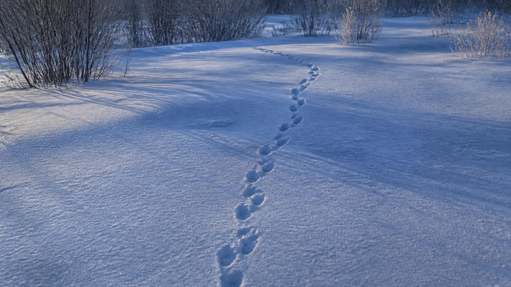

# Fox Tracks in Snow

## Use this when

Use this card for a winding line of unidentified fox-like tracks crossing fresh snow. It is a fictional, public-domain, or authorized photographic concept, not documentary proof or Card-level generation evidence. Use a Recipe when identity, product geometry, continuity, or repeatability must be evaluated.

## Required inputs

- A fictional, public-domain, or authorized subject and project context.
- The exact subject details, setting, viewpoint, and allowed props.
- Lighting, color, camera-character, and output intent.
- The visual risks, claims, and content that must not appear.

## Prompt

```text
Create one winter nature photograph for {PROJECT_CONTEXT} depicting a winding line of unidentified fox-like tracks crossing fresh snow.

SUBJECT
Use {SUBJECT_DETAILS} exactly; do not infer identity, ownership, brand, or unseen facts.

SETTING AND COMPOSITION
Use {SETTING_DETAILS}. Follow {VIEWPOINT_AND_OUTPUT}. Let the tracks enter near camera and fade toward a low stand of bare shrubs without showing an animal. Keep scale, reflections, depth, and edges plausible.

LIGHT AND REALISM
Use cool open shade, subtle wind texture, and keep the track attribution visibly uncertain. Apply {LIGHT_AND_COLOR} with natural tonal transitions and material response.

CONSTRAINTS
Do not present a fictional setup as documentary proof. Add no real brand, real-person likeness, medical or legal claim, signature, or watermark. Do not imitate a named living photographer. Avoid {MUST_AVOID}.

OUTPUT
Return one 16:9 photographic concept with credible optics and no unrequested collage.
```

## Variables

- `{PROJECT_CONTEXT}`: the fictional or authorized editorial, archive, or creative context
- `{SUBJECT_DETAILS}`: the exact approved subject, condition, materials, and distinguishing features
- `{SETTING_DETAILS}`: the approved location, surfaces, background, props, and weather
- `{VIEWPOINT_AND_OUTPUT}`: the camera viewpoint, lens character, depth treatment, crop, and intended output use
- `{LIGHT_AND_COLOR}`: the lighting direction, time, palette, contrast, and camera character
- `{MUST_AVOID}`: additional prohibited content, artifacts, or unsupported implications

## Negative constraints

- No real brand, inferred real-person likeness, medical or legal claim, signature, or watermark.
- No false documentary implication, copied living-photographer style, or invented provenance.
- Do not break the photographic plan: Let the tracks enter near camera and fade toward a low stand of bare shrubs without showing an animal.

## Quick check

Confirm the image communicates a winding line of unidentified fox-like tracks crossing fresh snow. Check the assigned composition, then verify the specific direction: use cool open shade, subtle wind texture, and keep the track attribution visibly uncertain. Reject invented content, unsupported claims, or any mismatch between supplied inputs and the visible result.

## Rendered Sample



- Sample status: Rendered Sample.
- Generation surface: built-in image generation tool
- Generated at: `2026-08-30T23:22:59Z`
- Model: `not_exposed`
- Model version: `not_exposed`
- Seed: `not_exposed`
- Request parameters: `not_exposed`
- Request ID: `not_exposed`
- Exact prompt: [fox-tracks-in-snow.prompt.txt](samples/fox-tracks-in-snow/fox-tracks-in-snow.prompt.txt)
- Output dimensions: `1672 x 941`
- Output SHA-256: `42b89fb2fca46edb00c049a8a5fe3ac883ab55f07e56943746f68e1e2dabe5df`
- Profile ID: `null`
- Promotion evidence: `false`
- Human inspection: The accepted final follows one winding line of small tracks from the snowy foreground toward dark shrubs, with quiet overcast light and no animal in frame.
- Known misses: No material visible miss; the trail reads clearly, though the exact animal species cannot be established from the image alone.
- Rights and provenance: The concept, exact prompt, accepted image, and public WebP derivative are project-authored. Lossless masters and rejected attempts are retained privately with checksums. The public derivative may be reused under this repository's license; this record is illustrative evidence only.
## Rights and provenance

This Prompt Card is independently authored with `original` source posture. Use only fictional, public-domain, or properly authorized subjects, names, data, locations, and brand materials. It bundles no third-party prompt or image.
