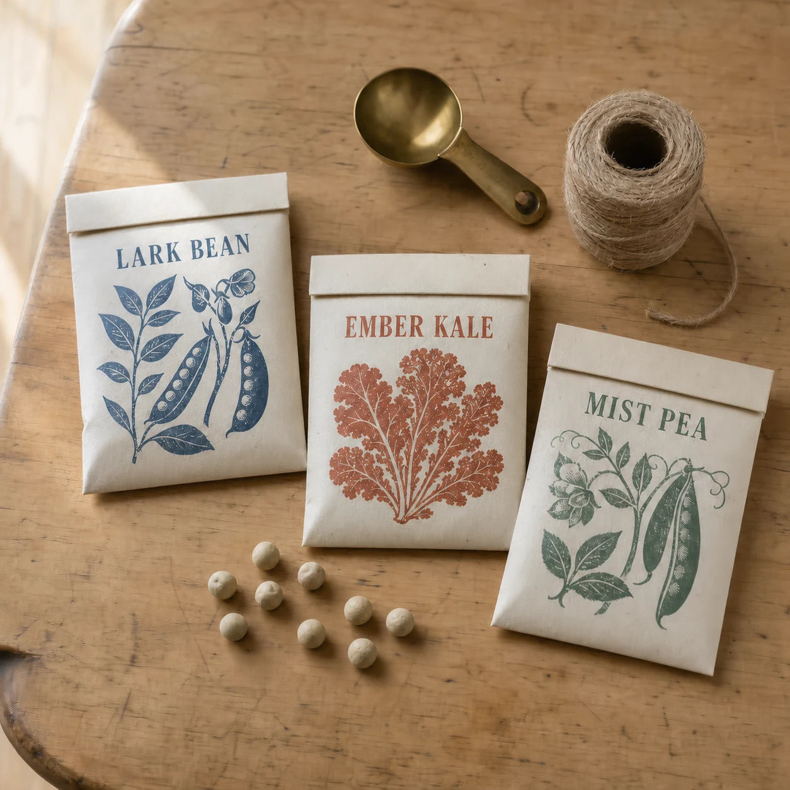

# Kitchen-Table Seed Catalog Still Life

## Use this when

Use this card for a photoreal editorial still life of fictional seed packets and gardening objects on a kitchen table. Use a Recipe when exact text, real product identity, or publishing evidence matters.

## Required inputs

- Exact fictional seed varieties, packet count, and approved packet text.
- Table surface, paper treatment, tool and prop manifest.
- Lighting, camera view, focus, season, and aspect ratio.

## Prompt

```text
SCENE
Create a photoreal kitchen-table still life on {TABLE_SURFACE} during {SEASON_AND_LIGHT}.

SUBJECT
Arrange exactly {PACKET_MANIFEST} fictional seed packets as the primary subject, viewed from {CAMERA_VIEW}.

DETAILS
Use {PACKET_DESIGN}, render only {EXACT_TEXT}, and add exactly {TOOL_AND_PROP_MANIFEST}. Apply {FOCUS_BEHAVIOR}; show believable paper fibers, folds, seed shapes, wood grain, metal wear, and contact shadows.

CONSTRAINTS
Keep every packet distinct, correctly counted, fully fictional, and legible where text is required. No real brands, extra packets, duplicated tools, impossible seeds, open food, hands, people, barcodes, prices, logos, watermarks, or unapproved text.

OUTPUT INTENT
Return one warm editorial still life at {ASPECT_RATIO}, with clear paper detail, natural domestic light, and an orderly preparation-for-planting mood.
```

## Variables

- `{TABLE_SURFACE}`: wood, laminate, stone, or cloth-covered table.
- `{SEASON_AND_LIGHT}`: season, time, window direction, and light softness.
- `{PACKET_MANIFEST}`: exact fictional varieties and packet count.
- `{CAMERA_VIEW}`: top-down or oblique angle, crop, and lens character.
- `{PACKET_DESIGN}`: paper stock, print palette, illustration style, and wear.
- `{EXACT_TEXT}`: approved packet strings, or `none`.
- `{TOOL_AND_PROP_MANIFEST}`: exact tools, seeds, notebook, twine, or tray items.
- `{FOCUS_BEHAVIOR}`: focal subject, depth of field, and acceptable background softness.
- `{ASPECT_RATIO}`: final width-to-height ratio.

## Negative constraints

- No real seed company, cultivar trademark, price, barcode, certification, or claim.
- No extra packets, unreadable pseudo-text, duplicated seed piles, or malformed tools.
- No excessive rustic clutter, flowers, food, hands, or outdoor garden elements.

## Quick check

Count packets and tools, compare visible text with the approved list, and inspect paper, seed, metal, and table textures for coherent scale and lighting.

## Rendered Sample



- Sample status: Rendered Sample.
- Generation surface: built-in image generation tool
- Generated at: `2026-08-30T23:03:35Z`
- Model: `not_exposed`
- Model version: `not_exposed`
- Seed: `not_exposed`
- Request parameters: `not_exposed`
- Request ID: `not_exposed`
- Exact prompt: [kitchen-table-seed-catalog-still-life.prompt.txt](samples/kitchen-table-seed-catalog-still-life/kitchen-table-seed-catalog-still-life.prompt.txt)
- Output dimensions: `1254 x 1254`
- Output SHA-256: `701d7dc3e2dd10cdf9196cd5afa3ce4182d8f5cbc8d713487c2b18a1be584039`
- Profile ID: `null`
- Promotion evidence: `false`
- Human inspection: The accepted final keeps three packets titled `PEA`, `BEAN`, and `DILL` beside a scoop and twine, but nine loose round seeds are visible on the tabletop.
- Known misses: The Card requests exactly eight loose seeds, while the accepted final shows nine; no extra readable copy appears.
- Rights and provenance: The concept, exact prompt, accepted image, and public WebP derivative are project-authored. Lossless masters and rejected attempts are retained privately with checksums. The public derivative may be reused under this repository's license; this record is illustrative evidence only.
## Rights and provenance

Use only fictional packet designs and project-owned or authorized props and references. This Prompt Card is independently authored, has source posture `original`, and includes no third-party prompt or image.
