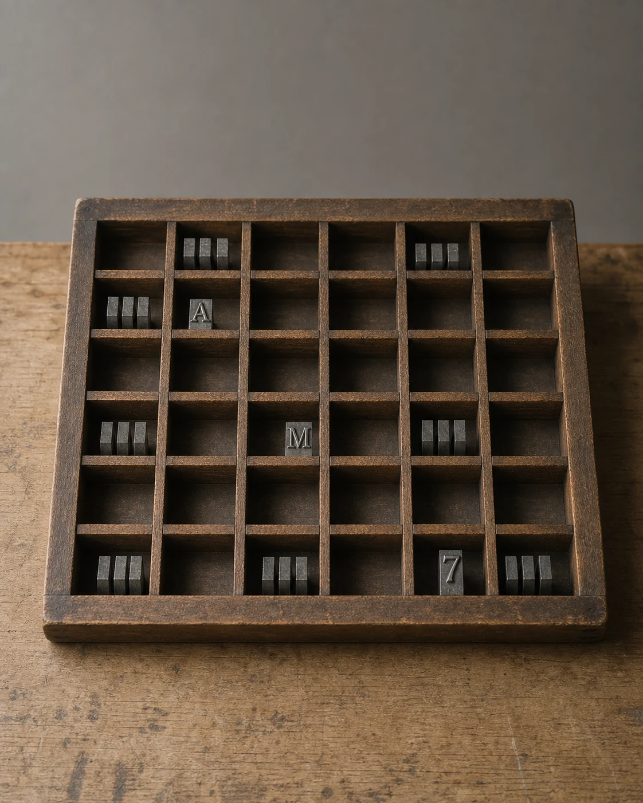

# Letterpress Type Drawer

## Use this when

Use this card for an authorized drawer of public-domain letterpress type. It is a fictional, public-domain, or authorized photographic concept, not documentary proof or Card-level generation evidence. Use a Recipe when identity, product geometry, continuity, or repeatability must be evaluated.

## Required inputs

- A fictional, public-domain, or authorized subject and project context.
- The exact subject details, setting, viewpoint, and allowed props.
- Lighting, color, camera-character, and output intent.
- An exact-copy manifest for every readable word or character.
- The visual risks, claims, and content that must not appear.
- The attached input asset or assets, an authority statement, assigned roles, and preservation scope.

## Prompt

```text
Create one archive detail photograph for {PROJECT_CONTEXT} depicting an authorized drawer of public-domain letterpress type.

SUBJECT
Use {SUBJECT_DETAILS} exactly; do not infer identity, ownership, brand, or unseen facts.

EXACT COPY
Render only the exact readable text in {EXACT_COPY}; do not add, omit, paraphrase, or alter copy.

SETTING AND COMPOSITION
Use {SETTING_DETAILS}. Follow {VIEWPOINT_AND_OUTPUT}. Look down at a shallow angle so compartments form a grid and a few supplied characters remain legible. Keep scale, reflections, depth, and edges plausible.

LIGHT AND REALISM
Preserve declared type arrangement, use soft archival light, and infer no foundry, date, value, or ownership. Apply {LIGHT_AND_COLOR} with natural tonal transitions and material response.

AUTHORIZED REFERENCE INPUT
Use {REFERENCE_IMAGE} only after confirming authority to use it for this task. Preserve only {PRESERVE_FEATURES}; do not infer identity, ownership, authorship, brand affiliation, unseen geometry, or facts outside the supplied image.

CONSTRAINTS
Do not present a fictional setup as documentary proof. Add no real brand, real-person likeness, medical or legal claim, signature, or watermark. Do not imitate a named living photographer. Avoid {MUST_AVOID}.

OUTPUT
Return one 4:5 photographic concept with credible optics and no unrequested collage.
```

## Variables

- `{PROJECT_CONTEXT}`: the fictional or authorized editorial, archive, or creative context
- `{SUBJECT_DETAILS}`: the exact approved subject, condition, materials, and distinguishing features
- `{SETTING_DETAILS}`: the approved location, surfaces, background, props, and weather
- `{VIEWPOINT_AND_OUTPUT}`: the camera viewpoint, lens character, depth treatment, crop, and intended output use
- `{LIGHT_AND_COLOR}`: the lighting direction, time, palette, contrast, and camera character
- `{EXACT_COPY}`: the complete approved text manifest, including exact spelling and punctuation
- `{MUST_AVOID}`: additional prohibited content, artifacts, or unsupported implications
- `{REFERENCE_IMAGE}`: the attached authorized reference image and its declared role
- `{PRESERVE_FEATURES}`: the visible features that must remain stable without invented details

## Negative constraints

- No real brand, inferred real-person likeness, medical or legal claim, signature, or watermark.
- No false documentary implication, copied living-photographer style, or invented provenance.
- Do not break the photographic plan: Look down at a shallow angle so compartments form a grid and a few supplied characters remain legible.

## Quick check

Confirm the image communicates an authorized drawer of public-domain letterpress type. Check the assigned composition, then verify the specific direction: preserve declared type arrangement, use soft archival light, and infer no foundry, date, value, or ownership. Reject invented content, unsupported claims, or any mismatch between supplied inputs and the visible result.

## Rendered Sample



- Sample status: Rendered Sample.
- Generation surface: built-in image generation tool
- Generated at: `2026-08-31T00:09:29Z`
- Model: `not_exposed`
- Model version: `not_exposed`
- Seed: `not_exposed`
- Request parameters: `not_exposed`
- Request ID: `not_exposed`
- Exact prompt: [letterpress-type-drawer.prompt.txt](samples/letterpress-type-drawer/letterpress-type-drawer.prompt.txt)
- Output dimensions: `1122 x 1402`
- Output SHA-256: `f47dadf5d70330997143d85a92a23ebfbf9d38d4c35fe7fe83e5ce247574d42a`
- Profile ID: `null`
- Promotion evidence: `false`
- Human inspection: The accepted shallow-angle final holds the compartment grid under soft light and shows `A`, `M`, and `7` exactly once among the letterpress sorts.
- Known misses: The supporting drawer input is approximately a 6 by 6 compartment grid rather than the support-generation prompt's requested 6 by 8 grid; the public Card does not require that count, and the accepted final shows A, M, and 7 exactly once.
- Rights and provenance: The concept, exact prompt, accepted image, and public WebP derivative are project-authored. Lossless masters and rejected attempts are retained privately with checksums. The public derivative may be reused under this repository's license; this record is illustrative evidence only.
- Supporting inputs:
  - [input-01-type-drawer-reference.webp](samples/letterpress-type-drawer/input-01-type-drawer-reference.webp): project-authored fictional type drawer reference input
## Rights and provenance

This Card is independently authored with `original` source posture. Use only a fictional, public-domain, project-owned, or otherwise authorized reference image. Record the authority and preservation scope before use. This Rendered Sample is illustrative evidence only; it does not establish reliable reference fidelity or identity preservation.
