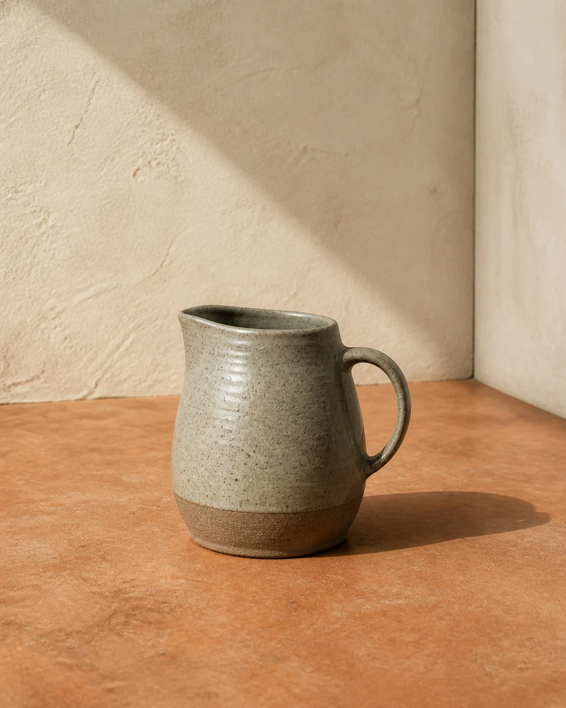

# Noon-Shadow Ceramic Study

## Use this when

Use this card for a minimal photoreal study of one ceramic vessel under hard noon light. Use a Recipe for exact product identity or calibrated material evaluation.

## Required inputs

- Vessel form, clay, glaze, imperfections, and authorization.
- Surface and wall colors, sun direction, camera view, and aspect ratio.
- Desired shadow geometry and degree of realism.

## Prompt

```text
SCENE
Create a minimal studio corner with {SURFACE_AND_WALL} under hard {SUN_DIRECTION} noon light.

SUBJECT
Show exactly one {VESSEL_DESCRIPTION} ceramic vessel, positioned {PLACEMENT} and viewed from {CAMERA_VIEW}.

DETAILS
Render {CLAY_AND_GLAZE}, including {SURFACE_VARIATION}. Form one crisp but physically plausible shadow with {SHADOW_DESCRIPTION}.

CONSTRAINTS
Keep the vessel watertight, stable, fully visible, and consistent in perspective and material response. No second vessel, flowers, liquid, cracks, melted rim, floating base, multiple suns, softbox reflections, logos, labels, watermarks, or text.

OUTPUT INTENT
Return one photoreal material study at {ASPECT_RATIO}, with the vessel and noon shadow forming a balanced, spare composition.
```

## Variables

- `{SURFACE_AND_WALL}`: colors, textures, corner condition, and finish.
- `{SUN_DIRECTION}`: light angle and direction.
- `{VESSEL_DESCRIPTION}`: form, scale, rim, handle, foot, and color.
- `{PLACEMENT}`: position and orientation in frame.
- `{CAMERA_VIEW}`: angle, crop, and lens character.
- `{CLAY_AND_GLAZE}`: clay body, glaze coverage, sheen, and translucency.
- `{SURFACE_VARIATION}`: approved speckle, throwing lines, pinholes, or brush marks.
- `{SHADOW_DESCRIPTION}`: direction, length, edge character, and shape.
- `{ASPECT_RATIO}`: final width-to-height ratio.

## Negative constraints

- No extra pottery, styling props, plants, hands, or workshop context.
- No impossible shadow direction, doubled rim, asymmetric base, or plastic material.
- No text, stamp, logo, maker's mark, or watermark.

## Quick check

Confirm one vessel, one light direction, a grounded base, coherent rim and foot geometry, and a shadow that matches the declared sun angle.

## Rendered Sample



- Sample status: Rendered Sample.
- Generation surface: built-in image generation tool
- Generated at: `2026-08-30T23:00:54Z`
- Model: `not_exposed`
- Model version: `not_exposed`
- Seed: `not_exposed`
- Request parameters: `not_exposed`
- Request ID: `not_exposed`
- Exact prompt: [noon-shadow-ceramic-study.prompt.txt](samples/noon-shadow-ceramic-study/noon-shadow-ceramic-study.prompt.txt)
- Output dimensions: `1122 x 1402`
- Output SHA-256: `d7e1740c940e65f6240ad41e09efa123e1cb097053264a238b18f6d346007d4a`
- Profile ID: `null`
- Promotion evidence: `false`
- Human inspection: The accepted square frame isolates one asymmetrical ceramic pitcher with an oval rim, single handle, and small foot, casting a hard noon shadow down and right.
- Known misses: No material visible miss; vessel geometry, clay surface, and shadow direction remain coherent without decoration or text.
- Rights and provenance: The concept, exact prompt, accepted image, and public WebP derivative are project-authored. Lossless masters and rejected attempts are retained privately with checksums. The public derivative may be reused under this repository's license; this record is illustrative evidence only.
## Rights and provenance

Use an independently described or authorized ceramic design. This Prompt Card is independently authored, has source posture `original`, and includes no third-party prompt or image.
