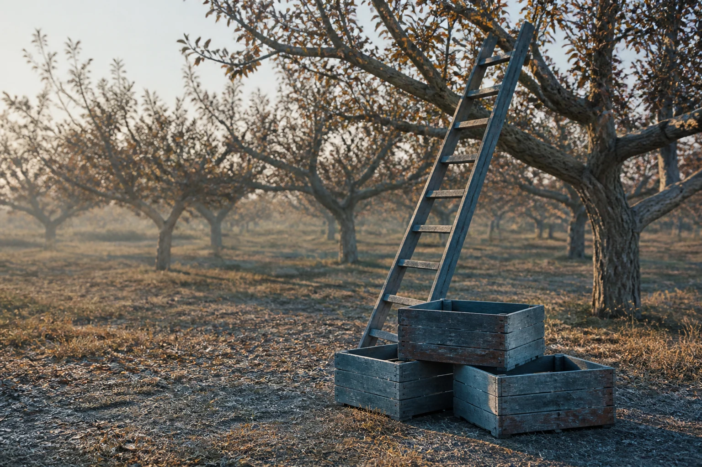

# Orchard Ladder and Crates

## Use this when

Use this card for an empty orchard work scene with a ladder and stacked wooden crates. It is a fictional, public-domain, or authorized photographic concept, not documentary proof or Card-level generation evidence. Use a Recipe when identity, product geometry, continuity, or repeatability must be evaluated.

## Required inputs

- A fictional, public-domain, or authorized subject and project context.
- The exact subject details, setting, viewpoint, and allowed props.
- Lighting, color, camera-character, and output intent.
- The visual risks, claims, and content that must not appear.

## Prompt

```text
Create one rural editorial photograph for {PROJECT_CONTEXT} depicting an empty orchard work scene with a ladder and stacked wooden crates.

SUBJECT
Use {SUBJECT_DETAILS} exactly; do not infer identity, ownership, brand, or unseen facts.

SETTING AND COMPOSITION
Use {SETTING_DETAILS}. Follow {VIEWPOINT_AND_OUTPUT}. Angle the ladder into low branches while three crates form a grounded triangle in the foreground. Keep scale, reflections, depth, and edges plausible.

LIGHT AND REALISM
Use late-afternoon side light, dusty leaves, scuffed wood, and no agricultural-performance claim. Apply {LIGHT_AND_COLOR} with natural tonal transitions and material response.

CONSTRAINTS
Do not present a fictional setup as documentary proof. Add no real brand, real-person likeness, medical or legal claim, signature, or watermark. Do not imitate a named living photographer. Avoid {MUST_AVOID}.

OUTPUT
Return one 3:2 photographic concept with credible optics and no unrequested collage.
```

## Variables

- `{PROJECT_CONTEXT}`: the fictional or authorized editorial, archive, or creative context
- `{SUBJECT_DETAILS}`: the exact approved subject, condition, materials, and distinguishing features
- `{SETTING_DETAILS}`: the approved location, surfaces, background, props, and weather
- `{VIEWPOINT_AND_OUTPUT}`: the camera viewpoint, lens character, depth treatment, crop, and intended output use
- `{LIGHT_AND_COLOR}`: the lighting direction, time, palette, contrast, and camera character
- `{MUST_AVOID}`: additional prohibited content, artifacts, or unsupported implications

## Negative constraints

- No real brand, inferred real-person likeness, medical or legal claim, signature, or watermark.
- No false documentary implication, copied living-photographer style, or invented provenance.
- Do not break the photographic plan: Angle the ladder into low branches while three crates form a grounded triangle in the foreground.

## Quick check

Confirm the image communicates an empty orchard work scene with a ladder and stacked wooden crates. Check the assigned composition, then verify the specific direction: use late-afternoon side light, dusty leaves, scuffed wood, and no agricultural-performance claim. Reject invented content, unsupported claims, or any mismatch between supplied inputs and the visible result.

## Rendered Sample



- Sample status: Rendered Sample.
- Generation surface: built-in image generation tool
- Generated at: `2026-08-30T23:35:47Z`
- Model: `not_exposed`
- Model version: `not_exposed`
- Seed: `not_exposed`
- Request parameters: `not_exposed`
- Request ID: `not_exposed`
- Exact prompt: [orchard-ladder-and-crates.prompt.txt](samples/orchard-ladder-and-crates/orchard-ladder-and-crates.prompt.txt)
- Output dimensions: `1536 x 1024`
- Output SHA-256: `5f9c0b104d109658952cb23b743587c6956de5137aa14bdb50e720d9dd3f11e2`
- Profile ID: `null`
- Promotion evidence: `false`
- Human inspection: The accepted final leans one orchard ladder into fruiting branches and places exactly three empty wooden crates beneath it in late natural light.
- Known misses: No material visible miss; ladder, three-crate count, foliage, and unoccupied scene remain legible without labels or people.
- Rights and provenance: The concept, exact prompt, accepted image, and public WebP derivative are project-authored. Lossless masters and rejected attempts are retained privately with checksums. The public derivative may be reused under this repository's license; this record is illustrative evidence only.
## Rights and provenance

This Prompt Card is independently authored with `original` source posture. Use only fictional, public-domain, or properly authorized subjects, names, data, locations, and brand materials. It bundles no third-party prompt or image.
