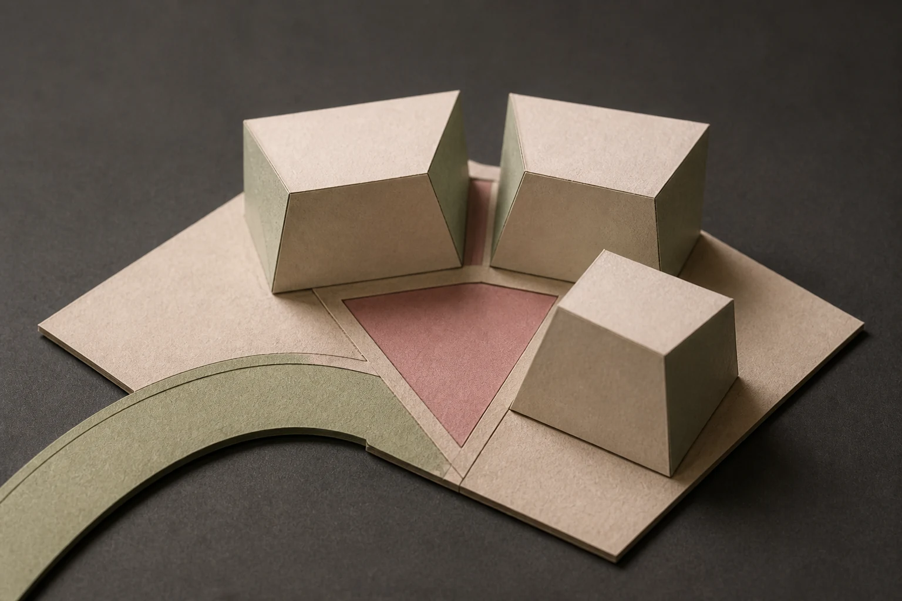

# Paper Model City Macro

## Use this when

Use this card for an original paper-model city block seen at tabletop scale. It is a fictional, public-domain, or authorized photographic concept, not documentary proof or Card-level generation evidence. Use a Recipe when identity, product geometry, continuity, or repeatability must be evaluated.

## Required inputs

- A fictional, public-domain, or authorized subject and project context.
- The exact subject details, setting, viewpoint, and allowed props.
- Lighting, color, camera-character, and output intent.
- The visual risks, claims, and content that must not appear.
- The attached input asset or assets, an authority statement, assigned roles, and preservation scope.

## Prompt

```text
Create one miniature macro photograph for {PROJECT_CONTEXT} depicting an original paper-model city block seen at tabletop scale.

SUBJECT
Use {SUBJECT_DETAILS} exactly; do not infer identity, ownership, brand, or unseen facts.

SETTING AND COMPOSITION
Use {SETTING_DETAILS}. Follow {VIEWPOINT_AND_OUTPUT}. Use the authorized sketch for street and massing relationships, then focus across three folded-paper buildings toward a tiny plaza. Keep scale, reflections, depth, and edges plausible.

LIGHT AND REALISM
Preserve approved layout only, use warm desk light, show paper edges, and avoid copying a real city or architect. Apply {LIGHT_AND_COLOR} with natural tonal transitions and material response.

AUTHORIZED SKETCH INPUT
Use {SKETCH_INPUT} only as an authorized guide for the declared arrangement. Preserve {PRESERVE_FEATURES}; do not copy a protected design language, named living artist style, signature, logo, or detail that the sketch does not establish.

CONSTRAINTS
Do not present a fictional setup as documentary proof. Add no real brand, real-person likeness, medical or legal claim, signature, or watermark. Do not imitate a named living photographer. Avoid {MUST_AVOID}.

OUTPUT
Return one 3:2 photographic concept with credible optics and no unrequested collage.
```

## Variables

- `{PROJECT_CONTEXT}`: the fictional or authorized editorial, archive, or creative context
- `{SUBJECT_DETAILS}`: the exact approved subject, condition, materials, and distinguishing features
- `{SETTING_DETAILS}`: the approved location, surfaces, background, props, and weather
- `{VIEWPOINT_AND_OUTPUT}`: the camera viewpoint, lens character, depth treatment, crop, and intended output use
- `{LIGHT_AND_COLOR}`: the lighting direction, time, palette, contrast, and camera character
- `{MUST_AVOID}`: additional prohibited content, artifacts, or unsupported implications
- `{SKETCH_INPUT}`: the attached project-owned or otherwise authorized sketch
- `{PRESERVE_FEATURES}`: the layout, geometry, or relationships explicitly approved for preservation

## Negative constraints

- No real brand, inferred real-person likeness, medical or legal claim, signature, or watermark.
- No false documentary implication, copied living-photographer style, or invented provenance.
- Do not break the photographic plan: Use the authorized sketch for street and massing relationships, then focus across three folded-paper buildings toward a tiny plaza.

## Quick check

Confirm the image communicates an original paper-model city block seen at tabletop scale. Check the assigned composition, then verify the specific direction: preserve approved layout only, use warm desk light, show paper edges, and avoid copying a real city or architect. Reject invented content, unsupported claims, or any mismatch between supplied inputs and the visible result.

## Rendered Sample



- Sample status: Rendered Sample.
- Generation surface: built-in image generation tool
- Generated at: `2026-08-31T00:13:45Z`
- Model: `not_exposed`
- Model version: `not_exposed`
- Seed: `not_exposed`
- Request parameters: `not_exposed`
- Request ID: `not_exposed`
- Exact prompt: [paper-model-city-macro.prompt.txt](samples/paper-model-city-macro/paper-model-city-macro.prompt.txt)
- Output dimensions: `1536 x 1024`
- Output SHA-256: `855c6940a5c762834fa96382e0dd9bf55162e478dfb6383e2e9d9ea31d949900`
- Profile ID: `null`
- Promotion evidence: `false`
- Human inspection: The accepted macro contains exactly three folded paper masses around a triangular plaza, with one curved street entering from the lower left.
- Known misses: No material visible miss; the three-mass count, plaza shape, street path, and shallow-focus paper treatment remain clear.
- Rights and provenance: The concept, exact prompt, accepted image, and public WebP derivative are project-authored. Lossless masters and rejected attempts are retained privately with checksums. The public derivative may be reused under this repository's license; this record is illustrative evidence only.
- Supporting inputs:
  - [input-01-layout-sketch.webp](samples/paper-model-city-macro/input-01-layout-sketch.webp): project-authored fictional layout sketch input
## Rights and provenance

This Card is independently authored with `original` source posture. Use only a project-owned, public-domain, or otherwise authorized sketch. Record its permitted role and preservation scope. This Rendered Sample is illustrative evidence only; it does not establish reliable sketch adherence, repeatability, or production reliability.
