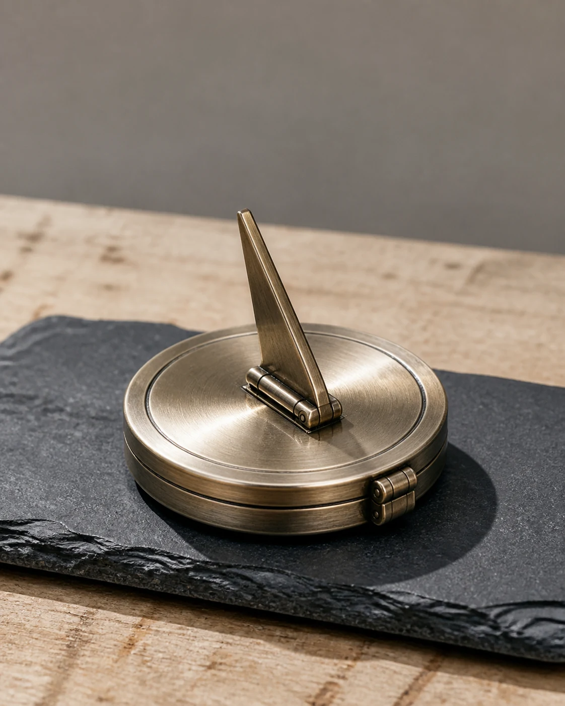

# Pocket Sundial Hero

## Use this when

Use this card for an original pocket sundial concept shown as a small object hero. It is a fictional, public-domain, or authorized photographic concept, not documentary proof or Card-level generation evidence. Use a Recipe when identity, product geometry, continuity, or repeatability must be evaluated.

## Required inputs

- A fictional, public-domain, or authorized subject and project context.
- The exact subject details, setting, viewpoint, and allowed props.
- Lighting, color, camera-character, and output intent.
- The visual risks, claims, and content that must not appear.
- The attached input asset or assets, an authority statement, assigned roles, and preservation scope.

## Prompt

```text
Create one fictional product photograph for {PROJECT_CONTEXT} depicting an original pocket sundial concept shown as a small object hero.

SUBJECT
Use {SUBJECT_DETAILS} exactly; do not infer identity, ownership, brand, or unseen facts.

SETTING AND COMPOSITION
Use {SETTING_DETAILS}. Follow {VIEWPOINT_AND_OUTPUT}. Use the authorized sketch for silhouette and hinge placement, then stand the object on slate with its shadow readable. Keep scale, reflections, depth, and edges plausible.

LIGHT AND REALISM
Preserve approved geometry, use hard noon-like light, and add no brand, engraving, or accuracy claim. Apply {LIGHT_AND_COLOR} with natural tonal transitions and material response.

AUTHORIZED SKETCH INPUT
Use {SKETCH_INPUT} only as an authorized guide for the declared arrangement. Preserve {PRESERVE_FEATURES}; do not copy a protected design language, named living artist style, signature, logo, or detail that the sketch does not establish.

CONSTRAINTS
Do not present a fictional setup as documentary proof. Add no real brand, real-person likeness, medical or legal claim, signature, or watermark. Do not imitate a named living photographer. Avoid {MUST_AVOID}.

OUTPUT
Return one 4:5 photographic concept with credible optics and no unrequested collage.
```

## Variables

- `{PROJECT_CONTEXT}`: the fictional or authorized editorial, archive, or creative context
- `{SUBJECT_DETAILS}`: the exact approved subject, condition, materials, and distinguishing features
- `{SETTING_DETAILS}`: the approved location, surfaces, background, props, and weather
- `{VIEWPOINT_AND_OUTPUT}`: the camera viewpoint, lens character, depth treatment, crop, and intended output use
- `{LIGHT_AND_COLOR}`: the lighting direction, time, palette, contrast, and camera character
- `{MUST_AVOID}`: additional prohibited content, artifacts, or unsupported implications
- `{SKETCH_INPUT}`: the attached project-owned or otherwise authorized sketch
- `{PRESERVE_FEATURES}`: the layout, geometry, or relationships explicitly approved for preservation

## Negative constraints

- No real brand, inferred real-person likeness, medical or legal claim, signature, or watermark.
- No false documentary implication, copied living-photographer style, or invented provenance.
- Do not break the photographic plan: Use the authorized sketch for silhouette and hinge placement, then stand the object on slate with its shadow readable.

## Quick check

Confirm the image communicates an original pocket sundial concept shown as a small object hero. Check the assigned composition, then verify the specific direction: preserve approved geometry, use hard noon-like light, and add no brand, engraving, or accuracy claim. Reject invented content, unsupported claims, or any mismatch between supplied inputs and the visible result.

## Rendered Sample



- Sample status: Rendered Sample.
- Generation surface: built-in image generation tool
- Generated at: `2026-08-31T00:13:47Z`
- Model: `not_exposed`
- Model version: `not_exposed`
- Seed: `not_exposed`
- Request parameters: `not_exposed`
- Request ID: `not_exposed`
- Exact prompt: [pocket-sundial-hero.prompt.txt](samples/pocket-sundial-hero/pocket-sundial-hero.prompt.txt)
- Output dimensions: `1122 x 1402`
- Output SHA-256: `3eb26db91b6bbe7db21f50fb30228015bd51c5597dc1be2049e7440c743db7c5`
- Profile ID: `null`
- Promotion evidence: `false`
- Human inspection: The accepted hero frame centers one circular pocket sundial with an upright gnomon and small hinge, casting a crisp shadow across dark slate.
- Known misses: No material visible miss; the object silhouette, hinge, hard light, and unbranded metal finish remain legible.
- Rights and provenance: The concept, exact prompt, accepted image, and public WebP derivative are project-authored. Lossless masters and rejected attempts are retained privately with checksums. The public derivative may be reused under this repository's license; this record is illustrative evidence only.
- Supporting inputs:
  - [input-01-sundial-sketch.webp](samples/pocket-sundial-hero/input-01-sundial-sketch.webp): project-authored fictional sundial sketch input
## Rights and provenance

This Card is independently authored with `original` source posture. Use only a project-owned, public-domain, or otherwise authorized sketch. Record its permitted role and preservation scope. This Rendered Sample is illustrative evidence only; it does not establish reliable sketch adherence, repeatability, or production reliability.
