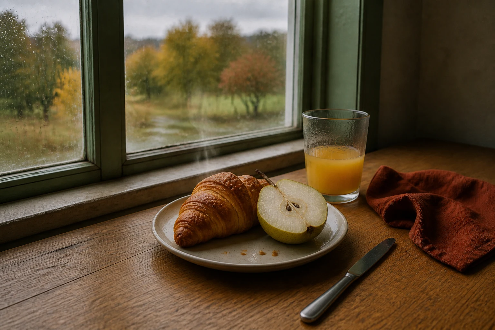

# Rainy-Window Breakfast Still Life

## Use this when

Use this card for a photoreal editorial breakfast still life beside a rain-streaked window. Use the linked [Recipe](../../recipes/rainy-window-breakfast-still-life/RECIPE.md) when object counts, realism checks, repair, or evidence matter.

## Required inputs

- Exact food, tableware, textile, and prop manifest.
- Window orientation, rain intensity, time of day, and lighting.
- Surface, composition, focus behavior, camera view, and aspect ratio.

## Prompt

```text
SCENE
Create a photoreal breakfast still life beside a {WINDOW_DESCRIPTION} during {RAIN_AND_TIME}, on {TABLE_SURFACE}.

SUBJECT
Arrange exactly {BREAKFAST_MANIFEST} as the primary still-life grouping, viewed from {CAMERA_VIEW}.

DETAILS
Use {TABLEWARE_AND_TEXTILES}, {APPROVED_PROPS}, and {LIGHTING}. Apply {FOCUS_BEHAVIOR}; show believable condensation, steam, crumbs, reflections, and rain-softened exterior depth only where appropriate.

CONSTRAINTS
Keep every object correctly counted, edible, grounded, and consistent with one light direction. No extra dishes, duplicated utensils, malformed food, impossible steam, floating crumbs, hands, people, packaging, labels, logos, watermarks, or readable text.

OUTPUT INTENT
Return one quiet editorial photograph at {ASPECT_RATIO}, with natural material detail, the declared focal behavior, and rainy-window atmosphere that does not obscure the breakfast.
```

## Variables

- `{WINDOW_DESCRIPTION}`: frame, glass, sill, and exterior glimpse.
- `{RAIN_AND_TIME}`: rain character, daylight phase, and sky.
- `{TABLE_SURFACE}`: material, wear, and color.
- `{BREAKFAST_MANIFEST}`: exact foods, drinks, and quantities.
- `{CAMERA_VIEW}`: angle, framing, and approximate focal length.
- `{TABLEWARE_AND_TEXTILES}`: exact vessels, cutlery, napkin, and fabric.
- `{APPROVED_PROPS}`: closed secondary-object list, or `none`.
- `{LIGHTING}`: window direction, softness, fill, and contrast.
- `{FOCUS_BEHAVIOR}`: focal subject, depth of field, and acceptable background softness.
- `{ASPECT_RATIO}`: final width-to-height ratio.

## Negative constraints

- No extra food, utensils, flowers, books, phones, or decorative objects.
- No plastic-looking food, broken ceramics, inconsistent reflections, or excessive blur.
- No invented packaging, text, branding, or human presence.

## Quick check

Count every object, follow the window light across surfaces, and inspect food texture, steam, reflections, rain streaks, and contact shadows at full size.

## Rendered Sample



- Sample status: Rendered Sample.
- Generation surface: built-in image generation tool
- Generated at: `2026-08-30T22:23:37Z`
- Model: `not_exposed`
- Model version: `not_exposed`
- Seed: `not_exposed`
- Request parameters: `not_exposed`
- Request ID: `not_exposed`
- Exact prompt: [rainy-window-breakfast-still-life.prompt.txt](samples/rainy-window-breakfast-still-life/rainy-window-breakfast-still-life.prompt.txt)
- Output dimensions: `1536 x 1024`
- Output SHA-256: `10d990a0e55c0ec62035516362fc8437a5411a449008d1df8318d2c224e2fcbf`
- Profile ID: `null`
- Promotion evidence: `false`
- Human inspection: The accepted tabletop still life includes one croissant, one pear half, a small glass of juice, a full knife, and a folded napkin beside the rain-streaked window.
- Known misses: No material visible miss; the requested object set remains complete and a faint warm wisp supplies the only heat cue.
- Rights and provenance: The concept, exact prompt, accepted image, and public WebP derivative are project-authored. Lossless masters and rejected attempts are retained privately with checksums. The public derivative may be reused under this repository's license; this record is illustrative evidence only.
## Rights and provenance

Use fictional arrangements and project-owned or authorized props and references. This Prompt Card is independently authored, has source posture `original`, and includes no third-party prompt or image.
