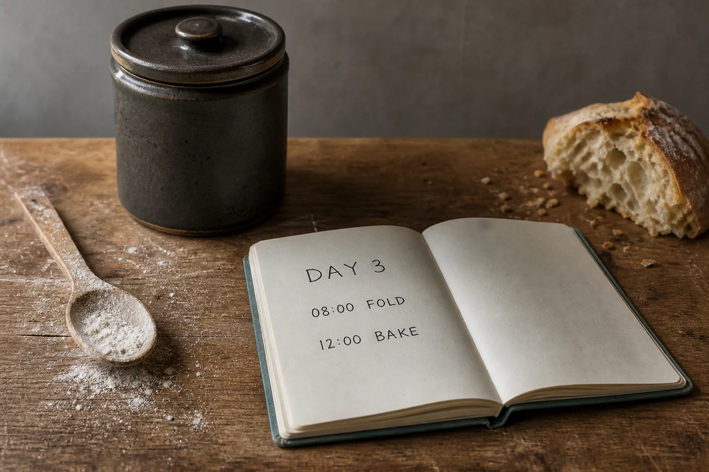

# Sourdough Journal Still Life

## Use this when

Use this card for a quiet bread-making journal scene with a fictional handwritten schedule. It is a fictional, public-domain, or authorized photographic concept, not documentary proof or Card-level generation evidence. Use a Recipe when identity, product geometry, continuity, or repeatability must be evaluated.

## Required inputs

- A fictional, public-domain, or authorized subject and project context.
- The exact subject details, setting, viewpoint, and allowed props.
- Lighting, color, camera-character, and output intent.
- An exact-copy manifest for every readable word or character.
- The visual risks, claims, and content that must not appear.

## Prompt

```text
Create one food-editorial photograph for {PROJECT_CONTEXT} depicting a quiet bread-making journal scene with a fictional handwritten schedule.

SUBJECT
Use {SUBJECT_DETAILS} exactly; do not infer identity, ownership, brand, or unseen facts.

EXACT COPY
Render only the exact readable text in {EXACT_COPY}; do not add, omit, paraphrase, or alter copy.

SETTING AND COMPOSITION
Use {SETTING_DETAILS}. Follow {VIEWPOINT_AND_OUTPUT}. Set a closed crock, flour-dusted spoon, torn bread edge, and project-authored notes on a worn kitchen table. Keep scale, reflections, depth, and edges plausible.

LIGHT AND REALISM
Use soft north-window light, natural crumbs, and no nutrition, freshness, or food-safety claim. Apply {LIGHT_AND_COLOR} with natural tonal transitions and material response.

CONSTRAINTS
Do not present a fictional setup as documentary proof. Add no real brand, real-person likeness, medical or legal claim, signature, or watermark. Do not imitate a named living photographer. Avoid {MUST_AVOID}.

OUTPUT
Return one 3:2 photographic concept with credible optics and no unrequested collage.
```

## Variables

- `{PROJECT_CONTEXT}`: the fictional or authorized editorial, archive, or creative context
- `{SUBJECT_DETAILS}`: the exact approved subject, condition, materials, and distinguishing features
- `{SETTING_DETAILS}`: the approved location, surfaces, background, props, and weather
- `{VIEWPOINT_AND_OUTPUT}`: the camera viewpoint, lens character, depth treatment, crop, and intended output use
- `{LIGHT_AND_COLOR}`: the lighting direction, time, palette, contrast, and camera character
- `{EXACT_COPY}`: the complete approved text manifest, including exact spelling and punctuation
- `{MUST_AVOID}`: additional prohibited content, artifacts, or unsupported implications

## Negative constraints

- No real brand, inferred real-person likeness, medical or legal claim, signature, or watermark.
- No false documentary implication, copied living-photographer style, or invented provenance.
- Do not break the photographic plan: Set a closed crock, flour-dusted spoon, torn bread edge, and project-authored notes on a worn kitchen table.

## Quick check

Confirm the image communicates a quiet bread-making journal scene with a fictional handwritten schedule. Check the assigned composition, then verify the specific direction: use soft north-window light, natural crumbs, and no nutrition, freshness, or food-safety claim. Reject invented content, unsupported claims, or any mismatch between supplied inputs and the visible result.

## Rendered Sample



- Sample status: Rendered Sample.
- Generation surface: built-in image generation tool
- Generated at: `2026-08-30T23:45:27Z`
- Model: `not_exposed`
- Model version: `not_exposed`
- Seed: `not_exposed`
- Request parameters: `not_exposed`
- Request ID: `not_exposed`
- Exact prompt: [sourdough-journal-still-life.prompt.txt](samples/sourdough-journal-still-life/sourdough-journal-still-life.prompt.txt)
- Output dimensions: `1536 x 1024`
- Output SHA-256: `d164ab4da8253099f01f5aa5dd6b32a05acb531a52df3ba7fe9bc46aeeb79da1`
- Profile ID: `null`
- Promotion evidence: `false`
- Human inspection: The accepted tabletop final renders `DAY 3`, `08:00 FOLD`, and `12:00 BAKE` clearly once each beside a crock, spoon, and loaf.
- Known misses: No material visible miss; the exact note set and food props remain legible without extra copy, branding, or health claims.
- Rights and provenance: The concept, exact prompt, accepted image, and public WebP derivative are project-authored. Lossless masters and rejected attempts are retained privately with checksums. The public derivative may be reused under this repository's license; this record is illustrative evidence only.
## Rights and provenance

This Prompt Card is independently authored with `original` source posture. Use only fictional, public-domain, or properly authorized subjects, names, data, locations, and brand materials. It bundles no third-party prompt or image.
