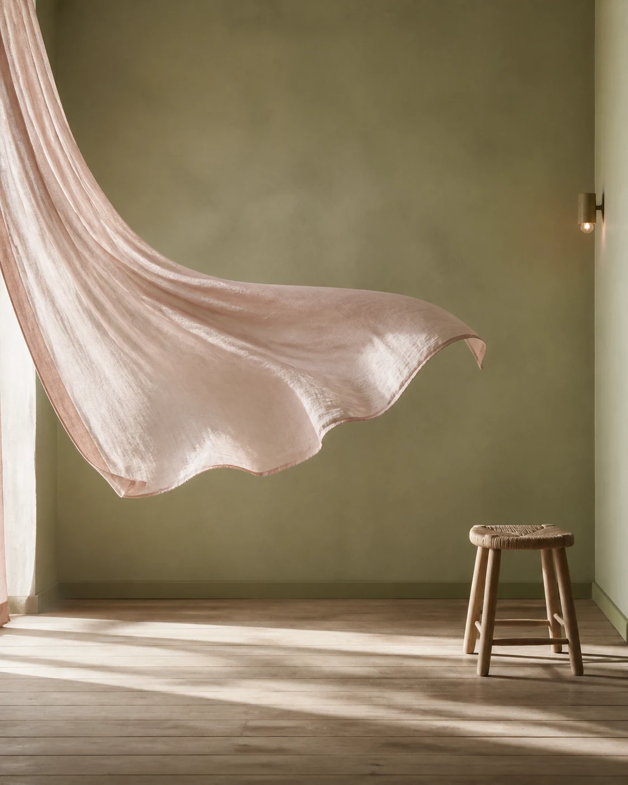

# Windblown Curtain Room

## Use this when

Use this card for an empty sunlit room with one curtain lifted by a breeze. It is a fictional, public-domain, or authorized photographic concept, not documentary proof or Card-level generation evidence. Use a Recipe when identity, product geometry, continuity, or repeatability must be evaluated.

## Required inputs

- A fictional, public-domain, or authorized subject and project context.
- The exact subject details, setting, viewpoint, and allowed props.
- Lighting, color, camera-character, and output intent.
- The visual risks, claims, and content that must not appear.

## Prompt

```text
Create one minimal interior photograph for {PROJECT_CONTEXT} depicting an empty sunlit room with one curtain lifted by a breeze.

SUBJECT
Use {SUBJECT_DETAILS} exactly; do not infer identity, ownership, brand, or unseen facts.

SETTING AND COMPOSITION
Use {SETTING_DETAILS}. Follow {VIEWPOINT_AND_OUTPUT}. Keep the window outside frame while the curtain arcs across a bare wall and a simple stool anchors the floor. Keep scale, reflections, depth, and edges plausible.

LIGHT AND REALISM
Use bright natural light, plausible fabric motion, no identifiable property, and no hidden person or story claim. Apply {LIGHT_AND_COLOR} with natural tonal transitions and material response.

CONSTRAINTS
Do not present a fictional setup as documentary proof. Add no real brand, real-person likeness, medical or legal claim, signature, or watermark. Do not imitate a named living photographer. Avoid {MUST_AVOID}.

OUTPUT
Return one 4:5 photographic concept with credible optics and no unrequested collage.
```

## Variables

- `{PROJECT_CONTEXT}`: the fictional or authorized editorial, archive, or creative context
- `{SUBJECT_DETAILS}`: the exact approved subject, condition, materials, and distinguishing features
- `{SETTING_DETAILS}`: the approved location, surfaces, background, props, and weather
- `{VIEWPOINT_AND_OUTPUT}`: the camera viewpoint, lens character, depth treatment, crop, and intended output use
- `{LIGHT_AND_COLOR}`: the lighting direction, time, palette, contrast, and camera character
- `{MUST_AVOID}`: additional prohibited content, artifacts, or unsupported implications

## Negative constraints

- No real brand, inferred real-person likeness, medical or legal claim, signature, or watermark.
- No false documentary implication, copied living-photographer style, or invented provenance.
- Do not break the photographic plan: Keep the window outside frame while the curtain arcs across a bare wall and a simple stool anchors the floor.

## Quick check

Confirm the image communicates an empty sunlit room with one curtain lifted by a breeze. Check the assigned composition, then verify the specific direction: use bright natural light, plausible fabric motion, no identifiable property, and no hidden person or story claim. Reject invented content, unsupported claims, or any mismatch between supplied inputs and the visible result.

## Rendered Sample



- Sample status: Rendered Sample.
- Generation surface: built-in image generation tool
- Generated at: `2026-08-30T23:58:07Z`
- Model: `not_exposed`
- Model version: `not_exposed`
- Seed: `not_exposed`
- Request parameters: `not_exposed`
- Request ID: `not_exposed`
- Exact prompt: [windblown-curtain-room.prompt.txt](samples/windblown-curtain-room/windblown-curtain-room.prompt.txt)
- Output dimensions: `1122 x 1402`
- Output SHA-256: `c1a8297593cf43015d0d9adc6b9a1a0e423759a118580782b1826f3cabad90e8`
- Profile ID: `null`
- Promotion evidence: `false`
- Human inspection: The accepted final shows one pale pink curtain lifting into the otherwise spare room, with the window held outside frame and a single stool near the wall.
- Known misses: No material visible miss; the curtain motion, one-stool count, empty room, and off-frame window constraint remain legible.
- Rights and provenance: The concept, exact prompt, accepted image, and public WebP derivative are project-authored. Lossless masters and rejected attempts are retained privately with checksums. The public derivative may be reused under this repository's license; this record is illustrative evidence only.
## Rights and provenance

This Prompt Card is independently authored with `original` source posture. Use only fictional, public-domain, or properly authorized subjects, names, data, locations, and brand materials. It bundles no third-party prompt or image.
