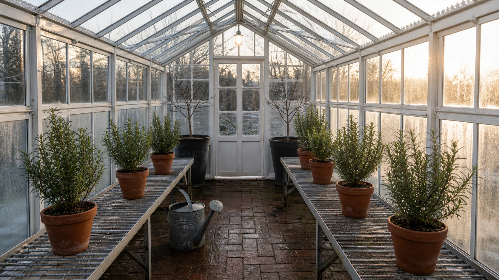

# Winter Greenhouse Morning

## Use this when

Use this card for a photoreal winter-morning greenhouse scene with a controlled plant and tool manifest. Use a Recipe when botanical or facility accuracy requires formal review.

## Required inputs

- Greenhouse type, climate, season, and time.
- Exact plant, bench, pot, and tool manifest.
- Condensation, frost, light, camera view, and aspect ratio.

## Prompt

```text
SCENE
Create a photoreal {GREENHOUSE_TYPE} greenhouse on a {WINTER_MORNING}, viewed from {CAMERA_VIEW}.

SUBJECT
Center the composition on {PRIMARY_PLANT_GROUP}, arranged across {BENCH_DESCRIPTION}.

DETAILS
Include exactly {PLANT_MANIFEST}, {POT_MANIFEST}, and {TOOL_MANIFEST}. Render {GLAZING_CONDITION}, {LIGHTING}, and believable cool-to-warm transitions across glass, soil, leaves, metal, and damp floor surfaces.

CONSTRAINTS
Keep plant species, season, scale, gravity, condensation, and shadows coherent. No tropical abundance unless declared, extra tools, duplicated pots, floating leaves, heavy snow indoors, people, labels, product packaging, logos, watermarks, or readable text.

OUTPUT INTENT
Return one quiet documentary-style photograph at {ASPECT_RATIO}, with clear greenhouse depth and a believable winter morning atmosphere.
```

## Variables

- `{GREENHOUSE_TYPE}`: frame, glazing, floor, and ventilation form.
- `{WINTER_MORNING}`: temperature, sky, snow or frost, and time.
- `{CAMERA_VIEW}`: aisle position, height, framing, and lens character.
- `{PRIMARY_PLANT_GROUP}`: main horticultural subject.
- `{BENCH_DESCRIPTION}`: bench material, height, and layout.
- `{PLANT_MANIFEST}`: exact species groups, sizes, and counts.
- `{POT_MANIFEST}`: exact containers, trays, and quantities.
- `{TOOL_MANIFEST}`: closed tool list, or `none`.
- `{GLAZING_CONDITION}`: condensation, frost, clarity, and streaking.
- `{LIGHTING}`: daylight direction, warmth, diffusion, and any work lights.
- `{ASPECT_RATIO}`: final width-to-height ratio.

## Negative constraints

- No seasonally impossible growth, mixed climates, or unlisted flowers.
- No exaggerated fog, magical sunbeams, ice inside warm zones, or mirrored geometry.
- No people, signage, labels, prices, branded tools, or decorative text.

## Quick check

Count pots and tools, check plant-season fit, and verify that condensation, frost, daylight, and floor moisture agree with one temperature story.

## Rendered Sample



- Sample status: Rendered Sample.
- Generation surface: built-in image generation tool
- Generated at: `2026-08-30T23:00:54Z`
- Model: `not_exposed`
- Model version: `not_exposed`
- Seed: `not_exposed`
- Request parameters: `not_exposed`
- Request ID: `not_exposed`
- Exact prompt: [winter-greenhouse-morning.prompt.txt](samples/winter-greenhouse-morning/winter-greenhouse-morning.prompt.txt)
- Output dimensions: `1672 x 941`
- Output SHA-256: `3224d1d9918604b944a709160071c6a648ea8734f4d123502f58eabc9c349a46`
- Profile ID: `null`
- Promotion evidence: `false`
- Human inspection: The accepted aisle view shows seven terracotta rosemary pots, two black-potted dormant fig saplings at the back, and one small metal watering can in pale winter light.
- Known misses: The Card requests exactly six rosemary plants, but seven are visible; the two fig saplings and one watering can match their requested counts.
- Rights and provenance: The concept, exact prompt, accepted image, and public WebP derivative are project-authored. Lossless masters and rejected attempts are retained privately with checksums. The public derivative may be reused under this repository's license; this record is illustrative evidence only.
## Rights and provenance

Use a fictional or authorized greenhouse and independently specified plant arrangement. This Prompt Card is independently authored, has source posture `original`, and includes no third-party prompt or image.
