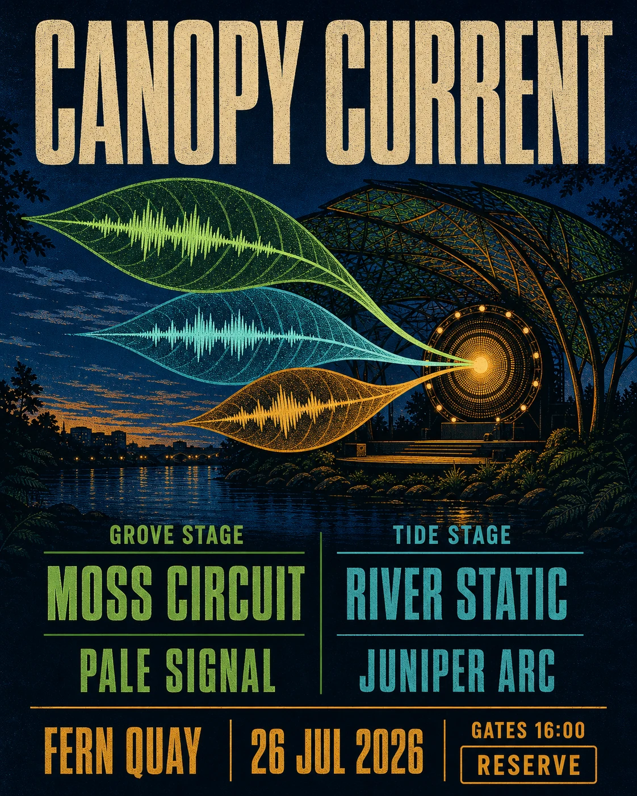

# Canopy Current Music Festival Poster

## Use this when

Use this card for one fictional music-festival poster with an exact multi-level lineup and a vivid canopy-and-river visual system. Use a Recipe for real artists, sponsor contracts, accessibility certification, or production evidence.

## Required inputs

- Fictional festival name, date, place, lineup, stages, and ticket action.
- Exact lineup order and tier hierarchy.
- Original motif, palette, type direction, output size, and aspect ratio.

## Prompt

```text
SCENE
Create one portrait poster for {FESTIVAL_NAME}, a fictional music festival held at {PLACE_EXACT} on {DATE_EXACT}, using {CANOPY_CURRENT_SCENE}.

SUBJECT
Center {PRIMARY_MOTIF} and the exact festival title, then organize the performer lineup {LINEUP_EXACT} by the declared tiers {LINEUP_HIERARCHY} and {STAGE_ASSIGNMENTS}.

DETAILS
Use {VISUAL_SYSTEM}, {TYPE_DIRECTION}, and {COMPOSITION}. Include exactly {LOGISTICS_TEXT} and {TICKET_ACTION}; keep every artist name distinct, correctly spelled, and aligned to its tier.

CONSTRAINTS
Render only {EXACT_TEXT_MANIFEST}. No real performer, sponsor, venue mark, copied festival identity, invented artist, changed lineup order, duplicate name, tiny pseudo-text, illegible type, signature, watermark, or unapproved copy.

OUTPUT INTENT
Return one energetic 4:5 festival poster at {OUTPUT_SIZE}, with immediate title recognition, an auditable lineup hierarchy, and a distinctive original landscape motif.
```

## Variables

- `{FESTIVAL_NAME}`: exact fictional festival title.
- `{PLACE_EXACT}`: exact fictional venue line.
- `{DATE_EXACT}`: exact date or date range.
- `{CANOPY_CURRENT_SCENE}`: original forest, river, light, and weather concept.
- `{PRIMARY_MOTIF}`: one central visual device.
- `{LINEUP_EXACT}`: complete fictional performer list.
- `{LINEUP_HIERARCHY}`: exact tier and ordering rules.
- `{STAGE_ASSIGNMENTS}`: exact stage assignment for every performer.
- `{VISUAL_SYSTEM}`: project-owned palette, shapes, texture, and spacing.
- `{TYPE_DIRECTION}`: lettering and supporting type character.
- `{COMPOSITION}`: title, motif, lineup, and logistics placement.
- `{LOGISTICS_TEXT}`: exact supporting event details.
- `{TICKET_ACTION}`: exact call to action.
- `{EXACT_TEXT_MANIFEST}`: all allowed strings.
- `{OUTPUT_SIZE}`: final pixel dimensions.

## Negative constraints

- No real musician, band, promoter, sponsor, ticketing platform, or protected festival branding.
- No misspelled or repeated performer, collapsed tier, unreadable small type, or hierarchy driven only by color.
- No generic equalizer bars, random music notes, fake QR code, signature, or watermark.

## Quick check

Compare every lineup name and tier with the manifest, confirm the title reads first and ticket action last, and inspect small type at intended delivery size.

## Rendered Sample



- Sample status: Rendered Sample.
- Generation surface: built-in image generation tool
- Generated at: `2026-08-30T22:37:53Z`
- Model: `not_exposed`
- Model version: `not_exposed`
- Seed: `not_exposed`
- Request parameters: `not_exposed`
- Request ID: `not_exposed`
- Exact prompt: [canopy-current-music-festival-poster.prompt.txt](samples/canopy-current-music-festival-poster/canopy-current-music-festival-poster.prompt.txt)
- Output dimensions: `1122 x 1402`
- Output SHA-256: `d01a96366c351c015209aa27b11ed2c19f9f20b66b6d3958271daf6dedf555f9`
- Profile ID: `null`
- Promotion evidence: `false`
- Human inspection: Three leaf-shaped sound waves lead into two stage columns, four act names, and a compact venue/date footer.
- Known misses: None observed at the reviewed master resolution.
- Rights and provenance: The concept, exact prompt, accepted image, and public WebP derivative are project-authored. Lossless masters and rejected attempts are retained privately with checksums. The public derivative may be reused under this repository's license; this record is illustrative evidence only.
## Rights and provenance

Use only fictional event, artist, venue, and sponsor information. This Prompt Card is independently authored, has source posture `original`, and includes no third-party prompt, festival identity, logo, or image.
