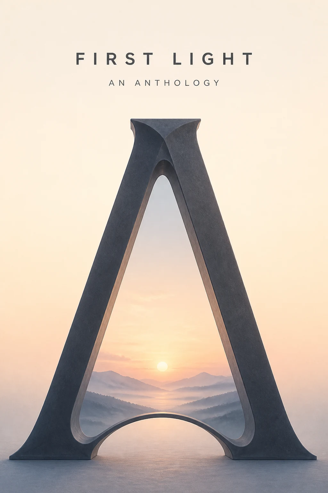

# First Light Drop-Cap Anthology Poster

## Use this when

Use this card when you need to promote a fictional anthology through one original drop cap. Use a Recipe when exact typography, preservation, structured repair, repeatability, or evidence matters.

## Required inputs

- A fictional or authorized subject brief and intended audience.
- The exact approved copy manifest, including an explicit `none` when no text is allowed.
- Visual motif, palette, type direction, composition rules, output size, and channel crop.

## Prompt

```text
COMMISSION
Create one 2:3 anthology promotion poster to promote a fictional anthology through one original drop cap. Use this independently authored concept: a monumental letter opening onto a pale dawn landscape.

CONTENT
Build the subject from {SUBJECT_BRIEF}. Render only the exact approved copy in {COPY_MANIFEST}; if the manifest says `none`, render no text. Do not add names, dates, sponsors, claims, labels, or calls to action outside that manifest.

VISUAL SYSTEM
Use {VISUAL_MOTIF}, {PALETTE}, and {TYPE_DIRECTION}. Organize the page as follows: drop cap fills the lower field while anthology copy sits in the quiet upper margin. Apply {COMPOSITION_RULES} for hierarchy, margins, crop, contrast, and reading order.

CONSTRAINTS
Use only fictional, public-domain, or authorized subject matter. No real brand, copied campaign, celebrity likeness, unsupported claim, unapproved logo, pseudo-writing, signature, or watermark.

OUTPUT INTENT
Return one flat anthology promotion poster at {OUTPUT_SIZE} in 2:3. Do not place it in a wall, frame, device, or merchandise mockup.
```

## Variables

- `{SUBJECT_BRIEF}`: fictional or authorized subject, audience, purpose, and factual details
- `{COPY_MANIFEST}`: complete allowed text with exact spelling and hierarchy, or `none`
- `{VISUAL_MOTIF}`: one original central motif and its visual role
- `{PALETTE}`: approved color names or values and contrast relationship
- `{TYPE_DIRECTION}`: project-owned typography character, weight, and case direction
- `{COMPOSITION_RULES}`: margins, reading order, focal position, safe zones, and crop behavior
- `{OUTPUT_SIZE}`: final pixel dimensions

## Negative constraints

- No copied poster, campaign system, trademark, copyrighted character, celebrity likeness, or unlicensed artwork.
- No misspelled, paraphrased, duplicated, invented, clipped, or decorative pseudo-text.
- No unsupported factual or product claim, signature, watermark, mockup scene, or extra design option.

## Quick check

Confirm the result reads as one anthology promotion poster, verify the exact copy against the manifest, and check the intended arrangement at thumbnail size: drop cap fills the lower field while anthology copy sits in the quiet upper margin. This is only an obvious-failure check.

## Rendered Sample



- Sample status: Rendered Sample.
- Generation surface: built-in image generation tool
- Generated at: `2026-08-30T22:51:37Z`
- Model: `not_exposed`
- Model version: `not_exposed`
- Seed: `not_exposed`
- Request parameters: `not_exposed`
- Request ID: `not_exposed`
- Exact prompt: [first-light-drop-cap-anthology-poster.prompt.txt](samples/first-light-drop-cap-anthology-poster/first-light-drop-cap-anthology-poster.prompt.txt)
- Output dimensions: `1024 x 1536`
- Output SHA-256: `b5471ef319202e6da1918be04ce97f5a9df3c3fd11f7f41f73b48d282bcf23d5`
- Profile ID: `null`
- Promotion evidence: `false`
- Human inspection: One monumental A frames the dawn horizon, with the two anthology lines held in the open upper field.
- Known misses: None observed at the reviewed master resolution.
- Rights and provenance: The concept, exact prompt, accepted image, and public WebP derivative are project-authored. Lossless masters and rejected attempts are retained privately with checksums. The public derivative may be reused under this repository's license; this record is illustrative evidence only.
## Rights and provenance

This Prompt Card is independently authored with `original` source posture. Use only fictional, public-domain, or properly authorized text, subjects, images, and type direction. It bundles no third-party prompt, poster, type artwork, or image.
