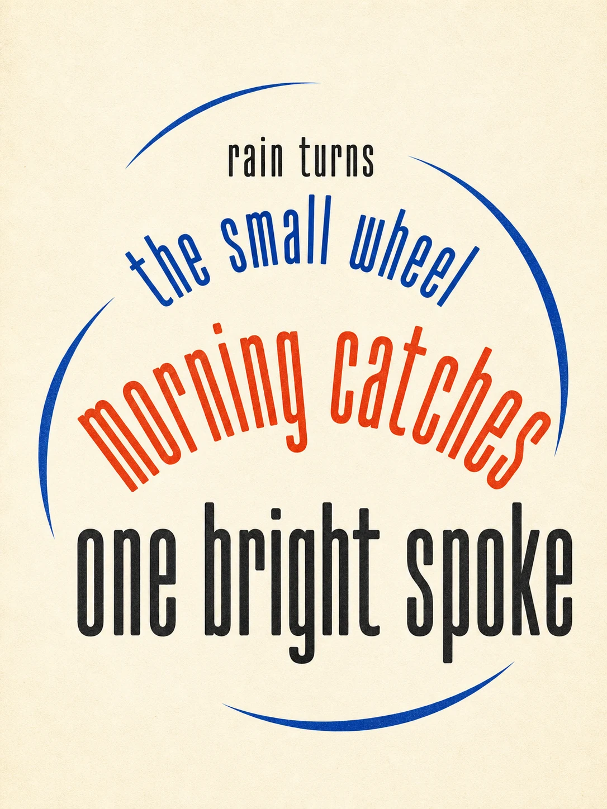

# Kinetic Word Poem Poster

## Use this when

Use this card for one typographic poster that turns a short project-authored poem into a controlled visual rhythm while preserving every word exactly. Use a Recipe for licensed literature, print production, or repeatability evidence.

## Required inputs

- A short project-authored or authorized poem with exact line breaks.
- Reading order, emphasis map, motion concept, and type direction.
- Palette, background, print size, and aspect ratio.

## Prompt

```text
SCENE
Create one portrait typographic poster on {BACKGROUND}, with no representational scene beyond {ABSTRACT_SUPPORT}.

SUBJECT
Use the exact poem {POEM_EXACT} as the complete visual subject, preserving the declared reading order {READING_ORDER}.

DETAILS
Express {MOTION_CONCEPT} through {TYPE_DIRECTION}, scale, spacing, rotation, and overlap rules in {EMPHASIS_MAP}. Use {PALETTE} and {COMPOSITION}; render every supplied word once unless repetition is explicitly listed in {AUTHORIZED_REPETITION}.

CONSTRAINTS
Preserve spelling, punctuation, capitalization, line breaks, and word order. No invented word, translation, paraphrase, decorative alphabet noise, unreadable overlap, copied poem, real type specimen, logo, signature, watermark, or unapproved text.

OUTPUT INTENT
Return one 3:4 kinetic word-poem poster at {OUTPUT_SIZE}, with the poem readable in the intended sequence and its rhythm visible before close reading.
```

## Variables

- `{BACKGROUND}`: one project-owned field color or texture.
- `{ABSTRACT_SUPPORT}`: restrained non-text geometry or `none`.
- `{POEM_EXACT}`: complete authorized poem with line breaks.
- `{READING_ORDER}`: explicit path through the text.
- `{MOTION_CONCEPT}`: one movement idea tied to the poem.
- `{TYPE_DIRECTION}`: independently specified letterform character.
- `{EMPHASIS_MAP}`: exact words and permitted transformations.
- `{PALETTE}`: limited approved colors.
- `{COMPOSITION}`: margins, focal zone, and negative space.
- `{AUTHORIZED_REPETITION}`: exact repeated words and counts, or `none`.
- `{OUTPUT_SIZE}`: final pixel dimensions.

## Negative constraints

- No copyrighted poem without documented permission and no imitation of a named living designer.
- No missing, added, merged, or duplicated word beyond the authorized repetition list.
- No illegible distortion, random filler glyphs, mockup frame, paper folds, signature, or watermark.

## Quick check

Transcribe the poster in reading order, compare every word and line break with the supplied poem, and confirm the movement remains legible without relying on invented text.

## Rendered Sample



- Sample status: Rendered Sample.
- Generation surface: built-in image generation tool
- Generated at: `2026-08-30T23:01:32Z`
- Model: `not_exposed`
- Model version: `not_exposed`
- Seed: `not_exposed`
- Request parameters: `not_exposed`
- Request ID: `not_exposed`
- Exact prompt: [kinetic-word-poem-poster.prompt.txt](samples/kinetic-word-poem-poster/kinetic-word-poem-poster.prompt.txt)
- Output dimensions: `1086 x 1448`
- Output SHA-256: `f662f977ded22a34078fabe9b6beb98f78b6e12de58df963d4510f2e63ef6409`
- Profile ID: `null`
- Promotion evidence: `false`
- Human inspection: The four poem lines scale and curve through cobalt arcs while preserving the intended top-to-bottom reading sequence.
- Known misses: None observed at the reviewed master resolution.
- Rights and provenance: The concept, exact prompt, accepted image, and public WebP derivative are project-authored. Lossless masters and rejected attempts are retained privately with checksums. The public derivative may be reused under this repository's license; this record is illustrative evidence only.
## Rights and provenance

Use project-authored text or retain documented permission for any supplied poem. This Prompt Card is independently authored, has source posture `original`, and includes no third-party prompt, poem, poster, font artwork, or image.
