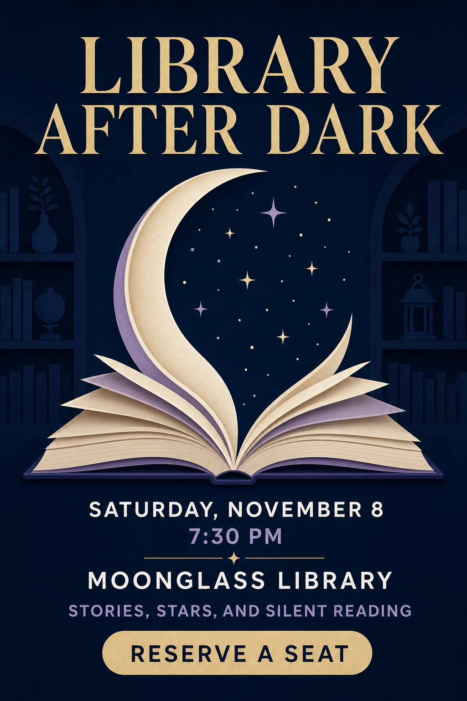

# Library After Dark Event Poster

## Use this when

Use this card for one fictional library event poster with a closed exact-text manifest and a strong nocturnal reading concept. Use the linked [Recipe](../../recipes/library-after-dark-event-poster/RECIPE.md) when exact typography, hierarchy, inspection, repair, or evidence matters.

## Required inputs

- Fictional event title, date, time, venue, program line, and call to action.
- Exact text manifest with fixed hierarchy and placement intent.
- Visual motif, palette, typography character, print size, and aspect ratio.

## Prompt

```text
SCENE
Create one portrait event poster for a fictional evening library program, set in {NIGHT_LIBRARY_SCENE}.

SUBJECT
Build the composition around {PRIMARY_MOTIF} and the exact headline {HEADLINE_EXACT}, with the event details clearly subordinate.

DETAILS
Render only {EXACT_TEXT_MANIFEST} in the hierarchy {TYPE_HIERARCHY}. Use {VISUAL_SYSTEM}, {ILLUSTRATION_STYLE}, and {SPATIAL_COMPOSITION}; keep the headline, date, time, venue, and action distinct and readable.

CONSTRAINTS
Preserve every supplied character, line break, date, time, and location. No invented sponsor, logo, book title, author, QR code, decorative pseudo-writing, duplicate text, clipped type, signature, watermark, or unapproved copy.

OUTPUT INTENT
Return one finished 2:3 event poster at {OUTPUT_SIZE}, with a memorable nighttime reading atmosphere and exact information readable at print and thumbnail size.
```

## Variables

- `{NIGHT_LIBRARY_SCENE}`: fictional interior or exterior context.
- `{PRIMARY_MOTIF}`: one central visual idea tied to books and night.
- `{HEADLINE_EXACT}`: exact event headline.
- `{EXACT_TEXT_MANIFEST}`: complete allowed text, including date, time, venue, program line, and action.
- `{TYPE_HIERARCHY}`: ordered levels and intended placements.
- `{VISUAL_SYSTEM}`: project-owned palette, typography direction, rules, and contrast.
- `{ILLUSTRATION_STYLE}`: independently specified image-making approach.
- `{SPATIAL_COMPOSITION}`: focal position, negative space, and reading order.
- `{OUTPUT_SIZE}`: final pixel dimensions.

## Negative constraints

- No misspelled, duplicated, paraphrased, translated, or invented event text.
- No real library branding, publisher marks, copyrighted book covers, author likenesses, or sponsor logos.
- No illegible decorative lettering, excessive glow, ornamental clutter, mockup frame, folds, signatures, or watermarks.

## Quick check

Transcribe every visible string back to the manifest, confirm the headline reads first and logistics second, and inspect all text edges for clipping or pseudo-characters.

## Rendered Sample



- Sample status: Rendered Sample.
- Generation surface: built-in image generation tool
- Generated at: `2026-08-30T23:01:32Z`
- Model: `not_exposed`
- Model version: `not_exposed`
- Seed: `not_exposed`
- Request parameters: `not_exposed`
- Request ID: `not_exposed`
- Exact prompt: [library-after-dark-event-poster.prompt.txt](samples/library-after-dark-event-poster/library-after-dark-event-poster.prompt.txt)
- Output dimensions: `1024 x 1536`
- Output SHA-256: `597a62f151c977f2628493a7abe876d199085e09050c0a1293a3959f5025079e`
- Profile ID: `null`
- Promotion evidence: `false`
- Human inspection: The crescent-book motif holds the center while all six approved copy lines read in a clear top-to-bottom hierarchy.
- Known misses: None observed at the reviewed master resolution.
- Rights and provenance: The concept, exact prompt, accepted image, and public WebP derivative are project-authored. Lossless masters and rejected attempts are retained privately with checksums. The public derivative may be reused under this repository's license; this record is illustrative evidence only.
## Rights and provenance

Use fictional event details and project-owned text and art direction. This Prompt Card is independently authored, has source posture `original`, and includes no third-party prompt, poster, type artwork, or image.
