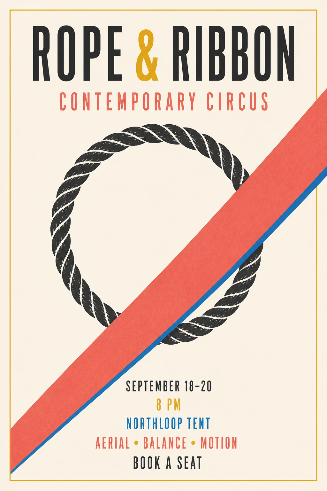

# Rope and Ribbon Circus Sketch Poster

## Use this when

Use this card when you need to translate an authorized composition sketch into a fictional contemporary circus poster. Use a Recipe when exact typography, preservation, structured repair, repeatability, or evidence matters.

## Required inputs

- A fictional or authorized subject brief and intended audience.
- The exact approved copy manifest, including an explicit `none` when no text is allowed.
- Visual motif, palette, type direction, composition rules, output size, and channel crop.
- One attached layout or product sketch and confirmation that it is authorized for this use.
- A sketch-flexibility note naming protected zones, landmarks, and details open to interpretation.

## Prompt

```text
COMMISSION
Create one 2:3 circus poster to translate an authorized composition sketch into a fictional contemporary circus poster. Use this independently authored concept: a rope loop and ribbon slash create a balanced aerial gesture.

SKETCH INPUT
Use the attached authorized {LAYOUT_SKETCH} only as a structural guide. Honor {SKETCH_FLEXIBILITY}, including protected zones, hierarchy, and landmarks. Do not trace distinctive artwork, reproduce sketch text, add a signature, or invent functional details.

CONTENT
Build the subject from {SUBJECT_BRIEF}. Render only the exact approved copy in {COPY_MANIFEST}; if the manifest says `none`, render no text. Do not add names, dates, sponsors, claims, labels, or calls to action outside that manifest.

VISUAL SYSTEM
Use {VISUAL_MOTIF}, {PALETTE}, and {TYPE_DIRECTION}. Organize the page as follows: honor the sketch's protected zones while refining type and negative space. Apply {COMPOSITION_RULES} for hierarchy, margins, crop, contrast, and reading order.

CONSTRAINTS
Use only fictional, public-domain, or authorized subject matter. No real brand, copied campaign, celebrity likeness, unsupported claim, unapproved logo, pseudo-writing, signature, or watermark.

OUTPUT INTENT
Return one flat circus poster at {OUTPUT_SIZE} in 2:3. Do not place it in a wall, frame, device, or merchandise mockup.
```

## Variables

- `{SUBJECT_BRIEF}`: fictional or authorized subject, audience, purpose, and factual details
- `{COPY_MANIFEST}`: complete allowed text with exact spelling and hierarchy, or `none`
- `{VISUAL_MOTIF}`: one original central motif and its visual role
- `{PALETTE}`: approved color names or values and contrast relationship
- `{TYPE_DIRECTION}`: project-owned typography character, weight, and case direction
- `{COMPOSITION_RULES}`: margins, reading order, focal position, safe zones, and crop behavior
- `{OUTPUT_SIZE}`: final pixel dimensions
- `{LAYOUT_SKETCH}`: attached authorized sketch used only as a structural guide
- `{SKETCH_FLEXIBILITY}`: protected landmarks and the degree of allowed refinement

## Negative constraints

- No copied poster, campaign system, trademark, copyrighted character, celebrity likeness, or unlicensed artwork.
- No misspelled, paraphrased, duplicated, invented, clipped, or decorative pseudo-text.
- No unsupported factual or product claim, signature, watermark, mockup scene, or extra design option.

## Quick check

Confirm the result reads as one circus poster, verify the exact copy against the manifest, and check the intended arrangement at thumbnail size: honor the sketch's protected zones while refining type and negative space. This is only an obvious-failure check.

## Rendered Sample



- Sample status: Rendered Sample.
- Generation surface: built-in image generation tool
- Generated at: `2026-08-30T23:57:37Z`
- Model: `not_exposed`
- Model version: `not_exposed`
- Seed: `not_exposed`
- Request parameters: `not_exposed`
- Request ID: `not_exposed`
- Exact prompt: [rope-ribbon-circus-sketch-poster.prompt.txt](samples/rope-ribbon-circus-sketch-poster/rope-ribbon-circus-sketch-poster.prompt.txt)
- Output dimensions: `1024 x 1536`
- Output SHA-256: `93b7b26832a84ee32f77ae18d3f9f3fc2f748ec7f1be811414e88ca3261df0e7`
- Profile ID: `null`
- Promotion evidence: `false`
- Human inspection: One charcoal rope loop is crossed once by one coral ribbon slash with a cobalt edge between header and footer.
- Known misses: None observed at the reviewed master resolution.
- Rights and provenance: The concept, exact prompt, accepted image, and public WebP derivative are project-authored. Lossless masters and rejected attempts are retained privately with checksums. The public derivative may be reused under this repository's license; this record is illustrative evidence only.
- Supporting inputs:
  - [input-01-layout-sketch.webp](samples/rope-ribbon-circus-sketch-poster/input-01-layout-sketch.webp): project-authored fictional layout sketch input
## Rights and provenance

This Prompt Card is independently authored with `original` source posture. Use only fictional, public-domain, or properly authorized text, subjects, images, and type direction. The sketch must be owned or explicitly authorized and used only within the declared flexibility boundary.
