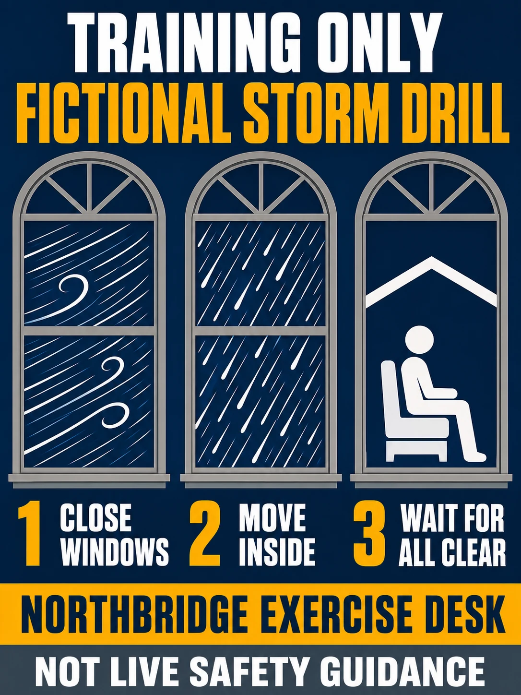

# Storm Window Weather Alert Poster

## Use this when

Use this card when you need to communicate a fictional training-only severe-weather preparation notice. Use a Recipe when exact typography, preservation, structured repair, repeatability, or evidence matters.

## Required inputs

- A fictional training brief and intended training audience.
- The exact approved copy manifest, including an explicit `none` when no text is allowed.
- Exact wording for a prominent training-only notice; never use the generated output for live safety guidance.
- Visual motif, palette, type direction, composition rules, output size, and channel crop.

## Prompt

```text
COMMISSION
Create one 3:4 public weather alert poster to communicate a fictional severe-weather preparation notice. Use this independently authored concept: three window panels show wind, rain, and safe shelter actions.

CONTENT
Build the subject from {SUBJECT_BRIEF}. Render only the exact approved copy in {COPY_MANIFEST}; if the manifest says `none`, render no text. Do not add names, dates, sponsors, claims, labels, or calls to action outside that manifest.

VISUAL SYSTEM
Use {VISUAL_MOTIF}, {PALETTE}, and {TYPE_DIRECTION}. Organize the page as follows: alert level first, action sequence second, official fictional contact last. Apply {COMPOSITION_RULES} for hierarchy, margins, crop, contrast, and reading order.

CONSTRAINTS
Use only fictional training subject matter. Include the exact supplied training-only notice prominently. This generated concept must not be used for live safety, emergency, closure, route, or weather guidance. No real brand, copied campaign, celebrity likeness, unsupported claim, unapproved logo, pseudo-writing, signature, or watermark.

OUTPUT INTENT
Return one flat public weather alert poster at {OUTPUT_SIZE} in 3:4. Do not place it in a wall, frame, device, or merchandise mockup.
```

## Variables

- `{SUBJECT_BRIEF}`: fictional or authorized subject, audience, purpose, and factual details
- `{COPY_MANIFEST}`: complete allowed text with exact spelling and hierarchy, or `none`
- `{VISUAL_MOTIF}`: one original central motif and its visual role
- `{PALETTE}`: approved color names or values and contrast relationship
- `{TYPE_DIRECTION}`: project-owned typography character, weight, and case direction
- `{COMPOSITION_RULES}`: margins, reading order, focal position, safe zones, and crop behavior
- `{OUTPUT_SIZE}`: final pixel dimensions

## Negative constraints

- No copied poster, campaign system, trademark, copyrighted character, celebrity likeness, or unlicensed artwork.
- No misspelled, paraphrased, duplicated, invented, clipped, or decorative pseudo-text.
- No unsupported factual or product claim, signature, watermark, mockup scene, or extra design option.
- No live deployment, real route or facility, operational instruction, emergency authority, or safety assurance.

## Quick check

Confirm the result reads as one public weather alert poster, verify the exact copy against the manifest, and check the intended arrangement at thumbnail size: alert level first, action sequence second, official fictional contact last. This is only an obvious-failure check. Confirm the training-only notice is prominent.

## Rendered Sample



- Sample status: Rendered Sample.
- Generation surface: built-in image generation tool
- Generated at: `2026-08-31T00:25:08Z`
- Model: `not_exposed`
- Model version: `not_exposed`
- Seed: `not_exposed`
- Request parameters: `not_exposed`
- Request ID: `not_exposed`
- Exact prompt: [storm-window-weather-alert-poster.prompt.txt](samples/storm-window-weather-alert-poster/storm-window-weather-alert-poster.prompt.txt)
- Output dimensions: `1086 x 1448`
- Output SHA-256: `89ed0c100038bad835cfef177421e8fed3fb13b894e61c1a06bbe5e8c77dceaa`
- Profile ID: `null`
- Promotion evidence: `false`
- Human inspection: Three window panels depict wind, rain, and shelter with the three numbered actions aligned directly below.
- Known misses: None observed at the reviewed master resolution.
- Rights and provenance: The concept, exact prompt, accepted image, and public WebP derivative are project-authored. Lossless masters and rejected attempts are retained privately with checksums. The public derivative may be reused under this repository's license; this record is illustrative evidence only.
## Rights and provenance

This Prompt Card is independently authored with `original` source posture. Use only fictional, public-domain, or properly authorized text, subjects, images, and type direction. It bundles no third-party prompt, poster, type artwork, or image.
