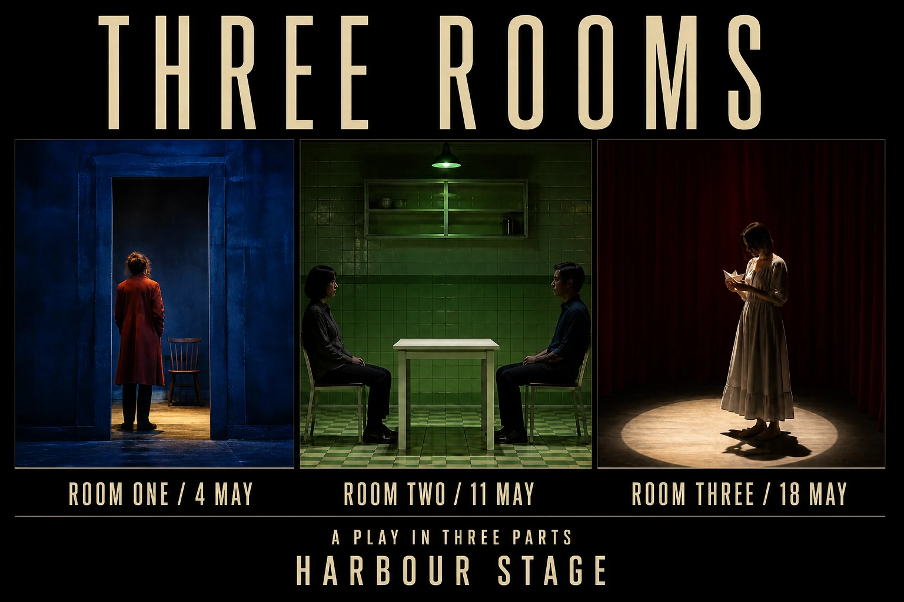

# Three Rooms Theatre Campaign Triptych

## Use this when

Use this card when you need to combine three authorized production stills into a fictional theatre campaign. Use a Recipe when exact typography, preservation, structured repair, repeatability, or evidence matters.

## Required inputs

- A fictional or authorized subject brief and intended audience.
- The exact approved copy manifest, including an explicit `none` when no text is allowed.
- Visual motif, palette, type direction, composition rules, output size, and channel crop.
- The complete attached source-image set, with authorization confirmed for every image.
- An image-role manifest and per-asset preservation rules.

## Prompt

```text
COMMISSION
Create one 3:2 theatre campaign triptych to combine three authorized production stills into a fictional theatre campaign. Use this independently authored concept: each still occupies a distinct room-shaped frame sharing one threshold line.

SOURCE IMAGE SET
Use only the authorized images in {SOURCE_IMAGES}, assigning each exactly the role in {IMAGE_ROLE_MANIFEST}. Preserve {PRESERVE_RULES}. Keep people, products, artwork, and source identities separate unless the manifest explicitly authorizes a relationship; do not invent or merge assets.

CONTENT
Build the subject from {SUBJECT_BRIEF}. Render only the exact approved copy in {COPY_MANIFEST}; if the manifest says `none`, render no text. Do not add names, dates, sponsors, claims, labels, or calls to action outside that manifest.

VISUAL SYSTEM
Use {VISUAL_MOTIF}, {PALETTE}, and {TYPE_DIRECTION}. Organize the page as follows: three equal panels with one spanning title and separate performance dates. Apply {COMPOSITION_RULES} for hierarchy, margins, crop, contrast, and reading order.

CONSTRAINTS
Use only fictional, public-domain, or authorized subject matter. No real brand, copied campaign, celebrity likeness, unsupported claim, unapproved logo, pseudo-writing, signature, or watermark.

OUTPUT INTENT
Return one flat theatre campaign triptych at {OUTPUT_SIZE} in 3:2. Do not place it in a wall, frame, device, or merchandise mockup.
```

## Variables

- `{SUBJECT_BRIEF}`: fictional or authorized subject, audience, purpose, and factual details
- `{COPY_MANIFEST}`: complete allowed text with exact spelling and hierarchy, or `none`
- `{VISUAL_MOTIF}`: one original central motif and its visual role
- `{PALETTE}`: approved color names or values and contrast relationship
- `{TYPE_DIRECTION}`: project-owned typography character, weight, and case direction
- `{COMPOSITION_RULES}`: margins, reading order, focal position, safe zones, and crop behavior
- `{OUTPUT_SIZE}`: final pixel dimensions
- `{SOURCE_IMAGES}`: complete set of attached authorized source images
- `{IMAGE_ROLE_MANIFEST}`: one permitted role for each source image
- `{PRESERVE_RULES}`: per-image identity, geometry, copy, crop, and relationship constraints

## Negative constraints

- No copied poster, campaign system, trademark, copyrighted character, celebrity likeness, or unlicensed artwork.
- No misspelled, paraphrased, duplicated, invented, clipped, or decorative pseudo-text.
- No unsupported factual or product claim, signature, watermark, mockup scene, or extra design option.

## Quick check

Confirm the result reads as one theatre campaign triptych, verify the exact copy against the manifest, and check the intended arrangement at thumbnail size: three equal panels with one spanning title and separate performance dates. This is only an obvious-failure check.

## Rendered Sample



- Sample status: Rendered Sample.
- Generation surface: built-in image generation tool
- Generated at: `2026-08-31T00:25:08Z`
- Model: `not_exposed`
- Model version: `not_exposed`
- Seed: `not_exposed`
- Request parameters: `not_exposed`
- Request ID: `not_exposed`
- Exact prompt: [three-rooms-theatre-campaign-triptych.prompt.txt](samples/three-rooms-theatre-campaign-triptych/three-rooms-theatre-campaign-triptych.prompt.txt)
- Output dimensions: `1536 x 1024`
- Output SHA-256: `a5695709990709cee4e15727b607ae3e3b9e9774006ee44e32a02eb29abc0881`
- Profile ID: `null`
- Promotion evidence: `false`
- Human inspection: Three equal blue, green, and red stills preserve the one/two/one figure counts and align with the correct room/date labels.
- Known misses: None observed at the reviewed master resolution.
- Rights and provenance: The concept, exact prompt, accepted image, and public WebP derivative are project-authored. Lossless masters and rejected attempts are retained privately with checksums. The public derivative may be reused under this repository's license; this record is illustrative evidence only.
- Supporting inputs:
  - [input-01-room-one-still.webp](samples/three-rooms-theatre-campaign-triptych/input-01-room-one-still.webp): project-authored fictional room one still input
  - [input-02-room-two-still.webp](samples/three-rooms-theatre-campaign-triptych/input-02-room-two-still.webp): project-authored fictional room two still input
  - [input-03-room-three-still.webp](samples/three-rooms-theatre-campaign-triptych/input-03-room-three-still.webp): project-authored fictional room three still input
## Rights and provenance

This Prompt Card is independently authored with `original` source posture. Use only fictional, public-domain, or properly authorized text, subjects, images, and type direction. Every source image must be owned or explicitly authorized, with a declared role and preservation rule.
