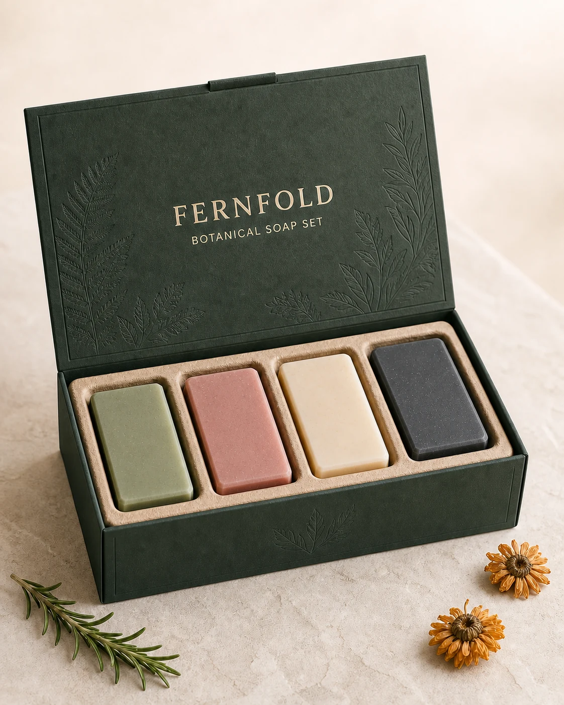

# Botanical Soap Gift Box Mockup

## Use this when

Use this card for a fictional or authorized gift-box mockup containing a small declared set of botanical soaps. Use a Recipe when exact package text, die-line fidelity, or publication evidence is required.

## Required inputs

- Box structure, materials, finish, and open or closed state.
- Exact soap count, forms, colors, and botanical cues.
- Approved package text, scene, camera view, and aspect ratio.

## Prompt

```text
SCENE
Create a refined tabletop packaging scene on {SURFACE}, viewed from {CAMERA_VIEW}, with {BACKGROUND} and {LIGHTING}.

SUBJECT
Show one {GIFT_BOX_NAME} botanical soap gift box in {BOX_STATE}, containing exactly {SOAP_MANIFEST}.

DETAILS
Use {BOX_MATERIALS}, {INSERT_DESCRIPTION}, and restrained botanical accents from {BOTANICAL_PROPS}. Render only this approved package text: {EXACT_TEXT}.

CONSTRAINTS
Keep the box construction plausible, every soap distinct and correctly counted, and all text legible and unchanged. No extra products, loose labels, duplicated botanicals, cosmetic claims, certification seals, prices, logos, watermarks, or unapproved copy.

OUTPUT INTENT
Return one premium gift-box mockup at {ASPECT_RATIO}, with the package fully visible and the soaps presented as a coherent set.
```

## Variables

- `{SURFACE}`: tabletop material and color.
- `{CAMERA_VIEW}`: approved viewpoint, height, and lens character.
- `{BACKGROUND}`: backdrop color and depth.
- `{LIGHTING}`: direction, softness, and highlight character.
- `{GIFT_BOX_NAME}`: fictional or authorized product name.
- `{BOX_STATE}`: closed, open, or lid-offset presentation.
- `{SOAP_MANIFEST}`: exact number, shape, color, and placement of soaps.
- `{BOX_MATERIALS}`: board, paper, print, foil, or closure details.
- `{INSERT_DESCRIPTION}`: tray, tissue, dividers, and fit.
- `{BOTANICAL_PROPS}`: closed list of allowed leaves or flowers.
- `{EXACT_TEXT}`: exact approved strings, or `none`.
- `{ASPECT_RATIO}`: final width-to-height ratio.

## Negative constraints

- No therapeutic, organic, sustainable, or ingredient claims unless approved.
- No malformed box folds, floating lid, fused soaps, or incorrect item count.
- No extra labels, ribbons, flowers, containers, or readable text.

## Quick check

Count the soaps, inspect the box folds and insert fit, and compare every visible character with the approved text list.

## Rendered Sample



- Sample status: Rendered Sample.
- Generation surface: built-in image generation tool
- Generated at: `2026-08-30T22:29:49Z`
- Model: `not_exposed`
- Model version: `not_exposed`
- Seed: `not_exposed`
- Request parameters: `not_exposed`
- Request ID: `not_exposed`
- Exact prompt: [botanical-soap-gift-box-mockup.prompt.txt](samples/botanical-soap-gift-box-mockup/botanical-soap-gift-box-mockup.prompt.txt)
- Output dimensions: `1122 x 1402`
- Output SHA-256: `b2172ae732ee80a641406e59e0824c538dfd98a8f8cb58f11750fa17350dfd56`
- Profile ID: `null`
- Promotion evidence: `false`
- Human inspection: Confirmed one plausible open box, exactly four plain soap bars in the four requested colors, one rosemary sprig, two calendula heads, exact FERNFOLD and BOTANICAL SOAP SET copy, and no claims, seals, or watermark.
- Known misses: The box embossing and molded-pulp tolerances are illustrative; package dieline accuracy and print production readiness are not established.
- Rights and provenance: The concept, exact prompt, accepted image, and public WebP derivative are project-authored. Lossless masters and rejected attempts are retained privately with checksums. The public derivative may be reused under this repository's license; this record is illustrative evidence only.
## Rights and provenance

Use only fictional or authorized packaging, names, copy, and botanical assets. This Prompt Card is independently authored, has source posture `original`, and includes no third-party prompt or image.
