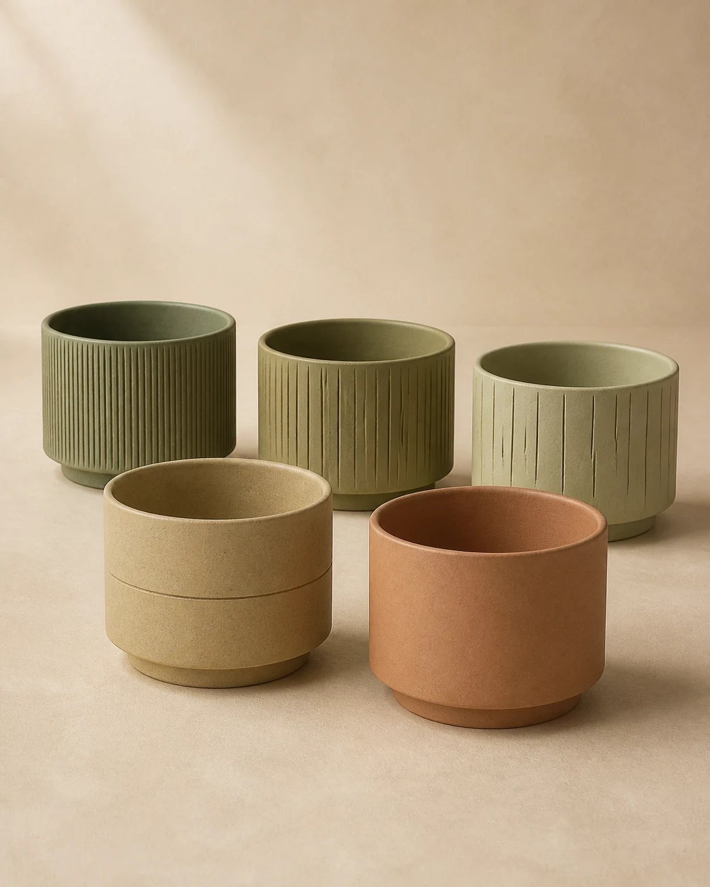

# Claygrove Planter Collection

## Use this when

Use this card when you need to present five fictional ceramic planters as one family. Use a Recipe when exact geometry preservation, claims review, repair, repeated comparison, or evidence matters.

## Required inputs

- A fictional or authorized product brief with exact form, components, and intended channel.
- Material, finish, color, package-content, and accessory manifest.
- Approved copy or explicit `none`, plus camera view, lighting, background, and output size.

## Prompt

```text
COMMISSION
Create one 4:5 homeware collection image to present five fictional ceramic planters as one family. Use this independently authored concept: five low-relief textures progress from grove lines to smooth clay.

PRODUCT
Use {PRODUCT_BRIEF} and build only the declared form, components, materials, finishes, and approved accessories in {MATERIAL_MANIFEST}. Do not invent a feature, certification, ingredient, performance result, compatibility statement, or package content.

PRESENTATION
Use {CAMERA_VIEW}, {LIGHTING}, and {BACKGROUND}. Arrange the product as follows: staggered group with clear silhouettes, consistent scale cues, and no plants. Render only {APPROVED_COPY}; if it says `none`, render no text or logo.

CONSTRAINTS
Use a fictional product or an authorized product brief. Keep declared geometry, part count, scale, color, and materials consistent. No real brand, copied package, unsupported claim, celebrity endorsement, signature, watermark, or unapproved accessory.

OUTPUT INTENT
Return one clean homeware collection image at {OUTPUT_SIZE} in 4:5, with the product fully visible and no unrelated props.
```

## Variables

- `{PRODUCT_BRIEF}`: fictional or authorized product identity, geometry, purpose, and channel
- `{MATERIAL_MANIFEST}`: exact components, counts, materials, finishes, colors, and allowed accessories
- `{CAMERA_VIEW}`: camera height, angle, lens character, crop, and scale relationship
- `{LIGHTING}`: declared studio or environmental lighting and shadow behavior
- `{BACKGROUND}`: surface, set, or plain field allowed behind the product
- `{APPROVED_COPY}`: complete allowed product and campaign text, or `none`
- `{OUTPUT_SIZE}`: final pixel dimensions

## Negative constraints

- No real brand, copied packaging, trademark, celebrity likeness, signature, watermark, or unlicensed design feature.
- No invented component, material, accessory, package content, label copy, certification, performance result, or product claim.
- No duplicated product, warped geometry, unreadable approved copy, unrelated prop, decorative pseudo-text, or mock marketplace UI.

## Quick check

Count the declared products and components, compare form and materials with the manifest, and check the intended arrangement: staggered group with clear silhouettes, consistent scale cues, and no plants. This does not establish preservation reliability or product readiness.

## Rendered Sample



- Sample status: Rendered Sample.
- Generation surface: built-in image generation tool
- Generated at: `2026-08-30T22:35:57Z`
- Model: `not_exposed`
- Model version: `not_exposed`
- Seed: `not_exposed`
- Request parameters: `not_exposed`
- Request ID: `not_exposed`
- Exact prompt: [claygrove-planter-collection.prompt.txt](samples/claygrove-planter-collection/claygrove-planter-collection.prompt.txt)
- Output dimensions: `1122 x 1402`
- Output SHA-256: `652c3f6218de3ffa422506300c07845b64c3d3be295b53c9c79761985578fbf4`
- Profile ID: `null`
- Promotion evidence: `false`
- Human inspection: Passed: exactly five empty planters are fully framed, consistent in scale, and differentiated by the requested surface progression and five mineral-slip colors.
- Known misses: The surface progression is communicated visually rather than with labels.
- Rights and provenance: The concept, exact prompt, accepted image, and public WebP derivative are project-authored. Lossless masters and rejected attempts are retained privately with checksums. The public derivative may be reused under this repository's license; this record is illustrative evidence only.
## Rights and provenance

This Prompt Card is independently authored with `original` source posture. Use only fictional or properly authorized product geometry, packaging, copy, names, and images. It bundles no third-party prompt, product design, package artwork, or image.
