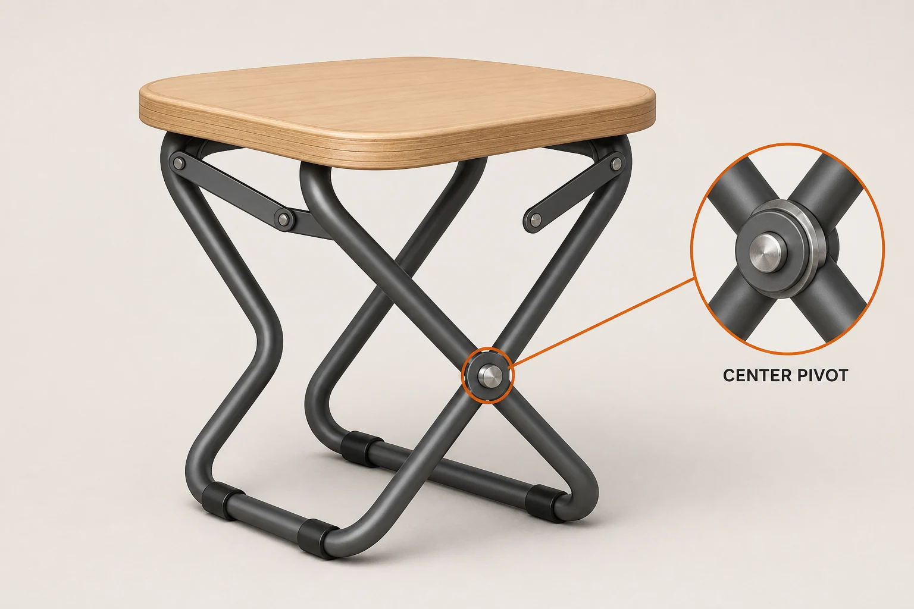

# Folding Stool Feature Callout

## Use this when

Use this card for one product image that highlights a single approved mechanical feature of a fictional or authorized folding stool. Use a Recipe for exact engineering communication, safety claims, or formal inspection.

## Required inputs

- Stool geometry, materials, finish, and authorized design details.
- An optional authorized mechanism sketch, or `none` when the text brief is sufficient.
- One feature to highlight and its factual approved description.
- View, background, callout style, text allowance, and aspect ratio.

## Prompt

```text
REFERENCE INPUT
Use {OPTIONAL_MECHANISM_SKETCH} only as an authorized structural guide. If it is `none`, rely on the approved text geometry and do not invent hidden mechanisms.

SCENE
Create a spare product-demonstration studio on {BACKGROUND}, using {LIGHTING}.

SUBJECT
Show exactly one {STOOL_NAME} folding stool in {POSE}, viewed from {CAMERA_VIEW}.

DETAILS
Render {MATERIALS_AND_FINISH} and preserve {STRUCTURAL_GEOMETRY}. Highlight only {FEATURE_NAME} according to {FEATURE_DESCRIPTION}, using {CALLOUT_STYLE}. If text is allowed, render exactly {EXACT_TEXT}; otherwise use no text.

CONSTRAINTS
Keep the stool mechanically plausible, stable, fully visible, and free of invented parts. No exploded components, impossible hinges, duplicated legs, extra products, people, tools, logos, measurements, claims, watermarks, or unapproved labels.

OUTPUT INTENT
Return one clear feature-callout image at {ASPECT_RATIO}, with the product dominant and the highlighted feature immediately understandable.
```

## Variables

- `{OPTIONAL_MECHANISM_SKETCH}`: attached authorized sketch, or `none`.
- `{BACKGROUND}`: simple studio background.
- `{LIGHTING}`: key direction, softness, and shadow treatment.
- `{STOOL_NAME}`: fictional or authorized product name.
- `{POSE}`: open, partially folded, or folded state.
- `{CAMERA_VIEW}`: declared three-dimensional view.
- `{MATERIALS_AND_FINISH}`: seat, frame, hinge, and foot materials.
- `{STRUCTURAL_GEOMETRY}`: exact leg, brace, and hinge relationships.
- `{FEATURE_NAME}`: one factual feature to highlight.
- `{FEATURE_DESCRIPTION}`: approved factual description of that feature.
- `{CALLOUT_STYLE}`: ring, glow, leader line, or inset without invented data.
- `{EXACT_TEXT}`: approved short label, or `none`.
- `{ASPECT_RATIO}`: final width-to-height ratio.

## Negative constraints

- No unsupported load ratings, ergonomic claims, dimensions, or certifications.
- No mechanically impossible fold, disconnected brace, floating fastener, or unstable stance.
- No second feature competing with the declared callout.

## Quick check

Trace every leg, brace, and hinge, then confirm the callout points to the correct feature and contains only approved text.

## Rendered Sample



- Sample status: Rendered Sample.
- Generation surface: built-in image generation tool
- Generated at: `2026-08-30T23:30:48Z`
- Model: `not_exposed`
- Model version: `not_exposed`
- Seed: `not_exposed`
- Request parameters: `not_exposed`
- Request ID: `not_exposed`
- Exact prompt: [folding-stool-feature-callout.prompt.txt](samples/folding-stool-feature-callout/folding-stool-feature-callout.prompt.txt)
- Output dimensions: `1536 x 1024`
- Output SHA-256: `04560268ad4f7d82b6ccbcd23a7df35fb16b303e841e98913929c237dbffdeca`
- Profile ID: `null`
- Promotion evidence: `false`
- Human inspection: Passed: one mechanically traceable open stool preserves the authorized sketch landmarks and highlights only the central pivot with one correctly labeled inset.
- Known misses: The visualization explains visible geometry only and is not load, safety, or engineering evidence.
- Rights and provenance: The concept, exact prompt, accepted image, and public WebP derivative are project-authored. Lossless masters and rejected attempts are retained privately with checksums. The public derivative may be reused under this repository's license; this record is illustrative evidence only.
- Supporting inputs:
  - [input-01-mechanism-sketch.webp](samples/folding-stool-feature-callout/input-01-mechanism-sketch.webp): project-authored fictional mechanism sketch input
## Rights and provenance

Use only fictional or authorized product designs, sketches, and approved factual descriptions. This Prompt Card is independently authored, has source posture `original`, and bundles no third-party prompt or image.
