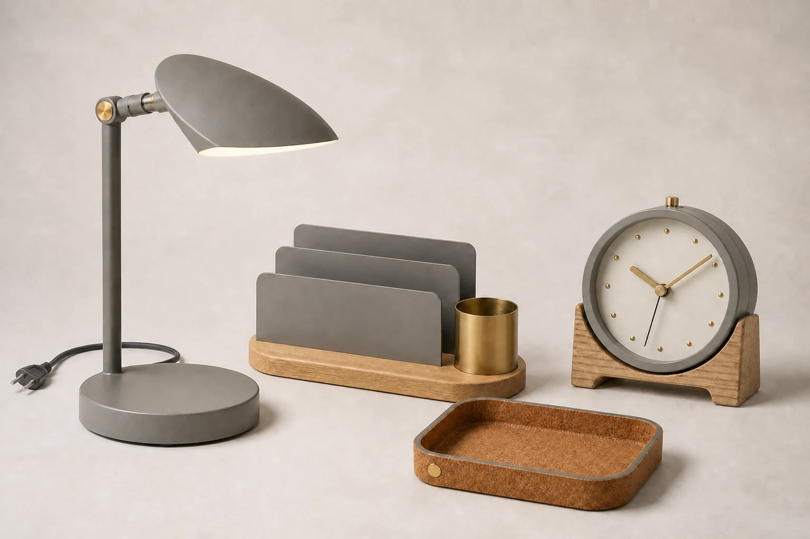

# Home Office Bundle Source Composition

## Use this when

Use this card when you need to compose authorized photographs of a lamp, organizer, tray, and clock into one fictional bundle. Use a Recipe when exact geometry preservation, claims review, repair, repeated comparison, or evidence matters.

## Required inputs

- A fictional or authorized product brief with exact form, components, and intended channel.
- Material, finish, color, package-content, and accessory manifest.
- Approved copy or explicit `none`, plus camera view, lighting, background, and output size.
- The complete attached source-image set, with authorization confirmed for every image.
- An image-role manifest and per-asset preservation rules.

## Prompt

```text
COMMISSION
Create one 3:2 multi-product bundle image to compose authorized photographs of a lamp, organizer, tray, and clock into one fictional bundle. Use this independently authored concept: four preserved products form a tidy stepped desktop arrangement.

SOURCE IMAGE SET
Use only the authorized images in {SOURCE_IMAGES}, assigning each exactly the role in {IMAGE_ROLE_MANIFEST}. Preserve {PRESERVE_RULES}. Keep people, products, artwork, and source identities separate unless the manifest explicitly authorizes a relationship; do not invent or merge assets.

PRODUCT
Use {PRODUCT_BRIEF} and build only the declared form, components, materials, finishes, and approved accessories in {MATERIAL_MANIFEST}. Do not invent a feature, certification, ingredient, performance result, compatibility statement, or package content.

PRESENTATION
Use {CAMERA_VIEW}, {LIGHTING}, and {BACKGROUND}. Arrange the product as follows: one coherent scene with each source asset separate, uncropped, and correctly scaled. Render only {APPROVED_COPY}; if it says `none`, render no text or logo.

CONSTRAINTS
Use a fictional product or an authorized product brief. Keep declared geometry, part count, scale, color, and materials consistent. No real brand, copied package, unsupported claim, celebrity endorsement, signature, watermark, or unapproved accessory.

OUTPUT INTENT
Return one clean multi-product bundle image at {OUTPUT_SIZE} in 3:2, with the product fully visible and no unrelated props.
```

## Variables

- `{PRODUCT_BRIEF}`: fictional or authorized product identity, geometry, purpose, and channel
- `{MATERIAL_MANIFEST}`: exact components, counts, materials, finishes, colors, and allowed accessories
- `{CAMERA_VIEW}`: camera height, angle, lens character, crop, and scale relationship
- `{LIGHTING}`: declared studio or environmental lighting and shadow behavior
- `{BACKGROUND}`: surface, set, or plain field allowed behind the product
- `{APPROVED_COPY}`: complete allowed product and campaign text, or `none`
- `{OUTPUT_SIZE}`: final pixel dimensions
- `{SOURCE_IMAGES}`: complete set of attached authorized source images
- `{IMAGE_ROLE_MANIFEST}`: one permitted role for each source image
- `{PRESERVE_RULES}`: per-image identity, geometry, copy, crop, and relationship constraints

## Negative constraints

- No real brand, copied packaging, trademark, celebrity likeness, signature, watermark, or unlicensed design feature.
- No invented component, material, accessory, package content, label copy, certification, performance result, or product claim.
- No duplicated product, warped geometry, unreadable approved copy, unrelated prop, decorative pseudo-text, or mock marketplace UI.

## Quick check

Count the declared products and components, compare form and materials with the manifest, and check the intended arrangement: one coherent scene with each source asset separate, uncropped, and correctly scaled. This does not establish preservation reliability or product readiness.

## Rendered Sample



- Sample status: Rendered Sample.
- Generation surface: built-in image generation tool
- Generated at: `2026-08-30T22:06:30Z`
- Model: `not_exposed`
- Model version: `not_exposed`
- Seed: `not_exposed`
- Request parameters: `not_exposed`
- Request ID: `not_exposed`
- Exact prompt: [home-office-bundle-source-composition.prompt.txt](samples/home-office-bundle-source-composition/home-office-bundle-source-composition.prompt.txt)
- Output dimensions: `1536 x 1024`
- Output SHA-256: `5c5b91a296a9a36ac48a72c4cd61c645f6a3dfd305e601a67b685c27bc7f6a39`
- Profile ID: `null`
- Promotion evidence: `false`
- Human inspection: The accepted derivative contains exactly one lamp, one organizer with three dividers and one brass cup, one empty cork tray, and one clock with its cradle and twelve dot markers. All four products are fully visible, distinct, unbranded, and free of visible text or watermarks. A second attempt corrected the lamp cord so its loop and plug remain inside the frame.
- Known misses: Exact pixel-level preservation is not established. Fine cork grain, powder-coat texture, and contact-shadow shape are slightly regularized relative to the supporting inputs.
- Rights and provenance: The four fictional products, source images, prompt chain, accepted derivative, and public WebP conversions are project-authored. Lossless masters and the rejected first attempt are retained privately with checksums. The public derivatives may be reused under this repository's license; this record is illustrative evidence only.
- Supporting inputs:
  - [input-01-lamp.webp](samples/home-office-bundle-source-composition/input-01-lamp.webp): project-authored fictional task-lamp reference
  - [input-02-organizer.webp](samples/home-office-bundle-source-composition/input-02-organizer.webp): project-authored fictional desktop-organizer reference
  - [input-03-tray.webp](samples/home-office-bundle-source-composition/input-03-tray.webp): project-authored fictional cork-tray reference
  - [input-04-clock.webp](samples/home-office-bundle-source-composition/input-04-clock.webp): project-authored fictional analog-clock reference

## Rights and provenance

This Prompt Card is independently authored with `original` source posture. Use only fictional or properly authorized product geometry, packaging, copy, names, and images. Every source image must be owned or explicitly authorized, with a declared role and preservation rule.
