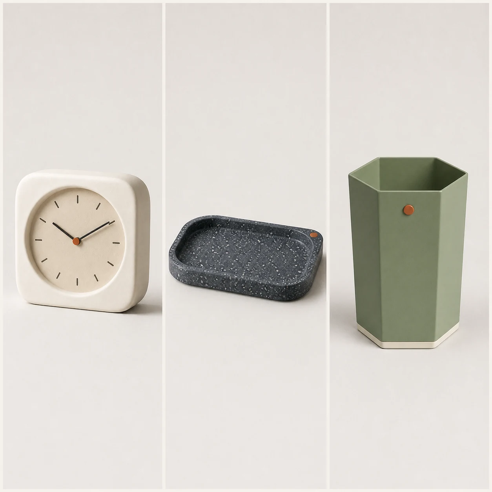

# Marketplace Thumbnail Source Set

## Use this when

Use this card when you need to turn three authorized product photographs into a coordinated thumbnail family. Use a Recipe when exact geometry preservation, claims review, repair, repeated comparison, or evidence matters.

## Required inputs

- A fictional or authorized product brief with exact form, components, and intended channel.
- Material, finish, color, package-content, and accessory manifest.
- Approved copy or explicit `none`, plus camera view, lighting, background, and output size.
- The complete attached source-image set, with authorization confirmed for every image.
- An image-role manifest and per-asset preservation rules.

## Prompt

```text
COMMISSION
Create one 1:1 e-commerce thumbnail set to turn three authorized product photographs into a coordinated thumbnail family. Use this independently authored concept: each source product keeps its own geometry while sharing one light and crop system.

SOURCE IMAGE SET
Use only the authorized images in {SOURCE_IMAGES}, assigning each exactly the role in {IMAGE_ROLE_MANIFEST}. Preserve {PRESERVE_RULES}. Keep people, products, artwork, and source identities separate unless the manifest explicitly authorizes a relationship; do not invent or merge assets.

PRODUCT
Use {PRODUCT_BRIEF} and build only the declared form, components, materials, finishes, and approved accessories in {MATERIAL_MANIFEST}. Do not invent a feature, certification, ingredient, performance result, compatibility statement, or package content.

PRESENTATION
Use {CAMERA_VIEW}, {LIGHTING}, and {BACKGROUND}. Arrange the product as follows: three equal thumbnail cells with no compositing between products. Render only {APPROVED_COPY}; if it says `none`, render no text or logo.

CONSTRAINTS
Use a fictional product or an authorized product brief. Keep declared geometry, part count, scale, color, and materials consistent. No real brand, copied package, unsupported claim, celebrity endorsement, signature, watermark, or unapproved accessory.

OUTPUT INTENT
Return one clean e-commerce thumbnail set at {OUTPUT_SIZE} in 1:1, with the product fully visible and no unrelated props.
```

## Variables

- `{PRODUCT_BRIEF}`: fictional or authorized product identity, geometry, purpose, and channel
- `{MATERIAL_MANIFEST}`: exact components, counts, materials, finishes, colors, and allowed accessories
- `{CAMERA_VIEW}`: camera height, angle, lens character, crop, and scale relationship
- `{LIGHTING}`: declared studio or environmental lighting and shadow behavior
- `{BACKGROUND}`: surface, set, or plain field allowed behind the product
- `{APPROVED_COPY}`: complete allowed product and campaign text, or `none`
- `{OUTPUT_SIZE}`: final pixel dimensions
- `{SOURCE_IMAGES}`: complete set of attached authorized source images
- `{IMAGE_ROLE_MANIFEST}`: one permitted role for each source image
- `{PRESERVE_RULES}`: per-image identity, geometry, copy, crop, and relationship constraints

## Negative constraints

- No real brand, copied packaging, trademark, celebrity likeness, signature, watermark, or unlicensed design feature.
- No invented component, material, accessory, package content, label copy, certification, performance result, or product claim.
- No duplicated product, warped geometry, unreadable approved copy, unrelated prop, decorative pseudo-text, or mock marketplace UI.

## Quick check

Count the declared products and components, compare form and materials with the manifest, and check the intended arrangement: three equal thumbnail cells with no compositing between products. This does not establish preservation reliability or product readiness.

## Rendered Sample



- Sample status: Rendered Sample.
- Generation surface: built-in image generation tool
- Generated at: `2026-08-30T23:38:24Z`
- Model: `not_exposed`
- Model version: `not_exposed`
- Seed: `not_exposed`
- Request parameters: `not_exposed`
- Request ID: `not_exposed`
- Exact prompt: [marketplace-thumbnail-source-set.prompt.txt](samples/marketplace-thumbnail-source-set/marketplace-thumbnail-source-set.prompt.txt)
- Output dimensions: `1254 x 1254`
- Output SHA-256: `cbab6b78f3d6a93d33a43cab55cadf0f24b61ea2e2b55e9ae519f34aed86c21c`
- Profile ID: `null`
- Promotion evidence: `false`
- Human inspection: Passed: the clock, tray, and pencil cup each retain their source identity in three separate equal cells with one shared background, light, crop, and visual scale system.
- Known misses: The coordinated board is illustrative visual preservation evidence and does not prove pixel-level or production-scale consistency.
- Rights and provenance: The concept, exact prompt, accepted image, and public WebP derivative are project-authored. Lossless masters and rejected attempts are retained privately with checksums. The public derivative may be reused under this repository's license; this record is illustrative evidence only.
- Supporting inputs:
  - [input-01-desk-clock-reference.webp](samples/marketplace-thumbnail-source-set/input-01-desk-clock-reference.webp): project-authored fictional desk clock reference input
  - [input-02-catchall-tray-reference.webp](samples/marketplace-thumbnail-source-set/input-02-catchall-tray-reference.webp): project-authored fictional catchall tray reference input
  - [input-03-pencil-cup-reference.webp](samples/marketplace-thumbnail-source-set/input-03-pencil-cup-reference.webp): project-authored fictional pencil cup reference input
## Rights and provenance

This Prompt Card is independently authored with `original` source posture. Use only fictional or properly authorized product geometry, packaging, copy, names, and images. Every source image must be owned or explicitly authorized, with a declared role and preservation rule.
