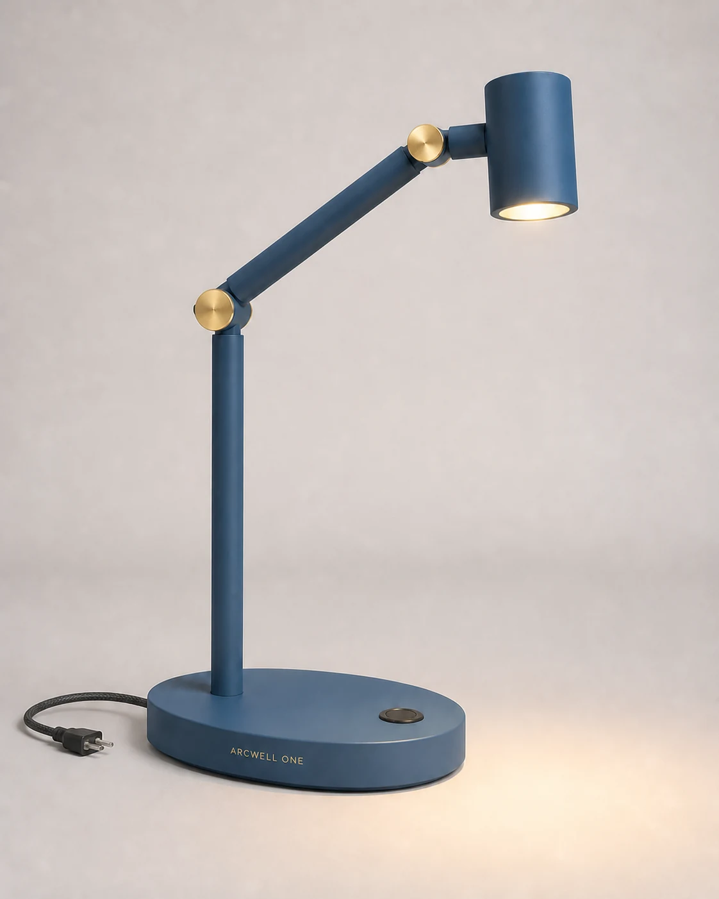

# Modular Desk Lamp Listing Hero

## Use this when

Use this card for one clean marketplace hero image of a fictional or authorized hard-surface desk lamp. Use the linked [Recipe](../../recipes/modular-desk-lamp-listing-hero/RECIPE.md) when exact geometry, inspection, repair, or evidence matters.

## Required inputs

- A fictional or authorized lamp name and design.
- Lamp materials, finish, silhouette, joints, and base geometry.
- Background color, camera angle, lighting direction, and target aspect ratio.
- Any display text, supplied as an exact closed list.

## Prompt

```text
SCENE
Create a clean e-commerce studio set on {BACKGROUND}, lit by {LIGHTING}.

SUBJECT
Show exactly one {LAMP_NAME} modular desk lamp in {PRIMARY_FINISH}, viewed from {CAMERA_ANGLE}.

DETAILS
The lamp has {GEOMETRY}, {JOINT_DESCRIPTION}, a {BASE_DESCRIPTION}, and restrained material separation between {MATERIALS}. Keep the power state {POWER_STATE}. Render only this approved text: {EXACT_TEXT}.

CONSTRAINTS
Preserve plausible hardware, stable balance, clean edges, and a complete silhouette. No extra lamps, floating parts, duplicated joints, invented controls, logos, watermarks, price badges, lifestyle props, or unapproved text.

OUTPUT INTENT
Return one polished product-listing hero image at {ASPECT_RATIO}, with the lamp dominant, fully inside the frame, and surrounded by useful negative space.
```

## Variables

- `{BACKGROUND}`: one flat or subtly graduated studio background.
- `{LIGHTING}`: key direction, softness, fill, and shadow character.
- `{LAMP_NAME}`: fictional or authorized product name.
- `{PRIMARY_FINISH}`: dominant color and finish.
- `{CAMERA_ANGLE}`: declared product view.
- `{GEOMETRY}`: shade, arm, stem, and proportion description.
- `{JOINT_DESCRIPTION}`: visible hinge or connector details.
- `{BASE_DESCRIPTION}`: base shape, footprint, and material.
- `{MATERIALS}`: approved material list.
- `{POWER_STATE}`: on or off, with glow behavior if on.
- `{EXACT_TEXT}`: exact approved strings, or `none`.
- `{ASPECT_RATIO}`: final width-to-height ratio.

## Negative constraints

- No second product, accessory bundle, comparison panel, or exploded view.
- No impossible hinges, unstable balance, melted edges, or disconnected hardware.
- No invented certification marks, claims, prices, or brand symbols.

## Quick check

Confirm there is one complete lamp, every joint connects plausibly, the base can support the pose, and no unapproved text or object appears.

## Rendered Sample



- Sample status: Rendered Sample.
- Generation surface: built-in image generation tool
- Generated at: `2026-08-30T22:26:03Z`
- Model: `not_exposed`
- Model version: `not_exposed`
- Seed: `not_exposed`
- Request parameters: `not_exposed`
- Request ID: `not_exposed`
- Exact prompt: [modular-desk-lamp-listing-hero.prompt.txt](samples/modular-desk-lamp-listing-hero/modular-desk-lamp-listing-hero.prompt.txt)
- Output dimensions: `1122 x 1402`
- Output SHA-256: `e756fba5e2a151b5df3fa2ed1da9391aea0c39420be4a89efff35b32c2f0450b`
- Profile ID: `null`
- Promotion evidence: `false`
- Human inspection: Confirmed one complete lamp, two brass-capped pivots, one recessed control, exact ARCWELL ONE copy, a contained cord and plug, stable hardware, and no extra product or watermark.
- Known misses: The image does not establish manufacturable joint tolerances or electrical compliance; the warm light pool is illustrative.
- Rights and provenance: The concept, exact prompt, accepted image, and public WebP derivative are project-authored. Lossless masters and rejected attempts are retained privately with checksums. The public derivative may be reused under this repository's license; this record is illustrative evidence only.
## Rights and provenance

Use only fictional or authorized product designs, names, and text. This Prompt Card is independently authored, has source posture `original`, and includes no third-party prompt or image.
