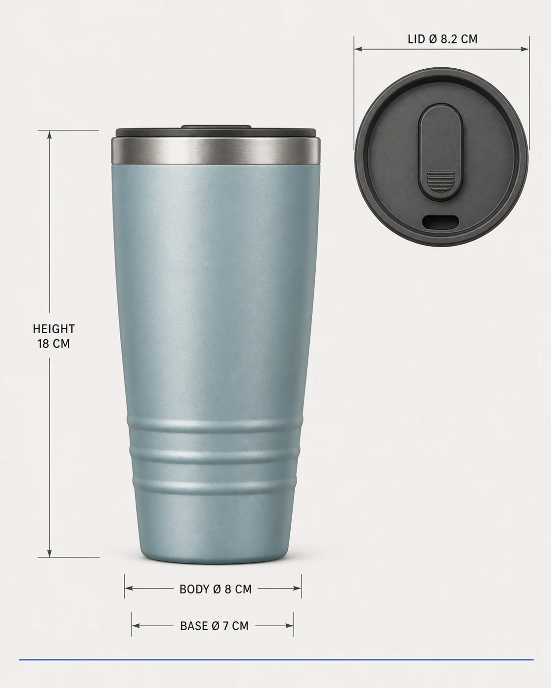

# Ridgecup Travel Mug Dimension Board

## Use this when

Use this card when you need to refine an authorized mug sketch into a dimensional product board. Use a Recipe when exact geometry preservation, claims review, repair, repeated comparison, or evidence matters.

## Required inputs

- A fictional or authorized product brief with exact form, components, and intended channel.
- Material, finish, color, package-content, and accessory manifest.
- Approved copy or explicit `none`, plus camera view, lighting, background, and output size.
- One attached layout or product sketch and confirmation that it is authorized for this use.
- A sketch-flexibility note naming protected zones, landmarks, and details open to interpretation.

## Prompt

```text
COMMISSION
Create one 4:5 dimension presentation board to refine an authorized mug sketch into a dimensional product board. Use this independently authored concept: a straight elevation and lid detail share one exact measurement language.

SKETCH INPUT
Use the attached authorized {LAYOUT_SKETCH} only as a structural guide. Honor {SKETCH_FLEXIBILITY}, including protected zones, hierarchy, and landmarks. Do not trace distinctive artwork, reproduce sketch text, add a signature, or invent functional details.

PRODUCT
Use {PRODUCT_BRIEF} and build only the declared form, components, materials, finishes, and approved accessories in {MATERIAL_MANIFEST}. Do not invent a feature, certification, ingredient, performance result, compatibility statement, or package content.

PRESENTATION
Use {CAMERA_VIEW}, {LIGHTING}, and {BACKGROUND}. Arrange the product as follows: front elevation fills the page with dimension lines outside the silhouette. Render only {APPROVED_COPY}; if it says `none`, render no text or logo.

CONSTRAINTS
Use a fictional product or an authorized product brief. Keep declared geometry, part count, scale, color, and materials consistent. No real brand, copied package, unsupported claim, celebrity endorsement, signature, watermark, or unapproved accessory.

OUTPUT INTENT
Return one clean dimension presentation board at {OUTPUT_SIZE} in 4:5, with the product fully visible and no unrelated props.
```

## Variables

- `{PRODUCT_BRIEF}`: fictional or authorized product identity, geometry, purpose, and channel
- `{MATERIAL_MANIFEST}`: exact components, counts, materials, finishes, colors, and allowed accessories
- `{CAMERA_VIEW}`: camera height, angle, lens character, crop, and scale relationship
- `{LIGHTING}`: declared studio or environmental lighting and shadow behavior
- `{BACKGROUND}`: surface, set, or plain field allowed behind the product
- `{APPROVED_COPY}`: complete allowed product and campaign text, or `none`
- `{OUTPUT_SIZE}`: final pixel dimensions
- `{LAYOUT_SKETCH}`: attached authorized sketch used only as a structural guide
- `{SKETCH_FLEXIBILITY}`: protected landmarks and the degree of allowed refinement

## Negative constraints

- No real brand, copied packaging, trademark, celebrity likeness, signature, watermark, or unlicensed design feature.
- No invented component, material, accessory, package content, label copy, certification, performance result, or product claim.
- No duplicated product, warped geometry, unreadable approved copy, unrelated prop, decorative pseudo-text, or mock marketplace UI.

## Quick check

Count the declared products and components, compare form and materials with the manifest, and check the intended arrangement: front elevation fills the page with dimension lines outside the silhouette. This does not establish preservation reliability or product readiness.

## Rendered Sample



- Sample status: Rendered Sample.
- Generation surface: built-in image generation tool
- Generated at: `2026-08-30T23:30:48Z`
- Model: `not_exposed`
- Model version: `not_exposed`
- Seed: `not_exposed`
- Request parameters: `not_exposed`
- Request ID: `not_exposed`
- Exact prompt: [ridgecup-travel-mug-dimension-board.prompt.txt](samples/ridgecup-travel-mug-dimension-board/ridgecup-travel-mug-dimension-board.prompt.txt)
- Output dimensions: `1122 x 1402`
- Output SHA-256: `773ee675ae24ef0ae76532fc0c79867b59276186649cdf23a0625e99653099b5`
- Profile ID: `null`
- Promotion evidence: `false`
- Human inspection: Passed: the front elevation and lid detail preserve the sketch landmarks, and all four supplied fictional dimensions are visible and correctly associated.
- Known misses: The dimensions are supplied specifications, not values measured from the generated image.
- Rights and provenance: The concept, exact prompt, accepted image, and public WebP derivative are project-authored. Lossless masters and rejected attempts are retained privately with checksums. The public derivative may be reused under this repository's license; this record is illustrative evidence only.
- Supporting inputs:
  - [input-01-layout-sketch.webp](samples/ridgecup-travel-mug-dimension-board/input-01-layout-sketch.webp): project-authored fictional layout sketch input
## Rights and provenance

This Prompt Card is independently authored with `original` source posture. Use only fictional or properly authorized product geometry, packaging, copy, names, and images. The sketch must be owned or explicitly authorized and used only within the declared flexibility boundary.
