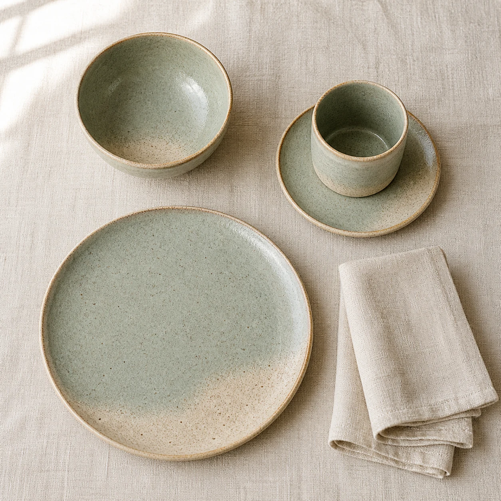

# Stoneware Breakfast Set Flat Lay

## Use this when

Use this card for a top-down catalog image of one coordinated fictional or authorized stoneware breakfast set. Use a Recipe when exact SKU counts, repeatable styling, or formal evidence is required.

## Required inputs

- The authorized set contents and exact item count.
- Clay body, glaze colors, surface variation, and edge treatment.
- Surface, prop allowance, lighting, crop, and aspect ratio.

## Prompt

```text
SCENE
Create a top-down tabletop scene on {SURFACE}, illuminated by {LIGHTING}.

SUBJECT
Arrange one coordinated {SET_NAME} stoneware breakfast set containing exactly {ITEM_MANIFEST}.

DETAILS
Use {CLAY_AND_GLAZE}, {EDGE_TREATMENT}, and {ARRANGEMENT}. Add only {APPROVED_PROPS}, kept secondary to the ceramics.

CONSTRAINTS
Keep every listed vessel distinct, correctly counted, undamaged, and grounded. No duplicate pieces, warped rims, fused handles, floating cutlery, food spills, logos, labels, watermarks, or extra text.

OUTPUT INTENT
Return one refined flat-lay catalog image at {ASPECT_RATIO}, with even spacing, clear product separation, and the complete set inside the frame.
```

## Variables

- `{SURFACE}`: tabletop material and color.
- `{LIGHTING}`: direction, softness, and shadow density.
- `{SET_NAME}`: fictional or authorized collection name.
- `{ITEM_MANIFEST}`: exact pieces and quantities.
- `{CLAY_AND_GLAZE}`: clay tone, glaze palette, sheen, and variation.
- `{EDGE_TREATMENT}`: rim and foot details.
- `{ARRANGEMENT}`: layout, orientation, spacing, and focal piece.
- `{APPROVED_PROPS}`: closed prop list, or `none`.
- `{ASPECT_RATIO}`: final width-to-height ratio.

## Negative constraints

- No missing, extra, nested, or partially cropped set pieces.
- No impossible ceramic thickness, broken handles, repeated glaze marks, or plastic surfaces.
- No packaging, price cards, utensils, ingredients, or flowers unless approved.

## Quick check

Count every item against the manifest, inspect rims and handles, and confirm all props and shadows remain secondary and physically grounded.

## Rendered Sample



- Sample status: Rendered Sample.
- Generation surface: built-in image generation tool
- Generated at: `2026-08-30T22:24:28Z`
- Model: `not_exposed`
- Model version: `not_exposed`
- Seed: `not_exposed`
- Request parameters: `not_exposed`
- Request ID: `not_exposed`
- Exact prompt: [stoneware-breakfast-set-flat-lay.prompt.txt](samples/stoneware-breakfast-set-flat-lay/stoneware-breakfast-set-flat-lay.prompt.txt)
- Output dimensions: `1254 x 1254`
- Output SHA-256: `7ffc108d05f8d08dd1edd507b428e01ddcfca7f2a576d1f012bb3dfe912a1625`
- Profile ID: `null`
- Promotion evidence: `false`
- Human inspection: Confirmed exactly four ceramic pieces, one secondary linen napkin, distinct grounded vessels, intact rims, coherent glaze treatment, even separation, and no text or watermark.
- Known misses: The stated physical diameters and volume were not measured from the image; subtle glaze variation is illustrative rather than a production specification.
- Rights and provenance: The concept, exact prompt, accepted image, and public WebP derivative are project-authored. Lossless masters and rejected attempts are retained privately with checksums. The public derivative may be reused under this repository's license; this record is illustrative evidence only.
## Rights and provenance

Use only fictional or authorized product designs and props. This Prompt Card is independently authored, has source posture `original`, and includes no third-party prompt or image.
