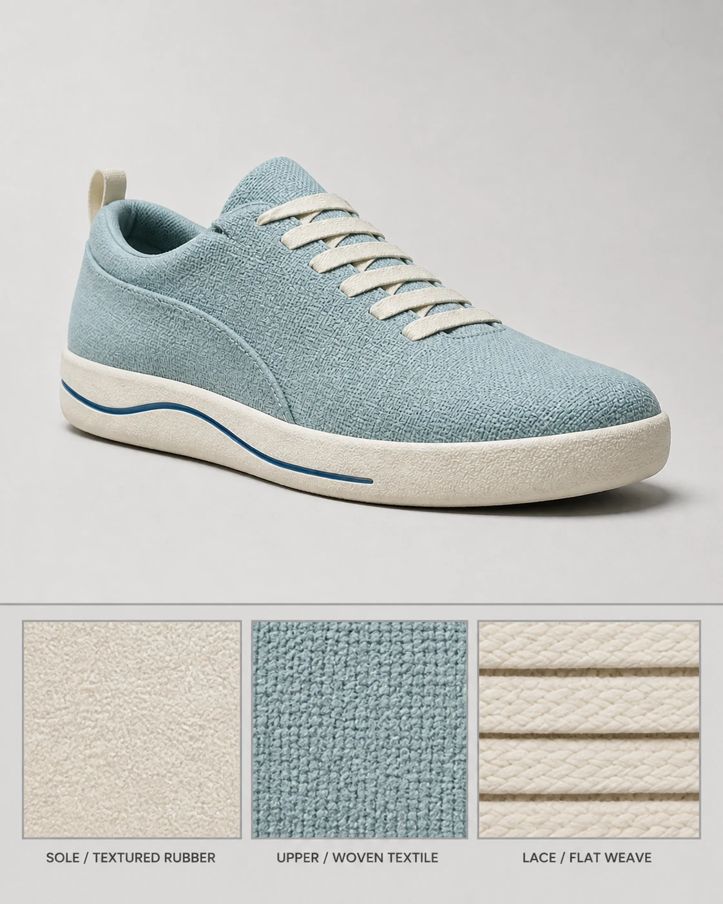

# Tide Sole Sneaker Material Board

## Use this when

Use this card when you need to document authorized sneaker materials without redesigning the shoe. Use a Recipe when exact geometry preservation, claims review, repair, repeated comparison, or evidence matters.

## Required inputs

- A fictional or authorized product brief with exact form, components, and intended channel.
- Material, finish, color, package-content, and accessory manifest.
- Approved copy or explicit `none`, plus camera view, lighting, background, and output size.
- One attached reference image and confirmation that it is authorized for this use.
- A preservation manifest separating protected features from approved changes.

## Prompt

```text
COMMISSION
Create one 4:5 footwear material board to document authorized sneaker materials without redesigning the shoe. Use this independently authored concept: the preserved shoe is paired with three labeled material swatches.

REFERENCE INPUT
Use the attached authorized {REFERENCE_IMAGE} only for {REFERENCE_ROLE}. Preserve {PRESERVE_RULES}; change only elements explicitly permitted by the brief. Do not infer unseen geometry, replace an identity, alter protected copy, or import marks from the reference.

PRODUCT
Use {PRODUCT_BRIEF} and build only the declared form, components, materials, finishes, and approved accessories in {MATERIAL_MANIFEST}. Do not invent a feature, certification, ingredient, performance result, compatibility statement, or package content.

PRESENTATION
Use {CAMERA_VIEW}, {LIGHTING}, and {BACKGROUND}. Arrange the product as follows: three-quarter shoe above an aligned sole, upper, and lace material rail. Render only {APPROVED_COPY}; if it says `none`, render no text or logo.

CONSTRAINTS
Use a fictional product or an authorized product brief. Keep declared geometry, part count, scale, color, and materials consistent. No real brand, copied package, unsupported claim, celebrity endorsement, signature, watermark, or unapproved accessory.

OUTPUT INTENT
Return one clean footwear material board at {OUTPUT_SIZE} in 4:5, with the product fully visible and no unrelated props.
```

## Variables

- `{PRODUCT_BRIEF}`: fictional or authorized product identity, geometry, purpose, and channel
- `{MATERIAL_MANIFEST}`: exact components, counts, materials, finishes, colors, and allowed accessories
- `{CAMERA_VIEW}`: camera height, angle, lens character, crop, and scale relationship
- `{LIGHTING}`: declared studio or environmental lighting and shadow behavior
- `{BACKGROUND}`: surface, set, or plain field allowed behind the product
- `{APPROVED_COPY}`: complete allowed product and campaign text, or `none`
- `{OUTPUT_SIZE}`: final pixel dimensions
- `{REFERENCE_IMAGE}`: attached authorized single reference image
- `{REFERENCE_ROLE}`: the sole role the reference may play in the composition
- `{PRESERVE_RULES}`: features, geometry, identity, copy, or relationships that must remain unchanged

## Negative constraints

- No real brand, copied packaging, trademark, celebrity likeness, signature, watermark, or unlicensed design feature.
- No invented component, material, accessory, package content, label copy, certification, performance result, or product claim.
- No duplicated product, warped geometry, unreadable approved copy, unrelated prop, decorative pseudo-text, or mock marketplace UI.

## Quick check

Count the declared products and components, compare form and materials with the manifest, and check the intended arrangement: three-quarter shoe above an aligned sole, upper, and lace material rail. This does not establish preservation reliability or product readiness.

## Rendered Sample



- Sample status: Rendered Sample.
- Generation surface: built-in image generation tool
- Generated at: `2026-08-30T23:34:32Z`
- Model: `not_exposed`
- Model version: `not_exposed`
- Seed: `not_exposed`
- Request parameters: `not_exposed`
- Request ID: `not_exposed`
- Exact prompt: [tide-sole-sneaker-material-board.prompt.txt](samples/tide-sole-sneaker-material-board/tide-sole-sneaker-material-board.prompt.txt)
- Output dimensions: `1122 x 1402`
- Output SHA-256: `f664603e96594b2daf11edba03b68397e913ddf4603a02c4f12b859a9031ea84`
- Profile ID: `null`
- Promotion evidence: `false`
- Human inspection: Passed: one shoe preserves the authorized silhouette, lace path, overlay, sole groove, and heel pull, with three correctly labeled matching material swatches.
- Known misses: The swatches document fictional visual material descriptions and do not prove composition, sourcing, or performance.
- Rights and provenance: The concept, exact prompt, accepted image, and public WebP derivative are project-authored. Lossless masters and rejected attempts are retained privately with checksums. The public derivative may be reused under this repository's license; this record is illustrative evidence only.
- Supporting inputs:
  - [input-01-product-reference.webp](samples/tide-sole-sneaker-material-board/input-01-product-reference.webp): project-authored fictional product reference input
## Rights and provenance

This Prompt Card is independently authored with `original` source posture. Use only fictional or properly authorized product geometry, packaging, copy, names, and images. The attached reference image must be owned or explicitly authorized, and its preservation manifest must be honored.
