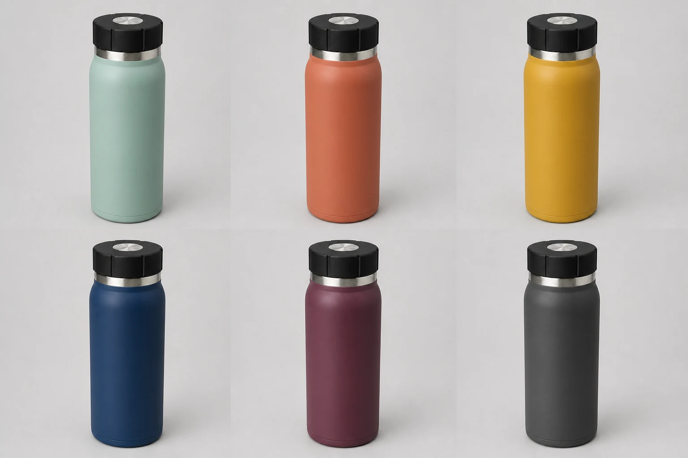

# Travel Flask Colorway Grid

## Use this when

Use this card to show one fictional or authorized travel-flask design across a small, declared set of colorways. Use a Recipe when geometry preservation or exact comparative evaluation is required.

## Required inputs

- One authorized reference image showing the flask geometry, lid, and material.
- The approved colorway manifest.
- Grid dimensions and ordering.
- Background, camera view, lighting, and target aspect ratio.

## Prompt

```text
REFERENCE INPUT
Use the attached authorized {REFERENCE_IMAGE} as the sole source for product geometry, lid construction, material, and camera-facing details.

SCENE
Create a controlled studio comparison grid on {BACKGROUND}, lit uniformly with {LIGHTING}.

SUBJECT
Show the same {FLASK_NAME} travel flask exactly {COUNT} times in a {GRID_LAYOUT} grid, one instance for each colorway in {COLORWAY_MANIFEST}.

DETAILS
Every flask must share {FLASK_GEOMETRY}, {LID_DESCRIPTION}, {MATERIAL_FINISH}, the same scale, and the same {CAMERA_VIEW}. Arrange colorways in the declared order.

CONSTRAINTS
Change color only. Do not alter proportions, lid geometry, highlights, camera angle, crop, or spacing between variants. No extra products, missing variants, labels, swatches, logos, watermarks, captions, or unapproved text.

OUTPUT INTENT
Return one precise colorway grid at {ASPECT_RATIO}, with consistent product geometry, equal cells, and all variants fully visible.
```

## Variables

- `{REFERENCE_IMAGE}`: attached authorized flask image to preserve across variants.
- `{BACKGROUND}`: neutral comparison background.
- `{LIGHTING}`: fixed studio-light description.
- `{FLASK_NAME}`: fictional or authorized product name.
- `{COUNT}`: exact number of variants.
- `{GRID_LAYOUT}`: rows by columns.
- `{COLORWAY_MANIFEST}`: ordered color names and finishes.
- `{FLASK_GEOMETRY}`: body shape, proportions, and base.
- `{LID_DESCRIPTION}`: closure form and material.
- `{MATERIAL_FINISH}`: body material and surface response.
- `{CAMERA_VIEW}`: one view shared by all cells.
- `{ASPECT_RATIO}`: final width-to-height ratio.

## Negative constraints

- No geometry drift, variant-specific accessories, or inconsistent camera views.
- No omitted, duplicated, or reordered colorway.
- No comparison labels, text, branding, or UI framing unless explicitly approved.

## Quick check

Count the flasks, compare silhouettes and lids cell by cell, and verify that only the approved color and finish change.

## Rendered Sample



- Sample status: Rendered Sample.
- Generation surface: built-in image generation tool
- Generated at: `2026-08-30T23:07:53Z`
- Model: `not_exposed`
- Model version: `not_exposed`
- Seed: `not_exposed`
- Request parameters: `not_exposed`
- Request ID: `not_exposed`
- Exact prompt: [travel-flask-colorway-grid.prompt.txt](samples/travel-flask-colorway-grid/travel-flask-colorway-grid.prompt.txt)
- Output dimensions: `1536 x 1024`
- Output SHA-256: `190007baab4458ed04323eab60fda9fda7348c998d0828d1c4512bd61560d831`
- Profile ID: `null`
- Promotion evidence: `false`
- Human inspection: Passed: exactly six flasks preserve the reference silhouette, lid, shoulder ring, scale, and camera angle while only the ordered color and finish change.
- Known misses: The grid is intentionally unlabeled, so the declared colorway order must be read from the exact prompt.
- Rights and provenance: The concept, exact prompt, accepted image, and public WebP derivative are project-authored. Lossless masters and rejected attempts are retained privately with checksums. The public derivative may be reused under this repository's license; this record is illustrative evidence only.
- Supporting inputs:
  - [input-01-product-reference.webp](samples/travel-flask-colorway-grid/input-01-product-reference.webp): project-authored fictional product reference input
## Rights and provenance

Use only fictional or authorized product geometry, finishes, names, and reference assets. This Prompt Card is independently authored, has source posture `original`, and bundles no third-party prompt or image.
