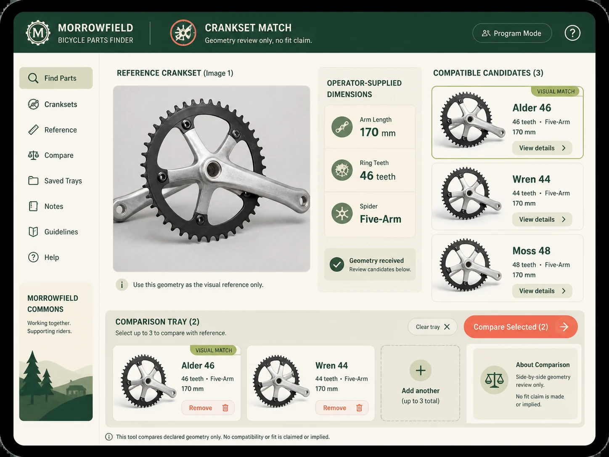

# Bicycle Parts Finder

## Use this when

Use this card for an authorized bicycle-component matching aid. It is a fast interface concept route, not a claim that the interface is functional, tested, accessible, compliant, or ready to ship. Use a Recipe when exact preservation, repeated output, or recorded repair is required.

## Required inputs

- A fictional or authorized project name and product context.
- The intended audience and one primary user goal.
- A closed content and data manifest using fictional or approved values.
- Visual direction, target device, and prohibited content.
- The attached input asset or assets, an authority statement, assigned roles, and preservation scope.

## Prompt

```text
Design one tablet catalog interface for {PROJECT_CONTEXT}. The concept is an authorized bicycle-component matching aid.

USER AND GOAL
The primary audience is {AUDIENCE}. Make {PRIMARY_GOAL} the unmistakable main action.

INFORMATION AND STRUCTURE
Use only {CONTENT_MANIFEST}. Place the reference image beside operator-supplied dimensions, compatible fictional parts, and a comparison tray. Keep hierarchy, states, and navigation legible.

VISUAL DIRECTION
Design for {TARGET_DEVICE}. Preserve declared geometry only and avoid fit, repair-safety, or manufacturer claims. Apply {VISUAL_DIRECTION} without borrowing a real product or brand system.

AUTHORIZED REFERENCE INPUT
Use {REFERENCE_IMAGE} only after confirming authority to use it for this task. Preserve only {PRESERVE_FEATURES}; do not infer identity, ownership, authorship, brand affiliation, unseen geometry, or facts outside the supplied image.

CONSTRAINTS
Treat every name, metric, status, and message as fictional or supplied. Do not imply functional testing, accessibility certification, legal compliance, medical advice, financial advice, or operational readiness. Add no real brand, unauthorized real-person likeness, signature, or watermark. Avoid {MUST_AVOID}.

OUTPUT
Return one 4:3 concept image with readable hierarchy and no unrequested screens.
```

## Variables

- `{PROJECT_CONTEXT}`: the fictional or authorized product, service, or organization
- `{AUDIENCE}`: the intended user group without inferred sensitive traits
- `{PRIMARY_GOAL}`: the single task the interface should make easiest
- `{CONTENT_MANIFEST}`: the exact labels, values, states, and sample data allowed in the image
- `{TARGET_DEVICE}`: the target device, viewport, orientation, and primary input method
- `{VISUAL_DIRECTION}`: the approved palette, typography mood, spacing, and surface treatment
- `{MUST_AVOID}`: additional prohibited content, patterns, or unsupported claims
- `{REFERENCE_IMAGE}`: the attached authorized reference image and its declared role
- `{PRESERVE_FEATURES}`: the visible features that must remain stable without invented details

## Negative constraints

- No real brands, unauthorized real-person likenesses, medical or legal claims, signatures, or watermarks.
- No invented metrics, unreadable pseudo-copy, deceptive controls, or implied production readiness.
- Do not lose the assigned structure: Place the reference image beside operator-supplied dimensions, compatible fictional parts, and a comparison tray.

## Quick check

Confirm the image communicates an authorized bicycle-component matching aid. Check the assigned composition, then verify the specific direction: preserve declared geometry only and avoid fit, repair-safety, or manufacturer claims. Reject invented content, unsupported claims, or any mismatch between supplied inputs and the visible result.

## Rendered Sample



- Sample status: Rendered Sample.
- Generation surface: built-in image generation tool
- Generated at: `2026-08-30T22:53:44Z`
- Model: `not_exposed`
- Model version: `not_exposed`
- Seed: `not_exposed`
- Request parameters: `not_exposed`
- Request ID: `not_exposed`
- Exact prompt: [bicycle-parts-finder.prompt.txt](samples/bicycle-parts-finder/bicycle-parts-finder.prompt.txt)
- Output dimensions: `1448 x 1086`
- Output SHA-256: `df94f27aacdd87b19c9e1b9f8a16d7ce0c0097bb4f33822975e3809e56bc094d`
- Profile ID: `null`
- Promotion evidence: `false`
- Human inspection: Passed at full resolution: the accepted 4:3 Bicycle Parts Finder render makes "compare three fictional crankset candidates against the supplied visible geometry" primary and keeps "CRANKSET MATCH", "supplied dimensions Arm 170 mm, ring 46 teeth, five-a…", "fictional candidates Alder 46 / visual match, Wren 44…" readable in a complete frame; no material count, crop, watermark, or unsafe-resemblance defect was observed. All 1 linked role-specific supporting inputs remain distinct in the composition.
- Known misses: No material miss was observed against the closed Bicycle Parts Finder manifest; this single illustrative render does not establish interaction behavior, repeatability, or production readiness.
- Rights and provenance: The concept, exact prompts, accepted image, and any supporting inputs are fictional and project-authored. The linked final is a quality-88 public WebP derivative; private archival storage retains the lossless PNG masters and exact call prompts with checksums. The public derivatives may be reused under this repository's license; this record is illustrative evidence only.
- Supporting inputs:
  - [input-01-crankset.webp](samples/bicycle-parts-finder/input-01-crankset.webp): project-authored fictional crankset supporting input; reduced public WebP derivative of its staged lossless PNG master

## Rights and provenance

This Card is independently authored with `original` source posture. Use only a fictional, public-domain, project-owned, or otherwise authorized reference image. Record the authority and preservation scope before use. This Rendered Sample is evidence for this exact illustrative run only; it does not establish reference fidelity, identity preservation, repeatability, or promotion.
