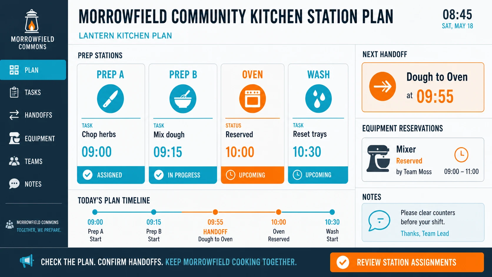

# Community Kitchen Station Plan

## Use this when

Use this card for a community-kitchen station assignment board. It is a fast interface concept route, not a claim that the interface is functional, tested, accessible, compliant, or ready to ship. Use a Recipe when exact preservation, repeated output, or recorded repair is required.

## Required inputs

- A fictional or authorized project name and product context.
- The intended audience and one primary user goal.
- A closed content and data manifest using fictional or approved values.
- Visual direction, target device, and prohibited content.

## Prompt

```text
Design one wall planning interface for {PROJECT_CONTEXT}. The concept is a community-kitchen station assignment board.

USER AND GOAL
The primary audience is {AUDIENCE}. Make {PRIMARY_GOAL} the unmistakable main action.

INFORMATION AND STRUCTURE
Use only {CONTENT_MANIFEST}. Arrange fictional prep stations, task cards, equipment reservations, and handoff notes without personal or health data. Keep hierarchy, states, and navigation legible.

VISUAL DIRECTION
Design for {TARGET_DEVICE}. Use clear zones and avoid food-safety certification, allergen clearance, or medical claims. Apply {VISUAL_DIRECTION} without borrowing a real product or brand system.

CONSTRAINTS
Treat every name, metric, status, and message as fictional or supplied. Do not imply functional testing, accessibility certification, legal compliance, medical advice, financial advice, or operational readiness. Add no real brand, unauthorized real-person likeness, signature, or watermark. Avoid {MUST_AVOID}.

OUTPUT
Return one 16:9 concept image with readable hierarchy and no unrequested screens.
```

## Variables

- `{PROJECT_CONTEXT}`: the fictional or authorized product, service, or organization
- `{AUDIENCE}`: the intended user group without inferred sensitive traits
- `{PRIMARY_GOAL}`: the single task the interface should make easiest
- `{CONTENT_MANIFEST}`: the exact labels, values, states, and sample data allowed in the image
- `{TARGET_DEVICE}`: the target device, viewport, orientation, and primary input method
- `{VISUAL_DIRECTION}`: the approved palette, typography mood, spacing, and surface treatment
- `{MUST_AVOID}`: additional prohibited content, patterns, or unsupported claims

## Negative constraints

- No real brands, unauthorized real-person likenesses, medical or legal claims, signatures, or watermarks.
- No invented metrics, unreadable pseudo-copy, deceptive controls, or implied production readiness.
- Do not lose the assigned structure: Arrange fictional prep stations, task cards, equipment reservations, and handoff notes without personal or health data.

## Quick check

Confirm the image communicates a community-kitchen station assignment board. Check the assigned composition, then verify the specific direction: use clear zones and avoid food-safety certification, allergen clearance, or medical claims. Reject invented content, unsupported claims, or any mismatch between supplied inputs and the visible result.

## Rendered Sample



- Sample status: Rendered Sample.
- Generation surface: built-in image generation tool
- Generated at: `2026-08-30T23:01:35Z`
- Model: `not_exposed`
- Model version: `not_exposed`
- Seed: `not_exposed`
- Request parameters: `not_exposed`
- Request ID: `not_exposed`
- Exact prompt: [community-kitchen-station-plan.prompt.txt](samples/community-kitchen-station-plan/community-kitchen-station-plan.prompt.txt)
- Output dimensions: `1672 x 941`
- Output SHA-256: `f6a0639786cf5e5962e85ff4ecc42dc811eab7663b9bcbf91db6dc775f5f5f09`
- Profile ID: `null`
- Promotion evidence: `false`
- Human inspection: Passed at full resolution: the accepted 16:9 Community Kitchen Station Plan render makes "review station assignments and the next fictional handoff" primary and keeps "LANTERN KITCHEN PLAN", "Prep A / Chop herbs / 09:00", "Prep B / Mix dough / 09:15" readable in a complete frame; no material count, crop, watermark, or unsafe-resemblance defect was observed.
- Known misses: No material miss was observed against the closed Community Kitchen Station Plan manifest; this single illustrative render does not establish interaction behavior, repeatability, or production readiness.
- Rights and provenance: The concept, exact prompts, accepted image, and any supporting inputs are fictional and project-authored. The linked final is a quality-88 public WebP derivative; private archival storage retains the lossless PNG masters and exact call prompts with checksums. The public derivatives may be reused under this repository's license; this record is illustrative evidence only.

## Rights and provenance

This Prompt Card is independently authored with `original` source posture. Use only fictional, public-domain, or properly authorized subjects, names, data, locations, and brand materials. It bundles no third-party prompt or image.
