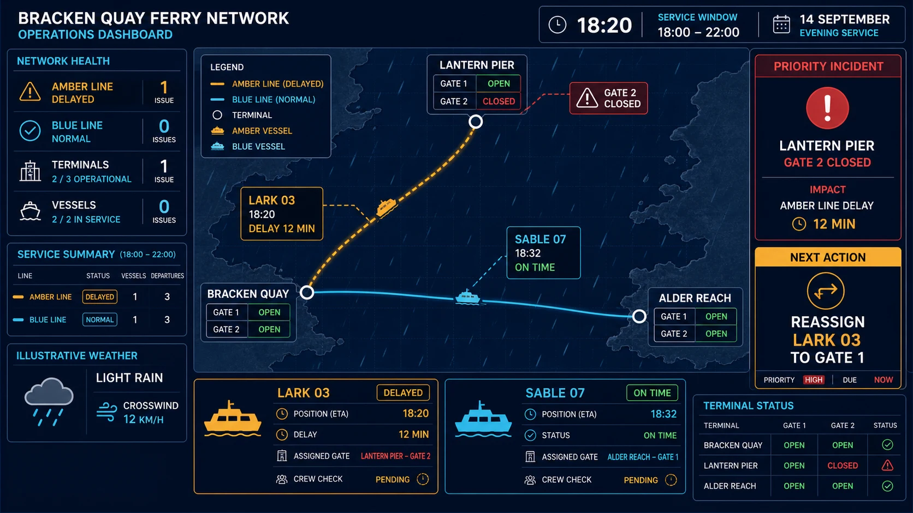

# Ferry Network Operations Dashboard

## Use this when

Use this card for one fictional desktop operations dashboard showing a regional ferry network, vessel status, route disruptions, and dispatch priorities. Use a Recipe for live operational use, safety decisions, or validated information architecture.

## Required inputs

- Fictional network, terminals, routes, and vessels.
- Approved status values, disruptions, schedule window, and priority action.
- Exact labels, map extent, visual system, screen size, and aspect ratio.

## Prompt

```text
SCENE
Create one desktop operations dashboard for {NETWORK_NAME} during {OPERATING_WINDOW}, viewed in a controlled dispatch room.

SUBJECT
Show the network map across {MAP_EXTENT}, with {ROUTE_MANIFEST}, {VESSEL_MANIFEST}, and the priority incident {PRIORITY_INCIDENT} clearly distinguished.

DETAILS
Arrange {NETWORK_SUMMARY}, {ARRIVAL_TABLE}, {ALERT_QUEUE}, and {WEATHER_STATUS} around the map using {VISUAL_SYSTEM}. Render only {EXACT_TEXT_MANIFEST}; use redundant color, shape, and label encoding for every service state.

CONSTRAINTS
Keep route lines, vessel positions, terminal names, timestamps, and status counts internally consistent. No real navigation data, invented safety advice, decorative charts, map-provider branding, tiny pseudo-text, logos, watermarks, or unapproved labels.

OUTPUT INTENT
Return one information-dense 16:9 desktop dashboard at {OUTPUT_SIZE}, with network health, disruptions, and the next dispatch action readable without changing screens.
```

## Variables

- `{NETWORK_NAME}`: fictional ferry operator name.
- `{OPERATING_WINDOW}`: exact date and time range.
- `{MAP_EXTENT}`: fictional coastal geography and terminal bounds.
- `{ROUTE_MANIFEST}`: route names, endpoints, and service states.
- `{VESSEL_MANIFEST}`: vessel names, assigned routes, and status.
- `{PRIORITY_INCIDENT}`: one approved disruption and response state.
- `{NETWORK_SUMMARY}`: closed list of operational totals.
- `{ARRIVAL_TABLE}`: exact rows, columns, and values.
- `{ALERT_QUEUE}`: ordered alerts with severity and timestamp.
- `{WEATHER_STATUS}`: approved conditions without safety interpretation.
- `{VISUAL_SYSTEM}`: project-owned colors, type, icons, and grid.
- `{EXACT_TEXT_MANIFEST}`: complete allowed text list.
- `{OUTPUT_SIZE}`: final pixel dimensions.

## Negative constraints

- No real company, vessel, port, chart, tracking data, or emergency guidance.
- No mismatched route colors, impossible vessel positions, duplicate terminals, or contradictory times.
- No unlabeled status color, ornamental gauges, unreadable tables, browser chrome, signatures, or watermarks.

## Quick check

Trace each vessel to one route, compare all summary counts with the table, confirm the priority alert is dominant, and verify that service states remain understandable without color alone.

## Rendered Sample



- Sample status: Rendered Sample.
- Generation surface: built-in image generation tool
- Generated at: `2026-08-30T23:10:10Z`
- Model: `not_exposed`
- Model version: `not_exposed`
- Seed: `not_exposed`
- Request parameters: `not_exposed`
- Request ID: `not_exposed`
- Exact prompt: [ferry-network-operations-dashboard.prompt.txt](samples/ferry-network-operations-dashboard/ferry-network-operations-dashboard.prompt.txt)
- Output dimensions: `1672 x 941`
- Output SHA-256: `08ab9f5d261f9f6ec54e4238f4796792b991813f80c664132ad787726a24cbf7`
- Profile ID: `null`
- Promotion evidence: `false`
- Human inspection: Passed at full resolution: the accepted 16:9 Ferry Network Operations Dashboard render makes "the declared primary task" primary and keeps "BRACKEN QUAY NETWORK", "2 LINES", "3 TERMINALS" readable in a complete frame; no material count, crop, watermark, or unsafe-resemblance defect was observed.
- Known misses: No material miss was observed against the closed Ferry Network Operations Dashboard manifest; this single illustrative render does not establish interaction behavior, repeatability, or production readiness.
- Rights and provenance: The concept, exact prompts, accepted image, and any supporting inputs are fictional and project-authored. The linked final is a quality-88 public WebP derivative; private archival storage retains the lossless PNG masters and exact call prompts with checksums. The public derivatives may be reused under this repository's license; this record is illustrative evidence only.

## Rights and provenance

Use only fictional network geography, schedules, vessel names, and operational data. This Prompt Card is independently authored, has source posture `original`, and includes no third-party prompt, map, interface, or image.
