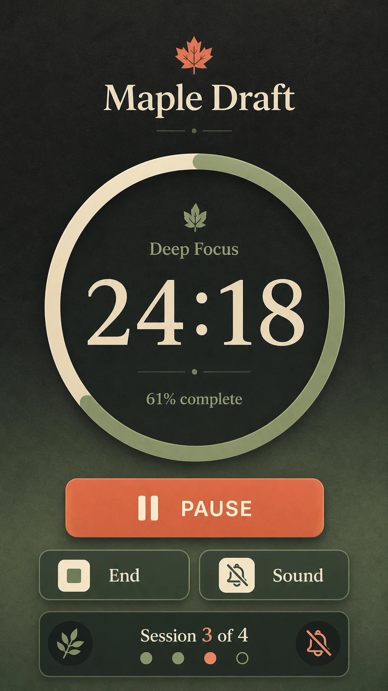

# Focus Timer Session Screen

## Use this when

Use this card for one low-distraction mobile focus-timer screen showing an active session, remaining time, and a small set of controls. Use a Recipe when exact interaction states, accessibility review, or evidence is required.

## Required inputs

- Exact session label, duration, elapsed state, and control labels.
- Visual mood, progress treatment, device frame, and aspect ratio.
- Whether sound, break, and interruption indicators are shown.

## Prompt

```text
SCENE
Create one portrait mobile session screen used in {AMBIENT_CONTEXT}, with a quiet background in {BACKGROUND_TREATMENT}.

SUBJECT
Center an active focus timer for {SESSION_LABEL}, showing exactly {TIME_REMAINING} and progress {PROGRESS_STATE}.

DETAILS
Use {TIMER_TREATMENT}, one primary control labeled {PRIMARY_CONTROL}, and secondary controls {SECONDARY_CONTROLS}. Show {SESSION_INDICATORS} with {VISUAL_SYSTEM}; keep the time as the strongest element and render only {EXACT_TEXT_MANIFEST}.

CONSTRAINTS
Respect {DEVICE_FRAME} safe areas, large tap targets, consistent spacing, and accessible contrast. No task list, analytics dashboard, extra navigation, fake notifications, tiny pseudo-text, logos, watermarks, or unapproved labels.

OUTPUT INTENT
Return one focused 9:16 session interface at {OUTPUT_SIZE}, with the remaining time and pause-or-resume action readable immediately.
```

## Variables

- `{AMBIENT_CONTEXT}`: restrained setting or emotional context.
- `{BACKGROUND_TREATMENT}`: flat color, subtle gradient, or quiet texture.
- `{SESSION_LABEL}`: exact focus-session name.
- `{TIME_REMAINING}`: exact displayed time.
- `{PROGRESS_STATE}`: approved percentage or arc position.
- `{TIMER_TREATMENT}`: circular, linear, or typographic timer design.
- `{PRIMARY_CONTROL}`: exact main control label.
- `{SECONDARY_CONTROLS}`: closed list of allowed secondary actions.
- `{SESSION_INDICATORS}`: allowed sound, break, or interruption status.
- `{VISUAL_SYSTEM}`: project-owned palette, typography, icons, and corner treatment.
- `{EXACT_TEXT_MANIFEST}`: complete allowed text list.
- `{DEVICE_FRAME}`: phone size and safe areas.
- `{OUTPUT_SIZE}`: final pixel dimensions.

## Negative constraints

- No extra productivity metrics, streaks, advertisements, social features, or gamified rewards.
- No contradictory timer values, duplicated controls, illegible digits, or hidden pause state.
- No third-party app styling, brand marks, notifications, signatures, or watermarks.

## Quick check

Read the time and primary control at thumbnail size, confirm the progress treatment agrees with the time, and verify every visible label belongs to the approved manifest.

## Rendered Sample



- Sample status: Rendered Sample.
- Generation surface: built-in image generation tool
- Generated at: `2026-08-30T22:21:20Z`
- Model: `not_exposed`
- Model version: `not_exposed`
- Seed: `not_exposed`
- Request parameters: `not_exposed`
- Request ID: `not_exposed`
- Exact prompt: [focus-timer-session-screen.prompt.txt](samples/focus-timer-session-screen/focus-timer-session-screen.prompt.txt)
- Output dimensions: `941 x 1672`
- Output SHA-256: `13678dba43ad13a341fbd1d25d1537746ecf7ca4133ec259dbe8f3baef484de4`
- Profile ID: `null`
- Promotion evidence: `false`
- Human inspection: Passed at full resolution: the accepted 9:16 Focus Timer Session Screen render makes "the declared primary task" primary and keeps "Maple Draft", "24:18", "61% complete" readable in a complete frame; no material count, crop, watermark, or unsafe-resemblance defect was observed.
- Known misses: The "Bell muted" state is conveyed by a muted-bell icon rather than repeating the literal phrase; the timer, progress value, and controls remain clear. This single render does not establish interaction behavior.
- Rights and provenance: The concept, exact prompts, accepted image, and any supporting inputs are fictional and project-authored. The linked final is a quality-88 public WebP derivative; private archival storage retains the lossless PNG masters and exact call prompts with checksums. The public derivatives may be reused under this repository's license; this record is illustrative evidence only.

## Rights and provenance

Use fictional session data and project-owned visual direction. This Prompt Card is independently authored, has source posture `original`, and includes no third-party prompt, interface, logo, or image.
