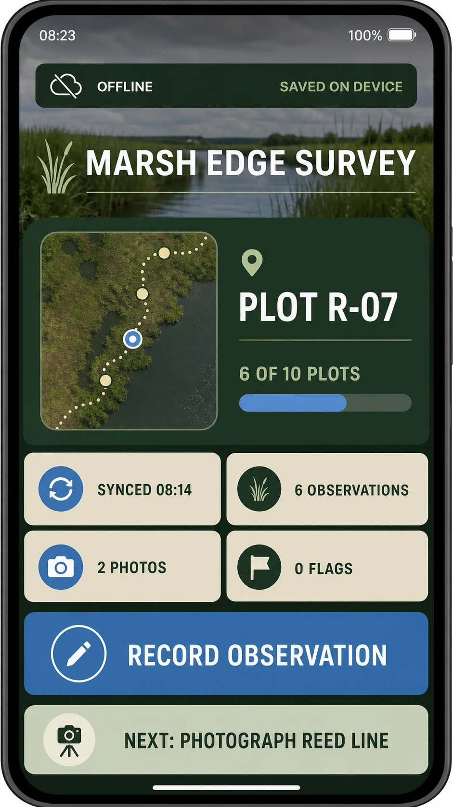

# Habitat Survey Mobile Dashboard

## Use this when

Use this card for one mobile field-survey dashboard that helps a conservation team see location, progress, and the next observation task at a glance. Use the linked [Recipe](../../recipes/habitat-survey-mobile-dashboard/RECIPE.md) when exact text, interaction hierarchy, inspection, repair, or evidence matters.

## Required inputs

- A fictional or authorized survey name and habitat.
- Current location, survey progress, observation counts, next task, and connection state.
- Exact labels, primary action, palette, device frame, and target aspect ratio.

## Prompt

```text
SCENE
Create one portrait mobile dashboard used by a field ecologist during {FIELD_CONDITIONS} in {HABITAT_NAME}.

SUBJECT
Show the active survey {SURVEY_NAME}, the current plot {PLOT_ID}, progress {PROGRESS_VALUE}, and one dominant action labeled {PRIMARY_ACTION}.

DETAILS
Arrange {STATUS_SUMMARY}, {OBSERVATION_METRICS}, {NEXT_TASK}, and {CONNECTIVITY_STATE} in a clear single-screen hierarchy. Use {VISUAL_SYSTEM}, a compact map or location cue, large touch targets, and only the exact approved labels in {EXACT_TEXT_MANIFEST}.

CONSTRAINTS
Keep the interface plausible on {DEVICE_FRAME}; preserve safe areas, consistent spacing, readable contrast, and a visible offline state. No extra screens, browser chrome, tiny pseudo-text, invented species, unsupported alerts, logos, watermarks, or unapproved labels.

OUTPUT INTENT
Return one polished 9:16 mobile interface at {OUTPUT_SIZE}, with the current survey state and next action understandable in one glance.
```

## Variables

- `{FIELD_CONDITIONS}`: weather, light, and practical field context.
- `{HABITAT_NAME}`: fictional or authorized survey habitat.
- `{SURVEY_NAME}`: exact survey title.
- `{PLOT_ID}`: exact active plot or transect label.
- `{PROGRESS_VALUE}`: approved completion value.
- `{PRIMARY_ACTION}`: one exact button label.
- `{STATUS_SUMMARY}`: short status and sync information.
- `{OBSERVATION_METRICS}`: closed list of counts with exact labels.
- `{NEXT_TASK}`: one next observation task.
- `{CONNECTIVITY_STATE}`: online, syncing, or offline wording.
- `{VISUAL_SYSTEM}`: project-owned colors, type character, icon style, and density.
- `{EXACT_TEXT_MANIFEST}`: complete allowed text list.
- `{DEVICE_FRAME}`: phone dimensions and safe-area behavior.
- `{OUTPUT_SIZE}`: final pixel dimensions.

## Negative constraints

- No desktop layout squeezed into a phone, overlapping cards, clipped controls, or ambiguous tap targets.
- No invented wildlife counts, safety warnings, map labels, or scientific claims.
- No real organization marks, third-party map branding, signatures, or decorative pseudo-writing.

## Quick check

Confirm one screen is shown, the active plot and progress agree, the primary action is dominant, all exact labels are legible, and offline status cannot be mistaken for a successful sync.

## Rendered Sample



- Sample status: Rendered Sample.
- Generation surface: built-in image generation tool
- Generated at: `2026-08-30T23:09:19Z`
- Model: `not_exposed`
- Model version: `not_exposed`
- Seed: `not_exposed`
- Request parameters: `not_exposed`
- Request ID: `not_exposed`
- Exact prompt: [habitat-survey-mobile-dashboard.prompt.txt](samples/habitat-survey-mobile-dashboard/habitat-survey-mobile-dashboard.prompt.txt)
- Output dimensions: `941 x 1672`
- Output SHA-256: `9c0afad3e934345b33e5b57663c667e1b2595efb9330b441110fdc271eba0bfc`
- Profile ID: `null`
- Promotion evidence: `false`
- Human inspection: Passed at full resolution: the accepted 9:16 Habitat Survey Mobile Dashboard render makes "RECORD OBSERVATION" primary and keeps "MARSH EDGE SURVEY", "PLOT R-07", "6 OF 10 PLOTS" readable in a complete frame; no material count, crop, watermark, or unsafe-resemblance defect was observed.
- Known misses: No material miss was observed against the closed Habitat Survey Mobile Dashboard manifest; this single illustrative render does not establish interaction behavior, repeatability, or production readiness.
- Rights and provenance: The concept, exact prompts, accepted image, and any supporting inputs are fictional and project-authored. The linked final is a quality-88 public WebP derivative; private archival storage retains the lossless PNG masters and exact call prompts with checksums. The public derivatives may be reused under this repository's license; this record is illustrative evidence only.

## Rights and provenance

Use fictional survey data and project-owned interface direction unless authorized materials are supplied. This Prompt Card is independently authored, has source posture `original`, and includes no third-party prompt, interface, map, or image.
