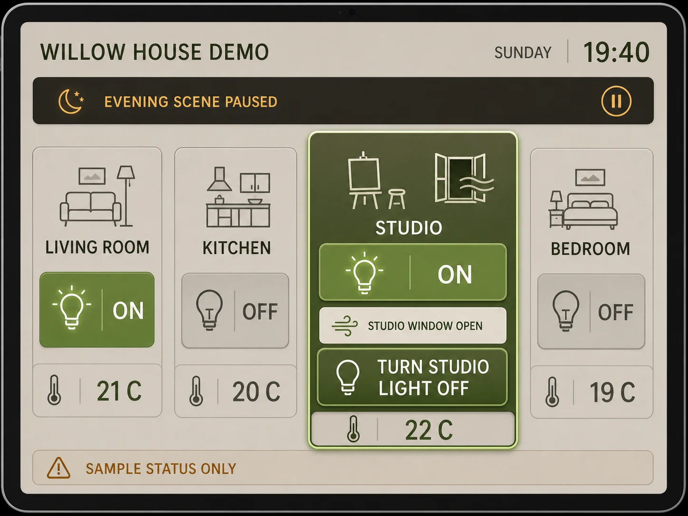

# Room-by-Room Home Control Panel

## Use this when

Use this card for one tablet control panel that summarizes authorized home systems by room and exposes a small set of immediate actions. Use a Recipe for a deployable control system, device integration, or safety validation.

## Required inputs

- Fictional or authorized room and device manifest.
- Exact states, alerts, automation mode, and allowed controls.
- Tablet frame, palette, icon language, and aspect ratio.

## Prompt

```text
SCENE
Create one landscape tablet control panel for {HOME_NAME} at {TIME_CONTEXT}, using a quiet residential visual system.

SUBJECT
Organize {ROOM_MANIFEST} as clearly separated room summaries, with the selected room {ACTIVE_ROOM} and its primary action {PRIMARY_ACTION} given priority.

DETAILS
Show only {DEVICE_STATES}, {ENVIRONMENT_VALUES}, {AUTOMATION_STATUS}, and {ALERTS}. Use {VISUAL_SYSTEM}, consistent device icons, visible on-off states, and only {EXACT_TEXT_MANIFEST}.

CONSTRAINTS
Respect {TABLET_FRAME} safe areas, large touch targets, state contrast, and room-to-device ownership. No controls for undeclared devices, no real address, no surveillance feed, no security codes, no tiny pseudo-text, logos, watermarks, or unapproved labels.

OUTPUT INTENT
Return one polished 4:3 tablet interface at {OUTPUT_SIZE}, with every room state scannable and the selected control unambiguous.
```

## Variables

- `{HOME_NAME}`: fictional or authorized household label.
- `{TIME_CONTEXT}`: time and occupancy context.
- `{ROOM_MANIFEST}`: exact rooms and their order.
- `{ACTIVE_ROOM}`: selected room.
- `{PRIMARY_ACTION}`: one exact control label.
- `{DEVICE_STATES}`: closed list of devices and current states.
- `{ENVIRONMENT_VALUES}`: approved temperature, light, or air values.
- `{AUTOMATION_STATUS}`: exact mode and next scheduled event.
- `{ALERTS}`: approved non-emergency alerts or `none`.
- `{VISUAL_SYSTEM}`: project-owned palette, typography, cards, and icons.
- `{EXACT_TEXT_MANIFEST}`: complete allowed text list.
- `{TABLET_FRAME}`: dimensions and safe-area behavior.
- `{OUTPUT_SIZE}`: final pixel dimensions.

## Negative constraints

- No invented cameras, locks, alarms, residents, addresses, or energy claims.
- No ambiguous toggles, contradictory states, duplicated devices, or room labels detached from controls.
- No third-party platform styling, brand marks, promotional panels, signatures, or watermarks.

## Quick check

Match every device to one declared room, confirm each toggle communicates its state, and verify the active room and primary action remain obvious at reduced size.

## Rendered Sample



- Sample status: Rendered Sample.
- Generation surface: built-in image generation tool
- Generated at: `2026-08-30T23:33:37Z`
- Model: `not_exposed`
- Model version: `not_exposed`
- Seed: `not_exposed`
- Request parameters: `not_exposed`
- Request ID: `not_exposed`
- Exact prompt: [room-by-room-home-control-panel.prompt.txt](samples/room-by-room-home-control-panel/room-by-room-home-control-panel.prompt.txt)
- Output dimensions: `1448 x 1086`
- Output SHA-256: `d601e3fa143ffd4fe2b32da85707abbfcbaf4f2b4642d5959a4604efe55999cb`
- Profile ID: `null`
- Promotion evidence: `false`
- Human inspection: Passed at full resolution: the accepted 4:3 Room-by-Room Home Control Panel render makes "TURN STUDIO LIGHT OFF" primary and keeps "WILLOW HOUSE DEMO", "SUNDAY 19:40", "LIVING ROOM" readable in a complete frame; no material count, crop, watermark, or unsafe-resemblance defect was observed.
- Known misses: No material miss was observed against the closed Room-by-Room Home Control Panel manifest; this single illustrative render does not establish interaction behavior, repeatability, or production readiness.
- Rights and provenance: The concept, exact prompts, accepted image, and any supporting inputs are fictional and project-authored. The linked final is a quality-88 public WebP derivative; private archival storage retains the lossless PNG masters and exact call prompts with checksums. The public derivatives may be reused under this repository's license; this record is illustrative evidence only.

## Rights and provenance

Use only fictional or authorized home and device information, with no private address or security detail. This Prompt Card is independently authored, has source posture `original`, and includes no third-party prompt, interface, logo, or image.
