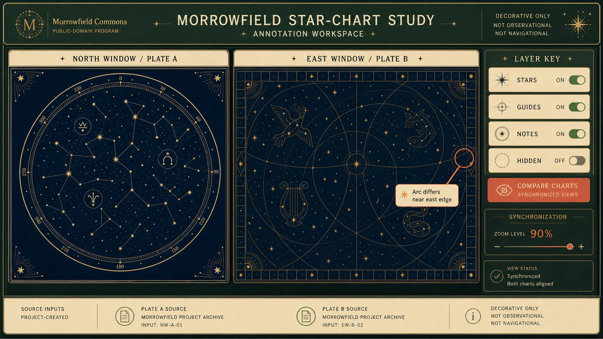

# Star Chart Annotation Workspace

## Use this when

Use this card for a public-domain star-chart annotation workspace. It is a fast interface concept route, not a claim that the interface is functional, tested, accessible, compliant, or ready to ship. Use a Recipe when exact preservation, repeated output, or recorded repair is required.

## Required inputs

- A fictional or authorized project name and product context.
- The intended audience and one primary user goal.
- A closed content and data manifest using fictional or approved values.
- Visual direction, target device, and prohibited content.
- The attached input asset or assets, an authority statement, assigned roles, and preservation scope.

## Prompt

```text
Design one desktop annotation interface for {PROJECT_CONTEXT}. The concept is a public-domain star-chart annotation workspace.

USER AND GOAL
The primary audience is {AUDIENCE}. Make {PRIMARY_GOAL} the unmistakable main action.

INFORMATION AND STRUCTURE
Use only {CONTENT_MANIFEST}. Keep two authorized charts in separate synchronized views with layer toggles, supplied labels, and source notes. Keep hierarchy, states, and navigation legible.

VISUAL DIRECTION
Design for {TARGET_DEVICE}. Preserve source roles and never imply observational accuracy, navigation utility, or ownership of public-domain material. Apply {VISUAL_DIRECTION} without borrowing a real product or brand system.

AUTHORIZED IMAGE SET
Use only {IMAGE_SET}, a small set whose items are all authorized for this task. Follow {IMAGE_ROLES} so each image has one declared purpose, and preserve only {PRESERVE_FEATURES}. Do not merge identities, brands, provenance, or hidden details across the sources.

CONSTRAINTS
Treat every name, metric, status, and message as fictional or supplied. Do not imply functional testing, accessibility certification, legal compliance, medical advice, financial advice, or operational readiness. Add no real brand, unauthorized real-person likeness, signature, or watermark. Avoid {MUST_AVOID}.

OUTPUT
Return one 16:9 concept image with readable hierarchy and no unrequested screens.
```

## Variables

- `{PROJECT_CONTEXT}`: the fictional or authorized product, service, or organization
- `{AUDIENCE}`: the intended user group without inferred sensitive traits
- `{PRIMARY_GOAL}`: the single task the interface should make easiest
- `{CONTENT_MANIFEST}`: the exact labels, values, states, and sample data allowed in the image
- `{TARGET_DEVICE}`: the target device, viewport, orientation, and primary input method
- `{VISUAL_DIRECTION}`: the approved palette, typography mood, spacing, and surface treatment
- `{MUST_AVOID}`: additional prohibited content, patterns, or unsupported claims
- `{IMAGE_SET}`: the attached authorized image set
- `{IMAGE_ROLES}`: the explicit source role assigned to every image
- `{PRESERVE_FEATURES}`: the approved visual facts to retain from each source

## Negative constraints

- No real brands, unauthorized real-person likenesses, medical or legal claims, signatures, or watermarks.
- No invented metrics, unreadable pseudo-copy, deceptive controls, or implied production readiness.
- Do not lose the assigned structure: Keep two authorized charts in separate synchronized views with layer toggles, supplied labels, and source notes.

## Quick check

Confirm the image communicates a public-domain star-chart annotation workspace. Check the assigned composition, then verify the specific direction: preserve source roles and never imply observational accuracy, navigation utility, or ownership of public-domain material. Reject invented content, unsupported claims, or any mismatch between supplied inputs and the visible result.

## Rendered Sample



- Sample status: Rendered Sample.
- Generation surface: built-in image generation tool
- Generated at: `2026-08-30T23:40:48Z`
- Model: `not_exposed`
- Model version: `not_exposed`
- Seed: `not_exposed`
- Request parameters: `not_exposed`
- Request ID: `not_exposed`
- Exact prompt: [star-chart-annotation-workspace.prompt.txt](samples/star-chart-annotation-workspace/star-chart-annotation-workspace.prompt.txt)
- Output dimensions: `1672 x 941`
- Output SHA-256: `c5b36ef14aad880b9fa42d93686d0fcfdf390b0fe5eb057e120b38c06c629bc6`
- Profile ID: `null`
- Promotion evidence: `false`
- Human inspection: Passed at full resolution: the accepted 16:9 Star Chart Annotation Workspace render makes "compare two project-created charts and toggle one annotation layer" primary and keeps "MORROWFIELD STAR-CHART STUDY", "left NORTH WINDOW / PLATE A", "right EAST WINDOW / PLATE B" readable in a complete frame; no material count, crop, watermark, or unsafe-resemblance defect was observed. All 3 linked role-specific supporting inputs remain distinct in the composition.
- Known misses: No material miss was observed against the closed Star Chart Annotation Workspace manifest; this single illustrative render does not establish interaction behavior, repeatability, or production readiness.
- Rights and provenance: The concept, exact prompts, accepted image, and any supporting inputs are fictional and project-authored. The linked final is a quality-88 public WebP derivative; private archival storage retains the lossless PNG masters and exact call prompts with checksums. The public derivatives may be reused under this repository's license; this record is illustrative evidence only.
- Supporting inputs:
  - [input-01-chart-a.webp](samples/star-chart-annotation-workspace/input-01-chart-a.webp): project-authored fictional chart a supporting input; reduced public WebP derivative of its staged lossless PNG master
  - [input-02-chart-b.webp](samples/star-chart-annotation-workspace/input-02-chart-b.webp): project-authored fictional chart b supporting input; reduced public WebP derivative of its staged lossless PNG master
  - [input-03-legend.webp](samples/star-chart-annotation-workspace/input-03-legend.webp): project-authored fictional legend supporting input; reduced public WebP derivative of its staged lossless PNG master

## Rights and provenance

This Card is independently authored with `original` source posture. Every image in the set must be fictional, public-domain, project-owned, or otherwise authorized, with a recorded role and preservation scope. This Rendered Sample is evidence for this exact illustrative run only; it does not establish multi-image fidelity, continuity, reliable composition, repeatability, or promotion.
