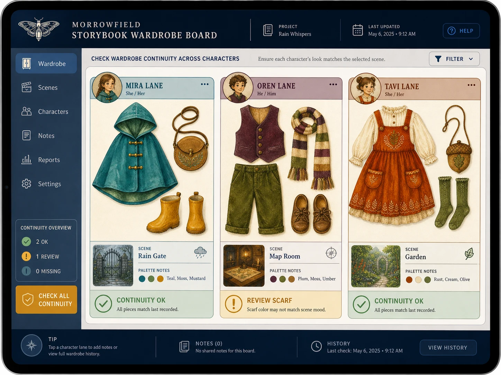

# Storybook Wardrobe Board

## Use this when

Use this card for an original storybook-character wardrobe board. It is a fast interface concept route, not a claim that the interface is functional, tested, accessible, compliant, or ready to ship. Use a Recipe when exact preservation, repeated output, or recorded repair is required.

## Required inputs

- A fictional or authorized project name and product context.
- The intended audience and one primary user goal.
- A closed content and data manifest using fictional or approved values.
- Visual direction, target device, and prohibited content.
- The attached input asset or assets, an authority statement, assigned roles, and preservation scope.

## Prompt

```text
Design one tablet visual-planning interface for {PROJECT_CONTEXT}. The concept is an original storybook-character wardrobe board.

USER AND GOAL
The primary audience is {AUDIENCE}. Make {PRIMARY_GOAL} the unmistakable main action.

INFORMATION AND STRUCTURE
Use only {CONTENT_MANIFEST}. Keep authorized costume images in character-specific lanes with scene tags, palette notes, and continuity flags. Keep hierarchy, states, and navigation legible.

VISUAL DIRECTION
Design for {TARGET_DEVICE}. Do not merge identities or copy protected characters; use only fictional characters and approved wardrobe references. Apply {VISUAL_DIRECTION} without borrowing a real product or brand system.

AUTHORIZED IMAGE SET
Use only {IMAGE_SET}, a small set whose items are all authorized for this task. Follow {IMAGE_ROLES} so each image has one declared purpose, and preserve only {PRESERVE_FEATURES}. Do not merge identities, brands, provenance, or hidden details across the sources.

CONSTRAINTS
Treat every name, metric, status, and message as fictional or supplied. Do not imply functional testing, accessibility certification, legal compliance, medical advice, financial advice, or operational readiness. Add no real brand, unauthorized real-person likeness, signature, or watermark. Avoid {MUST_AVOID}.

OUTPUT
Return one 4:3 concept image with readable hierarchy and no unrequested screens.
```

## Variables

- `{PROJECT_CONTEXT}`: the fictional or authorized product, service, or organization
- `{AUDIENCE}`: the intended user group without inferred sensitive traits
- `{PRIMARY_GOAL}`: the single task the interface should make easiest
- `{CONTENT_MANIFEST}`: the exact labels, values, states, and sample data allowed in the image
- `{TARGET_DEVICE}`: the target device, viewport, orientation, and primary input method
- `{VISUAL_DIRECTION}`: the approved palette, typography mood, spacing, and surface treatment
- `{MUST_AVOID}`: additional prohibited content, patterns, or unsupported claims
- `{IMAGE_SET}`: the attached authorized image set
- `{IMAGE_ROLES}`: the explicit source role assigned to every image
- `{PRESERVE_FEATURES}`: the approved visual facts to retain from each source

## Negative constraints

- No real brands, unauthorized real-person likenesses, medical or legal claims, signatures, or watermarks.
- No invented metrics, unreadable pseudo-copy, deceptive controls, or implied production readiness.
- Do not lose the assigned structure: Keep authorized costume images in character-specific lanes with scene tags, palette notes, and continuity flags.

## Quick check

Confirm the image communicates an original storybook-character wardrobe board. Check the assigned composition, then verify the specific direction: do not merge identities or copy protected characters; use only fictional characters and approved wardrobe references. Reject invented content, unsupported claims, or any mismatch between supplied inputs and the visible result.

## Rendered Sample



- Sample status: Rendered Sample.
- Generation surface: built-in image generation tool
- Generated at: `2026-08-30T23:39:50Z`
- Model: `not_exposed`
- Model version: `not_exposed`
- Seed: `not_exposed`
- Request parameters: `not_exposed`
- Request ID: `not_exposed`
- Exact prompt: [storybook-wardrobe-board.prompt.txt](samples/storybook-wardrobe-board/storybook-wardrobe-board.prompt.txt)
- Output dimensions: `1448 x 1086`
- Output SHA-256: `b23e62299f40c381e739c4b25893fe982aca1c2582bf27487021856c3926afbe`
- Profile ID: `null`
- Promotion evidence: `false`
- Human inspection: Passed at full resolution: the accepted 4:3 Storybook Wardrobe Board render makes "check wardrobe continuity across three original fictional characters" primary and keeps "MOTH LANTERN WARDROBE", "Mira lane / teal cape, mustard boots, round satchel /…", "Oren lane / plum waistcoat, moss trousers, striped sc…" readable in a complete frame; no material count, crop, watermark, or unsafe-resemblance defect was observed. All 3 linked role-specific supporting inputs remain distinct in the composition.
- Known misses: No material miss was observed against the closed Storybook Wardrobe Board manifest; this single illustrative render does not establish interaction behavior, repeatability, or production readiness.
- Rights and provenance: The concept, exact prompts, accepted image, and any supporting inputs are fictional and project-authored. The linked final is a quality-88 public WebP derivative; private archival storage retains the lossless PNG masters and exact call prompts with checksums. The public derivatives may be reused under this repository's license; this record is illustrative evidence only.
- Supporting inputs:
  - [input-01-mira-costume.webp](samples/storybook-wardrobe-board/input-01-mira-costume.webp): project-authored fictional mira costume supporting input; reduced public WebP derivative of its staged lossless PNG master
  - [input-02-oren-costume.webp](samples/storybook-wardrobe-board/input-02-oren-costume.webp): project-authored fictional oren costume supporting input; reduced public WebP derivative of its staged lossless PNG master
  - [input-03-tavi-costume.webp](samples/storybook-wardrobe-board/input-03-tavi-costume.webp): project-authored fictional tavi costume supporting input; reduced public WebP derivative of its staged lossless PNG master

## Rights and provenance

This Card is independently authored with `original` source posture. Every image in the set must be fictional, public-domain, project-owned, or otherwise authorized, with a recorded role and preservation scope. This Rendered Sample is evidence for this exact illustrative run only; it does not establish multi-image fidelity, continuity, reliable composition, repeatability, or promotion.
