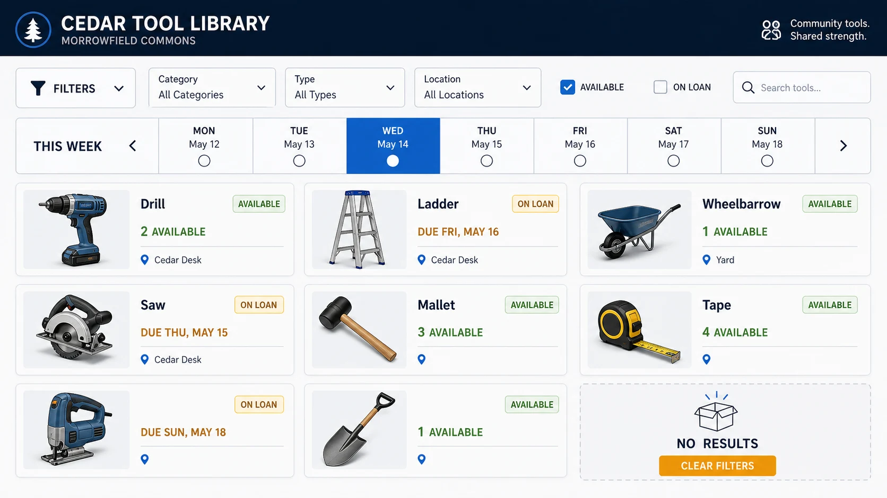

# Tool-Lending Availability Board

## Use this when

Use this card for a community tool-lending availability board. It is a fast interface concept route, not a claim that the interface is functional, tested, accessible, compliant, or ready to ship. Use a Recipe when exact preservation, repeated output, or recorded repair is required.

## Required inputs

- A fictional or authorized project name and product context.
- The intended audience and one primary user goal.
- A closed content and data manifest using fictional or approved values.
- Visual direction, target device, and prohibited content.
- The attached input asset or assets, an authority statement, assigned roles, and preservation scope.

## Prompt

```text
Design one responsive web interface for {PROJECT_CONTEXT}. The concept is a community tool-lending availability board.

USER AND GOAL
The primary audience is {AUDIENCE}. Make {PRIMARY_GOAL} the unmistakable main action.

INFORMATION AND STRUCTURE
Use only {CONTENT_MANIFEST}. Place filters and a date strip beside a scannable grid of fictional tools, condition states, and return windows. Keep hierarchy, states, and navigation legible.

VISUAL DIRECTION
Design for {TARGET_DEVICE}. Use sturdy neutral cards, distinct availability states, and visible empty-state guidance. Apply {VISUAL_DIRECTION} without borrowing a real product or brand system.

AUTHORIZED SKETCH INPUT
Use {SKETCH_INPUT} only as an authorized guide for the declared arrangement. Preserve {PRESERVE_FEATURES}; do not copy a protected design language, named living artist style, signature, logo, or detail that the sketch does not establish.

CONSTRAINTS
Treat every name, metric, status, and message as fictional or supplied. Do not imply functional testing, accessibility certification, legal compliance, medical advice, financial advice, or operational readiness. Add no real brand, unauthorized real-person likeness, signature, or watermark. Avoid {MUST_AVOID}.

OUTPUT
Return one 16:9 concept image with readable hierarchy and no unrequested screens.
```

## Variables

- `{PROJECT_CONTEXT}`: the fictional or authorized product, service, or organization
- `{AUDIENCE}`: the intended user group without inferred sensitive traits
- `{PRIMARY_GOAL}`: the single task the interface should make easiest
- `{CONTENT_MANIFEST}`: the exact labels, values, states, and sample data allowed in the image
- `{TARGET_DEVICE}`: the target device, viewport, orientation, and primary input method
- `{VISUAL_DIRECTION}`: the approved palette, typography mood, spacing, and surface treatment
- `{MUST_AVOID}`: additional prohibited content, patterns, or unsupported claims
- `{SKETCH_INPUT}`: the attached project-owned or otherwise authorized sketch
- `{PRESERVE_FEATURES}`: the layout, geometry, or relationships explicitly approved for preservation

## Negative constraints

- No real brands, unauthorized real-person likenesses, medical or legal claims, signatures, or watermarks.
- No invented metrics, unreadable pseudo-copy, deceptive controls, or implied production readiness.
- Do not lose the assigned structure: Place filters and a date strip beside a scannable grid of fictional tools, condition states, and return windows.

## Quick check

Confirm the image communicates a community tool-lending availability board. Check the assigned composition, then verify the specific direction: use sturdy neutral cards, distinct availability states, and visible empty-state guidance. Reject invented content, unsupported claims, or any mismatch between supplied inputs and the visible result.

## Rendered Sample



- Sample status: Rendered Sample.
- Generation surface: built-in image generation tool
- Generated at: `2026-08-30T23:42:49Z`
- Model: `not_exposed`
- Model version: `not_exposed`
- Seed: `not_exposed`
- Request parameters: `not_exposed`
- Request ID: `not_exposed`
- Exact prompt: [tool-lending-availability-board.prompt.txt](samples/tool-lending-availability-board/tool-lending-availability-board.prompt.txt)
- Output dimensions: `1672 x 941`
- Output SHA-256: `7c9d2867812727f4ccd2760dbe4e9a9376f13b8509ecf78f7c1a8dee4f38ee53`
- Profile ID: `null`
- Promotion evidence: `false`
- Human inspection: Passed at full resolution: the accepted 16:9 Tool-Lending Availability Board render makes "filter fictional tools by availability and recover from an empty state" primary and keeps "CEDAR TOOL LIBRARY", "date strip Mon-Sun with Wed selected", "Drill / 2 available / Cedar Desk" readable in a complete frame; no material count, crop, watermark, or unsafe-resemblance defect was observed. All 1 linked role-specific supporting inputs remain distinct in the composition.
- Known misses: No material miss was observed against the closed Tool-Lending Availability Board manifest; this single illustrative render does not establish interaction behavior, repeatability, or production readiness.
- Rights and provenance: The concept, exact prompts, accepted image, and any supporting inputs are fictional and project-authored. The linked final is a quality-88 public WebP derivative; private archival storage retains the lossless PNG masters and exact call prompts with checksums. The public derivatives may be reused under this repository's license; this record is illustrative evidence only.
- Supporting inputs:
  - [input-01-grid-sketch.webp](samples/tool-lending-availability-board/input-01-grid-sketch.webp): project-authored fictional grid sketch supporting input; reduced public WebP derivative of its staged lossless PNG master

## Rights and provenance

This Card is independently authored with `original` source posture. Use only a project-owned, public-domain, or otherwise authorized sketch. Record its permitted role and preservation scope. This Rendered Sample is evidence for this exact illustrative run only; it does not establish sketch adherence, repeatability, production reliability, or promotion.
