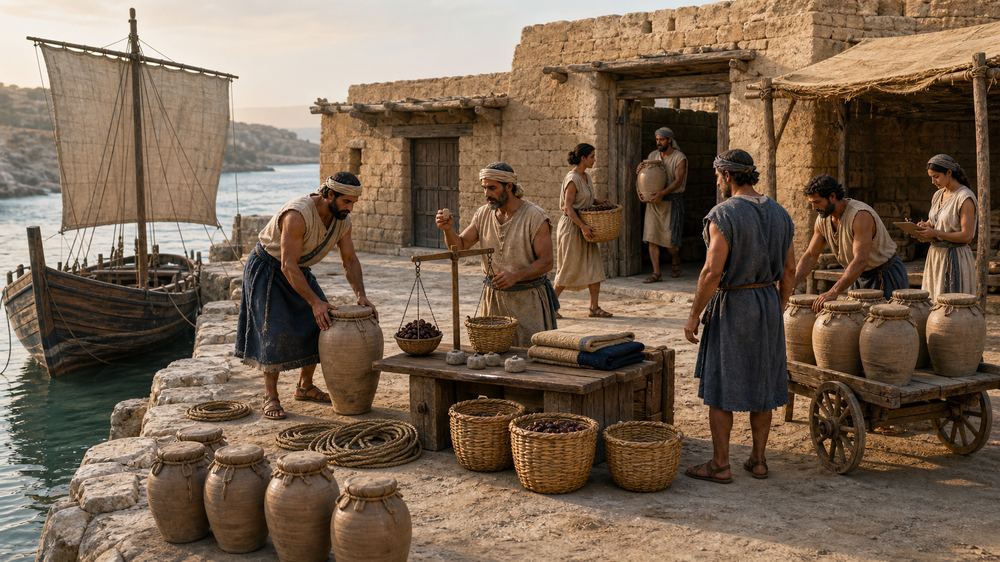

# Fictional Bronze Age Harbor Market

- Status: Draft
- Record version: 1
- Task family: Fact-bounded historical reconstruction
- Source posture: Original
- Evidence status: Recorded illustrative built-in-tool sample; promotion evidence: no
- Default outcome: Production Candidate, subject to final QA

This Recipe turns an approved period fact pack into one clearly labeled fictional historical composite. It is an interpretive concept image, not archaeological evidence or a reconstruction of one real site.

## Task fit and non-fit

Use this Recipe when:

- one region and date range define the factual boundary;
- architecture, vessels, clothing, goods, tools, and activities are preapproved;
- the scene is explicitly a fictional composite;
- every visible material-culture element must map to the fact pack;
- a qualified reviewer will inspect anachronisms and representation.

Do not use it to:

- reconstruct a named site, event, ruler, or documented individual;
- invent facts, inscriptions, technologies, or cultural links;
- copy an artifact, excavation image, museum reconstruction, or artwork;
- blend regions or centuries for visual effect;
- present generation as historical evidence or publication approval.

## Required Creative Brief inputs

Provide:

1. `region_and_date_range`, with the intended precision and limits.
2. `fact_pack`, approved by a named source owner and review date.
3. `architecture_and_vessels`, as a closed inventory.
4. `people`, including exact count, fictional roles, and activities.
5. `clothing_manifest`, materials, colors, and construction limits.
6. `goods_and_tools`, with exact counts when visible.
7. `material_culture_rules` and explicit anachronism exclusions.
8. `composition`, including shoreline logic, camera, light, and palette.
9. `output`, including aspect ratio, pixel size, background, and format.
10. `rights_confirmation` for every factual or visual reference.

Stop if the source owner, factual boundary, or rights record is missing.

## Input preparation

1. Split the fact pack into atomic approved statements.
2. Map each visible object, garment, structure, vessel, and activity to one fact.
3. Remove uncertain elements or label them as explicit hypotheses outside the image.
4. Freeze person and object counts.
5. Check scale relationships among people, vessels, doors, jars, and carts.
6. Review the exclusions for later technology and culture mixing.
7. Save the fact-pack revision, source-owner approval, and rendered prompt with every future run.

## Portable prompt

Replace all brace-delimited variables. Do not ask the model to fill historical gaps.

```text
Create one finished historical-concept image of a clearly fictional composite, not a documentary photograph, archaeological claim, museum reconstruction, map, or option sheet.

SCENE
Depict {FICTIONAL_PLACE}, an invented harbor within {REGION_AND_DATE_RANGE}, viewed from {CAMERA_POSITION} during {WEATHER_AND_LIGHT}.

SUBJECT
Center {PRIMARY_ACTIVITY} among exactly {PEOPLE_MANIFEST} and {ARCHITECTURE_AND_VESSELS}.

DETAILS
Include only {GOODS_AND_TOOLS}, {CLOTHING_MANIFEST}, and {SECONDARY_ACTIVITIES}. Follow {MATERIAL_CULTURE_RULES}, {SCALE_RULES}, and {PALETTE}.

CONSTRAINTS
Do not add anything outside {FACT_PACK_BOUNDARY}. Add no copied artifact, named person, real-site feature, inscription, mixed period, modern object, logo, signature, or watermark. Preserve the fictional-composite disclaimer in metadata.

OUTPUT INTENT
Return one coherent {ASPECT_RATIO} concept image at {PIXEL_SIZE}, with an auditable inventory and no claim of documentary certainty.
```

## Conversational Profile

Profile ID: `conversational-v1`

1. Supply the approved fact pack, completed brief, and prompt.
2. Ask the surface to identify unsupported or contradictory details before generation.
3. Remove or resolve those details with the source owner.
4. Request one image only.
5. Record visible settings and mark hidden metadata `not_exposed`.
6. Review every visible element against the same invariants below.

A conversational run does not establish historical accuracy or API promotion evidence.

## GPT Image 2 API Profile

Profile ID: `gpt-image-2-api-v1`

Endpoint: OpenAI Image API, `POST /v1/images/generations`.

```json
{
  "model": "gpt-image-2-2026-04-21",
  "prompt": "<completed portable prompt>",
  "n": 1,
  "size": "1536x1024",
  "quality": "high",
  "background": "opaque",
  "output_format": "png",
  "moderation": "auto"
}
```

Before any provider call, approve the exact prompt, credential source, spend ceiling, retention policy, evidence path, and stop condition. Preserve factual and generation failures.

## Critical Invariants

- `CI-01 Fact mapping`: every visible material-culture element maps to the approved fact pack.
- `CI-02 Temporal boundary`: no later or earlier technology, clothing, or architecture appears.
- `CI-03 Regional boundary`: the scene does not mix unrelated cultural or geographic systems.
- `CI-04 Inventory`: people, vessels, goods, tools, and structures match approved counts.
- `CI-05 Scale`: people, vessels, jars, doors, carts, and quay remain mutually plausible.
- `CI-06 Fiction label`: the result remains described as a fictional composite, not evidence.
- `CI-07 Rights`: no copied artifact, real-site reconstruction, logo, signature, or watermark appears.
- `CI-08 Representation`: people are not exoticized, caricatured, or assigned unsupported identities.

Any failed invariant blocks the candidate.

## Production Candidate Rubric

Score `pass` or `fail` after all invariants pass:

- `R-01 Historical coherence`: approved details read as one bounded time and place.
- `R-02 Activity clarity`: the primary exchange and secondary work remain legible.
- `R-03 Spatial logic`: vessel, quay, storehouses, market, and people connect plausibly.
- `R-04 Material credibility`: wood, mudbrick, stone, fiber, clay, and metal behave coherently.
- `R-05 Composition`: inventory remains readable without becoming a catalog sheet.
- `R-06 Finish`: anatomy, vessels, objects, light, and edges have no distracting artifacts.

All six items must pass. Promotion remains subject to separate multi-run evidence and expert review.

## Inspection and targeted repair

1. Build a visible-object list from the candidate.
2. Map every item and activity to the fact pack.
3. Check the date and regional exclusions for anachronisms or blending.
4. Count people, vessels, jars, baskets, tools, and goods.
5. Compare all major scale relationships.
6. Ask the source owner and representation reviewer to record findings.
7. Preserve every failure before repair.

Repair one defect class at a time. Restate the complete closed inventory for added objects and the full boundary for anachronisms. Preserve accepted composition and lighting. Rescore the whole result and require renewed source-owner review.

## Final-QA handoff

Include the image and checksum, brief and fact-pack revisions, source owner and review date, rendered prompt, profile data, object-to-fact mapping, invariant and rubric results, representation review, repairs, and rights confirmation. Label it `Production Candidate` and `Fictional composite, not archaeological evidence.`

## Representative fictional brief

- Place and date: Kalyra Cove, an invented eastern Mediterranean harbor around 1300 BCE.
- Primary activity: market keeper weighs dried figs while an arriving sailor sets down one sealed transport jar.
- People: exactly eight unnamed fictional adults performing loading, measuring, carrying, or recording tasks.
- Setting: mudbrick storehouses, stone-and-earth quay, one wooden coastal vessel with one lowered square sail.
- Inventory: twelve jars, four baskets, one balance and weights, two folded textiles, three rope coils, one handcart, and one clay tally token.
- Clothing: simple wool and linen tunics, wrapped skirts, belts, sandals, and head cloths.
- Exclusions: coins, glass windows, iron tools, alphabetic signs, columns, monuments, modern rigging, later armor, horses, camels, named people, real-site features, and copied artifacts.
- Output: 16:9 landscape, `1536x1024`, opaque PNG.
- Rights: scene direction is project-authored; factual review remains required before generation.

The fully resolved illustrative prompt is [saved here](samples/fictional-bronze-age-harbor-market.prompt.txt).

## Rendered Sample



This is one recorded illustrative output from the representative brief with the Codex built-in image generation tool on 2026-08-26. The stronger initial output was retained after one targeted retry reduced the worker and goods counts further. Manual review found a coherent fictional harbor exchange, but only seven adults, ten jars, and six baskets are visible rather than the required eight, twelve, and four, and the vessel's square sail is raised rather than lowered.

- [Exact submitted prompt](samples/fictional-bronze-age-harbor-market.prompt.txt)
- [Rejected retry prompt](samples/fictional-bronze-age-harbor-market.retry.prompt.txt)
- [Generation run record](evidence.json)
- Model, model version, seed, request parameters, and request ID: `not_exposed`
- Output: `1672x941` PNG, not the brief's `1536x1024` target
- Promotion evidence: no

This sample is one illustrative built-in-tool output. It does not demonstrate repeatability, GPT Image 2 API conformance, Recipe promotion evidence, a full inventory pass, historical validity, expert review, or publication readiness.

## Rights and provenance boundary

This independently authored Recipe has `original` source posture and no Source Entry. Future factual references must be authorized and itemized. Do not reproduce archaeological photographs, museum reconstructions, protected illustrations, or upstream prompts. Historical plausibility and cultural respect require qualified human review.
