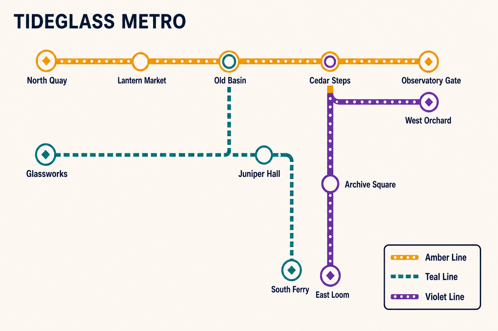

# Fictional Metro Route Map

- Status: Draft
- Record version: 1
- Task family: Schematic route map
- Source posture: Original
- Evidence status: Recorded illustrative built-in-tool sample; promotion evidence: no
- Default outcome: Production Candidate, subject to final QA

This Recipe turns one approved fictional route graph into a single inspectable transit schematic. It does not research geography, calculate service, or represent a real operator.

## Task fit and non-fit

Use this Recipe when:

- every route, station, branch, transfer, and terminal is already approved;
- station names and legend strings form a closed exact-text manifest;
- the output is a schematic diagram rather than a geographic map;
- topology and non-color accessibility encoding must be inspected;
- one finished map is required.

Do not use it to:

- map a real transit network or copy its identity;
- choose routes, infer transfers, or estimate travel time;
- produce a live timetable, journey planner, or fare claim;
- fit an unbounded station list onto one canvas;
- treat generation as publication or accessibility approval.

## Required Creative Brief inputs

Provide:

1. `network_name` and `title_exact`.
2. `routes`, with each line's exact name and ordered station sequence.
3. `branches`, if any, expressed as explicit graph edges.
4. `transfers`, naming every participating route at each node.
5. `terminals` and any required accessible stations.
6. `exact_labels`, including title, station names, and legend strings.
7. `route_styles`, including colors and non-color reinforcement.
8. `layout_rules`, including orientation, margins, title, and legend position.
9. `output`, including aspect ratio, pixel size, background, and format.
10. `rights_confirmation` that all names and visual rules are fictional or authorized.

Stop if the graph, exact labels, or transfer list is incomplete.

## Input preparation

1. Normalize every station and route name without changing case or punctuation.
2. Express each route as an ordered list and each transfer as an explicit relation.
3. Validate that all referenced nodes exist and every terminal has one route endpoint.
4. Choose line styles that remain distinguishable without color.
5. Set one label-placement rule before generation.
6. Split the network if labels cannot remain legible at the selected size.
7. Save the brief revision and fully rendered prompt with any future run.

## Portable prompt

Replace every brace-delimited variable. Do not leave placeholders.

```text
Create one finished schematic transit map, not a geographic map, UI, timetable, or option sheet.

SCENE
Use {BACKGROUND} in a {ASPECT_RATIO} canvas. Place "{TITLE_EXACT}" at {TITLE_POSITION} and the legend at {LEGEND_POSITION}.

SUBJECT
Diagram the fictional network {NETWORK_NAME} using only {ORDERED_ROUTE_GRAPH}. Mark transfers exactly as {TRANSFER_LIST} and terminals exactly as {TERMINAL_LIST}.

DETAILS
Render {EXACT_LABEL_MANIFEST} verbatim. Apply {ROUTE_STYLES}, {NODE_SYSTEM}, and {NON_COLOR_ENCODING}. Keep labels {LABEL_RULES} and use {LINE_GEOMETRY}.

CONSTRAINTS
Do not add, remove, rename, reorder, merge, or reconnect nodes. Add no fares, times, geography, logos, signatures, watermarks, or extra text. Keep every required element inside the canvas.

OUTPUT INTENT
Return one clean {ASPECT_RATIO} schematic at {PIXEL_SIZE}, with correct topology and enough spacing for route-by-route inspection.
```

## Conversational Profile

Profile ID: `conversational-v1`

1. Supply the completed brief and prompt.
2. Ask for unresolved fields before generation.
3. Resolve graph or label conflicts outside the image model.
4. Request one image only after the graph is frozen.
5. Record visible surface and setting information; mark hidden metadata `not_exposed`.
6. Inspect topology and text with the same invariants used below.

A conversational run cannot count as API promotion evidence.

## GPT Image 2 API Profile

Profile ID: `gpt-image-2-api-v1`

Endpoint: OpenAI Image API, `POST /v1/images/generations`.

```json
{
  "model": "gpt-image-2-2026-04-21",
  "prompt": "<completed portable prompt>",
  "n": 1,
  "size": "1536x1024",
  "quality": "high",
  "background": "opaque",
  "output_format": "png",
  "moderation": "auto"
}
```

Before any provider call, approve the prompt, credential source, spend ceiling, retention policy, evidence location, and stop condition. Record failures rather than silently changing the graph.

## Critical Invariants

- `CI-01 Graph`: every route follows the supplied ordered nodes and edges.
- `CI-02 Transfers`: each transfer joins exactly the declared routes.
- `CI-03 Exact text`: every approved string appears correctly and no extra text appears.
- `CI-04 Terminals`: endpoints and terminal encoding match the manifest.
- `CI-05 Accessibility`: line identity is not communicated by color alone.
- `CI-06 Canvas`: no node, label, title, or legend is cropped or occluded.
- `CI-07 Identity`: no real operator mark, map, or geographic claim appears.

One failed invariant blocks the candidate.

## Production Candidate Rubric

Score each item `pass` or `fail` after all invariants pass:

- `R-01 Route tracing`: every line can be followed without ambiguity.
- `R-02 Label legibility`: labels are readable and do not collide with nodes or lines.
- `R-03 Hierarchy`: title, map, and legend have the declared priority.
- `R-04 Geometry`: corner angles, spacing, and line weights form one system.
- `R-05 Transfer clarity`: interchange nodes are immediately distinguishable.
- `R-06 Finish`: no pseudo-writing, accidental marks, or rendering artifacts remain.

A full pass requires every item to pass. Promotion still requires the repository's separate multi-run gate.

## Inspection and targeted repair

1. Trace each route terminal to terminal against the graph.
2. Check every branch and transfer from all participating lines.
3. Transcribe title, legend, route names, and stations character by character.
4. Review at full size and intended display size.
5. Test the map in grayscale and by node or line pattern.
6. Record every failure before repair.

Repair one defect class at a time. Restate the complete graph when repairing topology, and the complete exact-text manifest when repairing text. Preserve all accepted routes and styles. Treat the repair as a new candidate and rescore everything.

## Final-QA handoff

Include the selected image and checksum, brief revision, rendered prompt, route graph, exact labels, profile and model data, invariant results, rubric results, repair history, and rights confirmation. Label the result `Production Candidate`. A transit, accessibility, and channel owner must still approve publication.

## Representative fictional brief

- Network and title: `TIDEGLASS METRO`.
- Amber Line: North Quay, Lantern Market, Old Basin, Cedar Steps, Observatory Gate.
- Teal Line: Glassworks, Old Basin, Juniper Hall, South Ferry.
- Violet Line: West Orchard, Cedar Steps, Archive Square, East Loom.
- Transfers: Old Basin joins Amber and Teal; Cedar Steps joins Amber and Violet.
- Terminals: first and last station of each line.
- Encoding: circles for stations, double rings for transfers, diamonds inside terminals, and distinct line patterns.
- Layout: warm off-white field, title upper left, legend lower right, 3:2 landscape, `1536x1024`.
- Rights: all names, data, and visual direction are fictional and project-authored.

The fully resolved illustrative prompt is [saved here](samples/fictional-metro-route-map.prompt.txt).

## Rendered Sample



This is one recorded illustrative output from the representative brief with the Codex built-in image generation tool on 2026-08-26. It was selected after one targeted edit retry added the initially omitted West Orchard terminal. Manual review found all eleven station labels, route labels, transfer rings, and terminal marks legible, but the Teal Line junction below Old Basin reads as a branch rather than the strict ordered route.

- [Exact accepted edit prompt](samples/fictional-metro-route-map.edit.prompt.txt)
- [Base generation prompt](samples/fictional-metro-route-map.prompt.txt)
- [Generation run record](evidence.json)
- Model, model version, seed, request parameters, and request ID: `not_exposed`
- Output: `1536x1024` PNG
- Promotion evidence: no

This sample is one illustrative built-in-tool output. It does not demonstrate repeatability, GPT Image 2 API conformance, Recipe promotion evidence, a full topology or accessibility pass, or publication readiness.

## Rights and provenance boundary

This Recipe is independently authored with `original` source posture and no Source Entry. It does not copy an upstream prompt or map. Future briefs must use fictional or authorized network names, route data, labels, and visual rules. Generation does not establish trademark, accessibility, or publication clearance.
