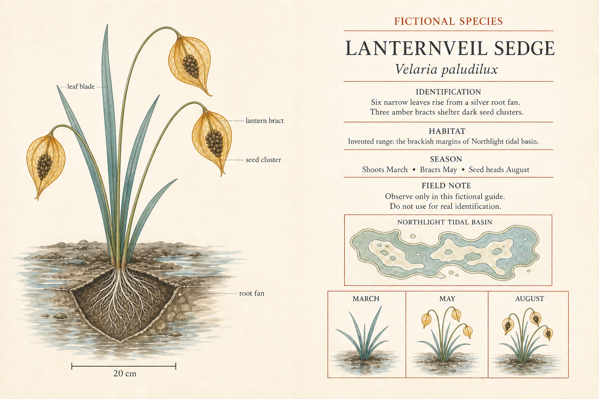

# Fictional Naturalist Field Guide Spread

- Record version: 1
- Status: Draft
- Source posture: Original
- Evidence status: Recorded illustrative built-in-tool sample; promotion evidence: no
- Profiles: `conversational-v1`, `gpt-image-2-api-v1`

Outcome: one Production Candidate for an illustrated two-page field-guide spread about an explicitly invented species. Generation alone does not make it factual, educationally suitable, print-ready, or publish-ready.

## Task fit

Use this Recipe when the brief requires:

- one flat two-page editorial spread about a deliberately fictional organism;
- approved fictional names, morphology, habitat, season, and observation copy;
- exact annotations tied to declared illustration structures;
- a fixed grid, page hierarchy, safe margins, and central gutter;
- inspection and targeted repair before editorial and print QA.

Do not use it for:

- real species identification, taxonomy, field safety, edibility, or medical guidance;
- scientific claims that have not been reviewed by a qualified source owner;
- reproduction of an existing naturalist plate, guide, or publisher identity;
- a full book, interactive guide, or multi-species comparison;
- a request that presents invented content as real authority.

## Required Creative Brief inputs

Provide every field before generation:

- `fiction_label_exact`: prominent statement that the species is invented.
- `common_name_exact`: project-authored fictional common name.
- `binomial_name_exact`: invented binomial checked for internal spelling consistency.
- `morphology_manifest`: exact structures, counts, colors, and relationships.
- `illustration_manifest`: whole-organism and detail views.
- `annotation_manifest`: exact labels and their target structures.
- `approved_copy_manifest`: exact headings and body copy.
- `range_panel`: explicitly fictional range label and abstract shape.
- `seasonal_panel`: approved stages, dates, and exact labels.
- `editorial_grid`: page ownership, columns, hierarchy, and reading order.
- `gutter_and_margins`: central and outer safe areas.
- `visual_system`: project-owned illustration, palette, type, line, and texture rules.
- `output`: aspect ratio and pixel dimensions.
- `rights_confirmation`: authority for all copy and supplied visual references.

Stop if the fiction label is missing, the copy makes a real-world claim, or an annotation lacks a declared target.

## Input preparation

1. Freeze common and binomial names, including capitalization and italics intent.
2. Check every body sentence against the fictional morphology and seasonal manifests.
3. Map each annotation to one visible structure before layout.
4. Keep the fictional range abstract and unrelated to real geography.
5. Reserve the gutter before placing copy, labels, or important illustration detail.
6. Remove conservation, medicinal, edible, safety, citation, and real taxonomic claims.

## Portable prompt

Replace every brace-delimited value with approved brief content. Leave no unresolved placeholder.

```text
Create one flat, open two-page naturalist field-guide spread about a deliberately invented organism.

FICTION BOUNDARY
- Display {FICTION_LABEL_EXACT} prominently.
- Common name: {COMMON_NAME_EXACT}.
- Invented binomial: {BINOMIAL_NAME_EXACT}.
- Do not imply that the organism exists or can be used for real identification.

ILLUSTRATION
- Show {ILLUSTRATION_MANIFEST} with morphology exactly matching {MORPHOLOGY_MANIFEST}.
- Attach only {ANNOTATION_MANIFEST}, each to its declared structure.

EDITORIAL CONTENT
- Render only {APPROVED_COPY_MANIFEST}.
- Include the explicitly fictional range panel {RANGE_PANEL}.
- Include the seasonal panel {SEASONAL_PANEL}.

LAYOUT AND STYLE
- Follow {EDITORIAL_GRID}, {GUTTER_AND_MARGINS}, and {VISUAL_SYSTEM}.
- Keep every required label, line, and illustration detail inside its page and outside the gutter.

CONSTRAINTS
- Preserve every name, label, measurement, date, separator, and sentence exactly.
- Add no real taxonomy, range, conservation status, medicinal use, edibility guidance, source citation, publisher mark, page number, pseudo-text, signature, or watermark.

OUTPUT
- Return one complete spread at {OUTPUT}, not a book mockup, desk scene, page curl, or collection of loose plates.
```

## Conversational Profile

Profile ID: `conversational-v1`

1. Submit the approved brief and completed Portable prompt.
2. Ask the surface to identify unresolved copy, annotation, or gutter conflicts before generation.
3. Resolve every issue, then request one image.
4. Record the surface, date, visible settings, and exposed model information. Mark hidden fields `not_exposed`.
5. Inspect the fiction boundary and exact copy before judging illustration quality.

A conversational result is not API promotion evidence or scientific validation.

## GPT Image 2 API Profile

Profile ID: `gpt-image-2-api-v1`

Endpoint: OpenAI Image API, `POST /v1/images/generations`.

```json
{
  "model": "gpt-image-2-2026-04-21",
  "prompt": "<completed Portable prompt>",
  "n": 1,
  "size": "1536x1024",
  "quality": "high",
  "background": "opaque",
  "output_format": "png",
  "moderation": "auto"
}
```

Before any provider call, approve the exact prompt, credential source, spend ceiling, retention policy, output location, and stop condition. Preserve the request body and returned metadata. No API request has been made for this Recipe.

## Critical Invariants

- `CI-01 Fiction label`: the spread prominently and unambiguously states that the species is fictional.
- `CI-02 Exact copy`: names, headings, sentences, measurements, dates, and labels match the approved manifest.
- `CI-03 Morphology`: structure counts, colors, relationships, and detail views match the fictional brief without contradiction.
- `CI-04 Annotation accuracy`: every callout reaches the correct declared structure and no loose or invented label appears.
- `CI-05 Editorial safety`: no required content crosses the gutter, trim, or safe margins, and the reading order is intact.
- `CI-06 Factual restraint`: no real taxonomy, range, conservation, medicinal, edible, safety, citation, or publisher claim appears.

## Production Candidate Rubric

Score each item `pass` or `fail` after all Critical Invariants pass:

- `R-01 Plate clarity`: whole organism and detail views are easy to distinguish and compare.
- `R-02 Reading hierarchy`: fiction label, names, headings, copy, and panels follow the declared order.
- `R-03 Annotation legibility`: labels and callout lines are crisp, separated, and readable.
- `R-04 Editorial composition`: both pages feel balanced while the gutter remains visibly safe.
- `R-05 Visual coherence`: illustration, palette, type, rules, and texture belong to one project-owned system.
- `R-06 Finish`: no malformed anatomy, pseudo-text, clipped glyph, detached line, or low-resolution region remains.

A full pass requires all six items. It does not establish scientific truth. Recipe promotion still requires the library's separate evidence gate.

## Inspection and targeted repair

1. Locate the fiction label before reviewing any other content.
2. Transcribe names, headings, body copy, measurements, and panel labels character by character.
3. Count declared structures and trace every annotation line to its endpoint.
4. Inspect the gutter, margins, hierarchy, contrast, and illustration consistency.
5. Record every failure before repair.

```text
Repair only this defect in the supplied fictional field-guide spread: {DEFECT}.
Required correction: {EXACT_CORRECTION}.
Preserve all already-correct copy, fictional morphology, annotations, grid, gutter, palette, illustration style, and dimensions.
Add no real-world claim, taxonomy, citation, publisher mark, pseudo-text, signature, or watermark.
Return one corrected complete spread.
```

After repair, rescore the entire spread because a local text or illustration edit can disturb adjacent labels and layout.

## Final-QA handoff

Include the Recipe ID and version, brief revision, fiction label, approved copy and morphology manifests, exact prompt, profile and visible settings, output hash and path, invariant and rubric results, failures and repairs, rights status, print intent, and descriptive alt text. Label the output `Production Candidate` only after it passes. Editorial, scientific-sensitivity, accessibility, legal, and print review remain separate.

## Representative evaluation brief

The saved prompt at `samples/fictional-naturalist-field-guide-spread.prompt.txt` resolves this fictional brief:

- Fiction label: `FICTIONAL SPECIES`.
- Common name: `LANTERNVEIL SEDGE`.
- Invented binomial: `Velaria paludilux`.
- Morphology: six blue-green leaves, three amber bracts, dark seed clusters, and a silver root fan.
- Labels: `leaf blade`, `lantern bract`, `seed cluster`, `root fan`.
- Panels: invented Northlight tidal-basin range and March, May, August seasonal stages.
- Output: landscape 3:2, `1536x1024`.

## Rendered Sample



This is the retained output of a recorded two-step built-in-tool sequence from 2026-08-26. The initial call used the representative base prompt but appeared to exceed the six-leaf requirement. The second call used the exact targeted edit prompt and the recorded initial PNG as an authorized image input. Manual review found the retained output's fiction label, supplied copy, annotations, range panel, seasonal strip, and gutter legible, but the edit undershot the invariant: only four main leaf blades are clearly distinguishable rather than the required six.

- [Initial generation prompt](samples/fictional-naturalist-field-guide-spread.prompt.txt)
- [Exact targeted edit prompt](samples/fictional-naturalist-field-guide-spread.edit.prompt.txt)
- [Superseded initial PNG](samples/fictional-naturalist-field-guide-spread.initial.png)
- [Initial and edit run record](evidence.json)
- Model, model version, seed, request parameters, and request ID: `not_exposed`
- Initial and retained edit outputs: `1536x1024` PNG
- Promotion evidence: no

The retained PNG is bound to the edit run, not the base prompt alone, and it is not a passing morphology example. This two-step illustrative sequence does not demonstrate repeatability, GPT Image 2 API conformance, Recipe promotion evidence, factual or scientific validation, a full rubric pass, or publication readiness.

## Rights and provenance boundary

This Recipe and its saved fictional brief are independently authored with source posture `original` and `source_record: null`. Use only invented species information, project-authored copy, and original illustration direction. No linked Source Entry, third-party field guide, plate, taxonomy, prompt, or image is included.
