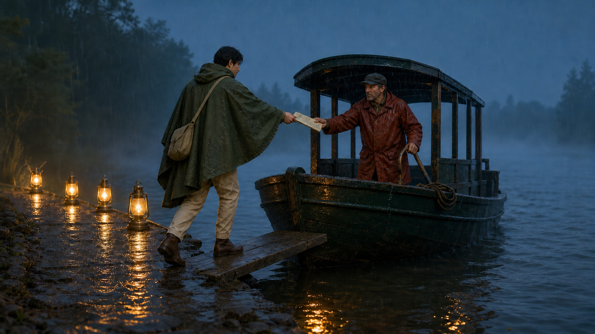

# Lantern Ferry Departure

- Status: Draft
- Record version: 1
- Task family: Single-frame narrative scene
- Source posture: Original
- Evidence status: Recorded illustrative built-in-tool sample; promotion evidence: no
- Default outcome: Production Candidate, subject to final QA

This Recipe turns one approved story beat into a single cinematic keyframe whose action reads without a caption. It does not create a storyboard or extend an existing story world.

## Task fit and non-fit

Use this Recipe when:

- one decisive departure beat has already been written;
- character count, identity anchors, props, and blocking are fixed;
- light, weather, gesture, and travel direction carry the story;
- one frame must communicate the event without text;
- the output will be inspected before downstream use.

Do not use it for:

- a storyboard, sequence, poster, or game screenshot;
- a real person, location, ferry operator, or documented event;
- dialogue, captions, or long explanatory text;
- a protected franchise, recognizable costume, or celebrity likeness;
- publication without story, rights, and channel review.

## Required Creative Brief inputs

Provide:

1. `story_beat`, expressed as one visible action and response.
2. `setting`, including fictional place, time, weather, and departure direction.
3. `character_manifest`, including exact count and identity anchors.
4. `wardrobe_manifest` for each character.
5. `prop_inventory`, including count, owner, and position.
6. `blocking_plan`, including gesture, eye line, and spatial relationships.
7. `camera`, `lighting_plan`, `palette`, and reflection rules.
8. `must_avoid`, including added characters and borrowed story cues.
9. `output`, including aspect ratio, pixel size, background, and format.
10. `rights_confirmation` for all story and visual inputs.

Stop if the beat, count, blocking, or rights are unresolved.

## Input preparation

1. Rewrite the beat as one visible subject action and one visible response.
2. Assign every character and prop one position.
3. Freeze travel direction, gesture, eye line, and hand contact.
4. Choose one key light and define reflection direction.
5. Remove background events that compete with the decisive beat.
6. Replace franchise or real-world shorthand with direct visual description.
7. Save the brief revision and rendered prompt with every future run.

## Portable prompt

Replace every brace-delimited field before use.

```text
Create one finished cinematic narrative keyframe, not a storyboard, poster, game screenshot, moodboard, or option sheet.

SCENE
Stage {FICTIONAL_SETTING} at {TIME_AND_WEATHER}, viewed from {CAMERA_POSITION}. Use {LIGHTING_PLAN} and {REFLECTION_RULES} to separate dock, water, and ferry.

SUBJECT
Show exactly {CHARACTER_COUNT}: {CHARACTER_MANIFEST}. Depict {STORY_BEAT} according to {BLOCKING_PLAN} and {DEPARTURE_DIRECTION}.

DETAILS
Preserve {IDENTITY_ANCHORS}, {WARDROBE_MANIFEST}, {PROP_INVENTORY}, {PALETTE}, eye lines, hand contact, scale, and negative space around the decisive gesture.

CONSTRAINTS
Do not add characters, boats, props, text, flags, logos, celebrity likenesses, franchise cues, supernatural effects, contradictory light, signatures, or watermarks. Additional exclusions: {MUST_AVOID}.

OUTPUT INTENT
Return one {ASPECT_RATIO} frame at {PIXEL_SIZE} in which the departure decision reads immediately without a caption.
```

## Conversational Profile

Profile ID: `conversational-v1`

1. Supply the completed brief and rendered prompt.
2. Ask for unresolved blocking, count, or direction before generation.
3. Resolve ambiguity outside the model.
4. Request one frame only.
5. Record visible surface settings and mark hidden metadata `not_exposed`.
6. Inspect narrative readability and physical coherence using the same criteria below.

A conversational run cannot count as API promotion evidence.

## GPT Image 2 API Profile

Profile ID: `gpt-image-2-api-v1`

Endpoint: OpenAI Image API, `POST /v1/images/generations`.

```json
{
  "model": "gpt-image-2-2026-04-21",
  "prompt": "<completed portable prompt>",
  "n": 1,
  "size": "1536x1024",
  "quality": "high",
  "background": "opaque",
  "output_format": "png",
  "moderation": "auto"
}
```

Approve the exact request, credential source, spend ceiling, retention policy, evidence path, and stop condition before any call. Preserve failed narrative attempts.

## Critical Invariants

- `CI-01 Beat`: the declared action and response are both visible.
- `CI-02 Count`: character, vessel, and prop counts match the brief.
- `CI-03 Identity`: characters retain their approved features and wardrobe.
- `CI-04 Blocking`: positions, gesture, contact, eye line, and departure direction match.
- `CI-05 Physical coherence`: weather, light, shadows, and reflections agree.
- `CI-06 Canvas`: no required face, hand, prop, or vessel is cropped or obscured.
- `CI-07 Rights`: no real mark, celebrity, franchise cue, signature, or watermark appears.

Any failed invariant blocks the candidate.

## Production Candidate Rubric

Score `pass` or `fail` after all invariants pass:

- `R-01 Narrative clarity`: the decisive beat reads without prose.
- `R-02 Focal hierarchy`: gesture and handoff lead before environment.
- `R-03 Character clarity`: poses, faces, hands, and eye lines remain readable.
- `R-04 Spatial logic`: dock, plank, ferry, shore, and river relate coherently.
- `R-05 Atmosphere`: palette, rain, mist, lanterns, and reflections support one moment.
- `R-06 Finish`: no anatomy, vessel, texture, or edge artifact distracts.

All six items must pass. Recipe promotion requires separate multi-run evidence.

## Inspection and targeted repair

1. State the visible story beat without reading the brief.
2. Count characters, vessels, lanterns, and props.
3. Trace gesture, eye line, contact point, and departure direction.
4. Compare identity, wardrobe, and prop ownership with the manifest.
5. Follow each light source into shadows and reflections.
6. Record every failure before repair.

Repair one diagnosed issue at a time. Restate the full blocking plan for gesture or direction failures and the complete inventory for count failures. Preserve accepted character identity, framing, palette, and dimensions. Rescore the full frame after repair.

## Final-QA handoff

Include the selected image and checksum, brief revision, rendered prompt, story beat, manifests, profile data, invariant and rubric results, repair history, and rights confirmation. Label it `Production Candidate`. Human owners still approve story continuity, representation, channel crop, and distribution.

## Representative fictional brief

- Setting: Willowwake Landing, a fictional river dock at blue-hour dusk in light rain.
- People: one traveler in a moss cape and one ferryperson in rust oilskin.
- Beat: the traveler steps onto the plank and hands a folded map to the ferryperson.
- Props: one ferry, one plank, five hooded lanterns, one satchel, one map, and one rope coil.
- Blocking: traveler left third; ferry right; open river and departure direction to the right.
- Light: amber lantern path against cool mist; reflections fall down and right.
- Output: 16:9 landscape, `1536x1024`, opaque PNG.
- Rights: all people, places, props, and visual direction are fictional and project-authored.

The fully resolved illustrative prompt is [saved here](samples/lantern-ferry-departure.prompt.txt).

## Rendered Sample



This is one recorded illustrative output from the representative brief with the Codex built-in image generation tool on 2026-08-26. Manual review found the two-person map handoff, ferry, plank, satchel, rope, rain, and lighting coherent. Four lanterns remain visible rather than the required five after one targeted edit retry.

- [Exact accepted edit prompt](samples/lantern-ferry-departure.edit.prompt.txt)
- [Base generation prompt](samples/lantern-ferry-departure.prompt.txt)
- [Generation run record](evidence.json)
- Model, model version, seed, request parameters, and request ID: `not_exposed`
- Output: `1672x941` PNG, not the brief's `1536x1024` target
- Promotion evidence: no

This sample is one illustrative built-in-tool output. It does not demonstrate repeatability, GPT Image 2 API conformance, Recipe promotion evidence, a full prop-count or narrative rubric pass, or publication readiness.

## Rights and provenance boundary

This independently authored Recipe has `original` source posture and no Source Entry. It uses no real ferry operator, location, person, franchise, or upstream prompt. A fictional scene still requires similarity and publication review.
