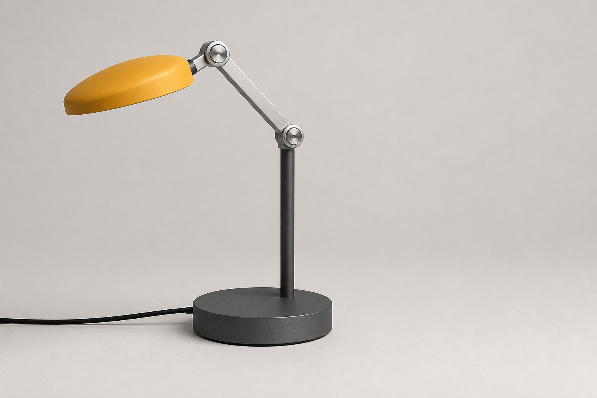

# Modular Desk Lamp Listing Hero

- Status: Draft
- Record version: 1
- Task family: Hard-surface product listing
- Source posture: Original
- Evidence status: Recorded illustrative built-in-tool sample; promotion evidence: no
- Default outcome: Production Candidate, subject to final QA

This Recipe creates one clean listing hero for a fictional or authorized modular desk lamp. It treats product count, connected geometry, stable balance, material separation, crop, and approved text as reviewable constraints.

## Task fit and non-fit

Use this Recipe when:

- one hard-surface desk lamp is the sole product;
- its shade, arms, joints, stem, base, cord, and controls can be described before generation;
- the result needs a marketplace or catalog hero rather than a lifestyle scene;
- the operator can inspect geometry and reject attractive but impossible hardware.

Do not use it to:

- reproduce an unauthorized commercial product or protected industrial design;
- create an instruction manual, exploded view, engineering drawing, or safety claim;
- compare several products or colorways;
- infer missing dimensions, electrical ratings, certification marks, or warranty copy;
- call generation alone a publish-ready listing asset.

## Required Creative Brief inputs

Provide every field before generation:

1. `product_identity`: fictional or authorized name and design authority.
2. `geometry_manifest`: exact shade, arm, joint, stem, base, control, and cord relationships.
3. `materials_and_finishes`: closed list mapped to specific parts.
4. `pose_and_power_state`: joint angles, shade direction, and on or off state.
5. `exact_text`: approved visible strings, or `none`.
6. `studio_direction`: background, camera, lighting, shadow, and negative space.
7. `output`: aspect ratio, pixel dimensions, background, and format.
8. `must_avoid`: brief-specific exclusions.
9. `rights_confirmation`: authority for the product design, copy, and references.

Stop if the geometry, product count, exact text, or rights confirmation is incomplete. Do not invent electrical facts or commercial claims.

## Input preparation

1. Convert the lamp description into a part manifest and a connection chain from shade to base.
2. Freeze the number and type of hinges, arms, controls, and cords.
3. Assign each material and finish to one named part.
4. Choose a pose that can balance over the declared base.
5. Freeze exact text and remove unused text placeholders.
6. Select one camera view that exposes the important joints without becoming an exploded view.
7. Save the completed brief, prompt, Recipe version, and rights statement for any future run.

## Portable prompt

Replace every brace-delimited variable with the approved brief.

```text
Create one clean e-commerce listing hero on {BACKGROUND}, lit by {LIGHTING}.

Show exactly one {PRODUCT_NAME} modular desk lamp from {CAMERA_VIEW}. Preserve this connected part manifest: {GEOMETRY_MANIFEST}. Set the lamp in {POSE_AND_POWER_STATE}.

Render {MATERIALS_AND_FINISHES} on their assigned parts. Keep the product fully visible, physically stable, and surrounded by {NEGATIVE_SPACE}. Render only this approved text: {EXACT_TEXT}.

No extra lamp, alternate view, exploded part, disconnected joint, duplicated hinge, floating fastener, impossible balance, invented control, lifestyle prop, logo, price, claim, signature, watermark, or unapproved text. Additional exclusions: {MUST_AVOID}.

Return one opaque PNG at {PIXEL_SIZE} in {ASPECT_RATIO}, suitable as a product-listing hero after inspection and final QA.
```

## Conversational Profile

Profile ID: `conversational-v1`

1. Submit the completed brief and prompt to a supported conversational image surface.
2. Ask the assistant to identify unresolved geometry, text, or rights fields before generation.
3. Resolve those fields, then request exactly one image.
4. Record the surface, time, displayed model, observable settings, and exact submitted prompt if a run is later authorized.
5. Mark hidden metadata `not_exposed`; do not infer it.
6. Inspect the output against the complete invariant gate and rubric.

A conversational output is not promotion evidence unless the evidence contract is separately satisfied.

## GPT Image 2 API Profile

Profile ID: `gpt-image-2-api-v1`

Endpoint: OpenAI Image API, `POST /v1/images/generations`.

```json
{
  "model": "gpt-image-2-2026-04-21",
  "prompt": "<completed portable prompt>",
  "n": 1,
  "size": "1536x1024",
  "quality": "high",
  "background": "opaque",
  "output_format": "png",
  "moderation": "auto"
}
```

Before any provider call, approve the exact run manifest, credential source, spend ceiling, retention policy, output location, and stop condition. Record failures. No API run has been made for this Recipe.

## Critical Invariants

Every candidate must pass all of these:

1. Exactly one lamp appears.
2. Every declared part appears once and connects in the declared order.
3. Joint angles, arm lengths, base footprint, and center of mass form a plausible stable pose.
4. Materials and finishes stay on their assigned parts and respond coherently to one light setup.
5. The complete shade, hardware, stem, base, and declared cord exit remain inside the frame.
6. Approved text is exact and no other readable text appears.
7. No unapproved logo, claim, price, rating, certification, signature, or watermark appears.
8. The output is one listing hero, not a grid, lifestyle scene, diagram, or option sheet.

## Production Candidate Rubric

Mark each criterion `pass` or `fail`. Any failure blocks the full-rubric pass.

| Criterion | Pass condition |
| --- | --- |
| Product hierarchy | The lamp is the immediate focal point with useful negative space. |
| Geometry | Silhouette, parts, connections, and pose match the brief. |
| Material realism | Metal, coating, diffuser, cord, and hardware read consistently. |
| Lighting | Highlights, reflections, contact shadow, and background share one setup. |
| Composition | Camera, crop, orientation, and product scale match the listing intent. |
| Surface quality | Edges are clean with no melting, doubling, halos, or low-detail patches. |
| Text control | Only approved text appears and is legible. |
| Technical delivery | Pixel size, format, aspect ratio, and opacity match the profile. |

## Inspection and targeted repair

1. Count the product and every declared part.
2. Trace the connection chain from shade to base.
3. Compare joint placement, pose, finish mapping, and text with the brief.
4. Inspect edges, reflections, contact shadow, cord exit, crop, and background at 100 percent.
5. Record every failed invariant and rubric item before repair.

Repair one defect class at a time:

- Geometry drift: regenerate from the original prompt with the failed connection restated.
- Unstable pose: reduce the reach or enlarge the declared base without changing accepted styling.
- Material drift: correct only the named part and preserve geometry and composition.
- Crop failure: expand the canvas or reduce product scale while preserving the view.
- Extra text or object: name the defect explicitly and prohibit all other changes.

Rescore the complete output after every repair. Preserve failed runs when evidence collection is authorized.

## Final-QA handoff

Hand off a passing Production Candidate with the brief, Recipe and profile IDs, exact prompt, output checksum, dimensions, invariant results, rubric results, failed attempts, repairs, and rights confirmation. A human owner must still approve product identity, copy, claims, channel crop, accessibility text, color, export, and distribution rights.

## Representative brief

The saved future prompt uses the fictional `ORBIT TASK` lamp: matte graphite base and stem, two short articulated aluminum arms, round friction hinges, muted saffron oval shade, small black cord, lamp off, warm light-gray studio, upper-left soft key, front three-quarter view, and a `1536x1024` landscape output. It contains no display text or third-party reference image.

- [Exact submitted prompt](samples/modular-desk-lamp-listing-hero.prompt.txt)

## Rendered Sample



This is one illustrative output generated from the representative brief with the Codex built-in image generation tool on 2026-08-26. Manual review found one connected lamp, a grounded base, separated materials, a single cord, useful right-side negative space, and no visible text.

- [Exact submitted prompt](samples/modular-desk-lamp-listing-hero.prompt.txt)
- [Generation Run record](evidence.json)
- Model, model version, seed, request parameters, and request ID: `not_exposed`
- Output: `1536x1024` PNG
- Promotion evidence: no

This sample is one illustrative built-in-tool output. It does not demonstrate repeatability, GPT Image 2 API conformance, Recipe promotion evidence, a full rubric pass, or publication readiness.

## Rights and provenance boundary

This Recipe is independently authored with source posture `original` and no Source Entry. Use only fictional or authorized product designs, names, copy, and references. Original prompt authorship does not establish rights in user inputs or future generated outputs. Any recorded run must retain item-level rights statements and remains non-promotional until the promotion gate is met.
