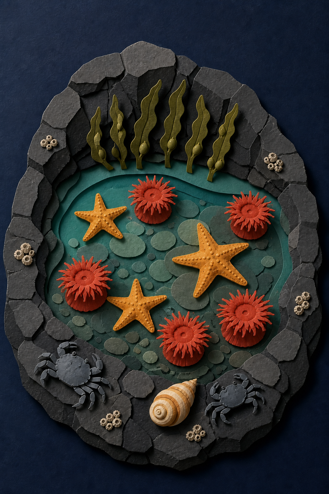

# Paper-Cut Tidal Ecosystem

- Status: Draft
- Record version: 1
- Task family: Layered paper-cut illustration
- Source posture: Original
- Evidence status: Recorded illustrative built-in-tool sample; promotion evidence: no
- Default outcome: Production Candidate, subject to final QA

This Recipe turns a closed scene and organism inventory into one original layered-paper editorial illustration. It does not imitate a named artist or verify biological claims.

## Task fit and non-fit

Use this Recipe when:

- the requested medium is a layered paper-cut illustration;
- the setting, subject counts, and depth order are already approved;
- material behavior and one light direction matter;
- every organism must remain recognizable and separate;
- one finished image is required.

Do not use it for:

- biological identification or scientific fact generation;
- a copied artwork, protected character, or named-artist imitation;
- a seamless pattern, specimen chart, or fabrication template;
- a photoreal underwater scene;
- publication without rights and subject review.

## Required Creative Brief inputs

Provide:

1. `setting`, including fictional place, tide state, and viewing angle.
2. `subject_inventory`, with exact organisms and counts.
3. `layer_order`, from backing field to foreground.
4. `paper_materials`, edge quality, and allowed texture.
5. `palette`, including the maximum number of colors.
6. `light_direction` and desired shadow depth.
7. `composition`, including focal silhouette and negative space.
8. `output`, including aspect ratio, pixel size, background, and format.
9. `must_avoid`, including unapproved species and borrowed styles.
10. `rights_confirmation` for every supplied reference or motif.

Stop when inventory, layer order, or rights are incomplete.

## Input preparation

1. Convert the subject list into exact counts.
2. Define a back-to-front layer stack with no ambiguous overlaps.
3. Assign each organism one dominant silhouette and one layer.
4. Set one light direction before specifying shadows.
5. Remove decorative elements that compete with organism readability.
6. Confirm the art direction uses material terms, not a living artist's name.
7. Save the brief and rendered prompt with every future run.

## Portable prompt

Replace every brace-delimited variable before use.

```text
Create one finished layered paper-cut editorial illustration, not a photograph, chart, pattern tile, fabrication sheet, or option board.

SCENE
Build {SETTING} on {BACKING_FIELD}, viewed from {CAMERA_VIEW} under one light from {LIGHT_DIRECTION}.

SUBJECT
Show exactly {SUBJECT_INVENTORY}, arranged according to {LAYER_ORDER} around {FOCAL_SILHOUETTE}.

DETAILS
Use {PAPER_MATERIALS}, {PALETTE}, {EDGE_TREATMENT}, physical gaps between layers, and coherent {SHADOW_DEPTH}. Keep every subject recognizable and separate.

CONSTRAINTS
Do not add text, logos, signatures, watermarks, unapproved species, fused forms, plastic surfaces, photographic water, or any named artist's style. Additional exclusions: {MUST_AVOID}.

OUTPUT INTENT
Return one complete {ASPECT_RATIO} illustration at {PIXEL_SIZE}, with an intact silhouette and inspectable layer separation.
```

## Conversational Profile

Profile ID: `conversational-v1`

1. Supply the completed brief and rendered prompt.
2. Ask the surface to list unresolved inventory or layer conflicts before generation.
3. Resolve those conflicts without asking the model to choose species or counts.
4. Request one image only.
5. Record visible surface settings and mark hidden metadata `not_exposed`.
6. Inspect with the invariants and rubric below.

The conversational profile cannot supply API promotion evidence.

## GPT Image 2 API Profile

Profile ID: `gpt-image-2-api-v1`

Endpoint: OpenAI Image API, `POST /v1/images/generations`.

```json
{
  "model": "gpt-image-2-2026-04-21",
  "prompt": "<completed portable prompt>",
  "n": 1,
  "size": "1024x1536",
  "quality": "high",
  "background": "opaque",
  "output_format": "png",
  "moderation": "auto"
}
```

Approve the exact prompt, credential source, spend ceiling, retention policy, evidence location, and stop condition before any provider call. Preserve failed outputs and prompts.

## Critical Invariants

- `CI-01 Inventory`: every approved organism appears in the exact count.
- `CI-02 Layer order`: every overlap follows the declared back-to-front stack.
- `CI-03 Material`: the scene reads as cut paper rather than plastic or photography.
- `CI-04 Lighting`: all cast shadows agree with one declared light direction.
- `CI-05 Separation`: subjects do not fuse or lose their defining silhouettes.
- `CI-06 Canvas`: the focal silhouette and required subjects remain inside the frame.
- `CI-07 Rights`: no logo, signature, protected character, or named-artist imitation appears.

One failed invariant blocks the candidate.

## Production Candidate Rubric

Score each item `pass` or `fail` after the invariants pass:

- `R-01 Focal hierarchy`: the declared ecosystem silhouette reads first.
- `R-02 Depth`: layer spacing and shadows create controlled dimensionality.
- `R-03 Subject clarity`: each organism remains recognizable at intended size.
- `R-04 Composition`: counts, gaps, and negative space feel deliberate.
- `R-05 Palette`: all colors follow the brief and separate adjacent layers.
- `R-06 Finish`: edges, fibers, and shadows are coherent without visible artifacts.

A full pass requires every item to pass. Promotion remains a separate multi-run gate.

## Inspection and targeted repair

1. Count each organism and compare it with the brief.
2. Trace the layer stack from backing field to foreground.
3. Follow every cast shadow to confirm one light direction.
4. Inspect edges for fusion, tearing artifacts, or plastic sheen.
5. Review at full resolution and intended display size.
6. Record every failure before repair.

Repair one issue class at a time. For count failures, restate the complete inventory. For overlap failures, restate the complete layer order. Preserve all accepted subjects, palette, framing, and dimensions. Rescore the entire repaired image.

## Final-QA handoff

Include the image and checksum, brief revision, rendered prompt, inventory, layer order, profile data, invariant and rubric results, repairs, and rights confirmation. Label it `Production Candidate`. A human still approves subject accuracy, accessibility, crop, and publication rights.

## Representative fictional brief

- Setting: Whisper Cove, a fictional basalt tide pool at low tide.
- Inventory: three ochre sea stars, five coral-red anemones, two slate crabs, one spiral shell, six bladderwrack strands, and one shallow pool.
- Layer order: navy backing, basalt rim, distant seaweed, water, submerged stones, anemones and sea stars, foreground crab and shell.
- Material: matte cotton paper with faint deckled fibers and crisp edges.
- Light: one soft source from upper left; shadows fall down and right.
- Palette: navy, basalt gray, turquoise, olive, coral, ochre, and warm cream.
- Output: portrait 2:3, `1024x1536`, opaque PNG.
- Rights: original fictional scene and project-authored direction.

The fully resolved illustrative prompt is [saved here](samples/paper-cut-tidal-ecosystem.prompt.txt).

## Rendered Sample



This is one recorded illustrative output from the representative brief with the Codex built-in image generation tool on 2026-08-26. It was selected after one targeted edit retry corrected the seaweed count to six. Manual review found the requested sea stars, anemones, crabs, shell, seaweed, paper layers, and lighting coherent, but barnacle-like clusters appear outside the closed organism inventory.

- [Exact accepted edit prompt](samples/paper-cut-tidal-ecosystem.edit.prompt.txt)
- [Base generation prompt](samples/paper-cut-tidal-ecosystem.prompt.txt)
- [Generation run record](evidence.json)
- Model, model version, seed, request parameters, and request ID: `not_exposed`
- Output: `1024x1536` PNG
- Promotion evidence: no

This sample is one illustrative built-in-tool output. It does not demonstrate repeatability, GPT Image 2 API conformance, Recipe promotion evidence, a full inventory or biological-review pass, or publication readiness.

## Rights and provenance boundary

This independently authored Recipe has `original` source posture and no Source Entry. Future inputs must be fictional, project-owned, or authorized. Describe medium, materials, geometry, and light directly; never use a living artist's name as shorthand.
