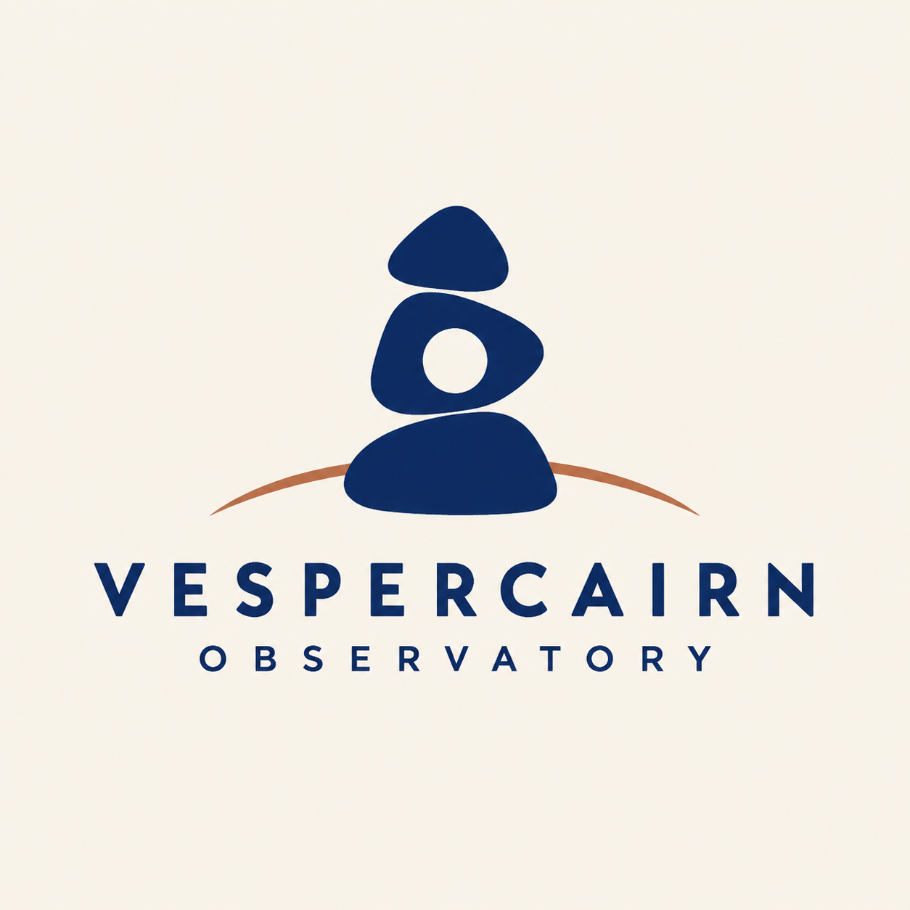

# Vespercairn Observatory Logo

- Record version: 1
- Status: Draft
- Source posture: Original
- Evidence status: Recorded illustrative built-in-tool sample; promotion evidence: no
- Profiles: `conversational-v1`, `gpt-image-2-api-v1`

Outcome: one Production Candidate for a fictional symbol-and-wordmark lockup. Generation is concept exploration, not trademark clearance, final vector artwork, or permission to publish.

## Task fit

Use this Recipe when the brief requires:

- one original symbol paired with one exact fictional wordmark;
- a declared construction idea, lockup, palette, and small-size intent;
- a single primary presentation rather than a page of variants;
- inspection of wordmark accuracy, silhouette, spacing, and resemblance risk;
- targeted repair before brand, legal, and production review.

Do not use it for:

- an existing organization or protected name without authorization;
- imitation of a known logo, named designer, space agency, or observatory;
- automated trademark search, clearance, registration, or legal advice;
- final Bézier paths, spacing specifications, or production masters;
- a request for multiple unexplained concepts in one image.

## Required Creative Brief inputs

Provide every field before generation:

- `name_exact`: exact fictional or authorized wordmark.
- `descriptor_exact`: optional exact descriptor or `none`.
- `symbol_concept`: one original conceptual combination.
- `construction_rules`: geometry, stroke, corners, counters, and symmetry.
- `lockup`: symbol and wordmark orientation and alignment.
- `wordmark_direction`: project-owned letterform character, case, and spacing.
- `palette`: exact colors plus one-color behavior.
- `background`: plain presentation field.
- `minimum_size_intent`: smallest conceptual viewing size.
- `prohibited_motifs`: known categories and generic shorthand to avoid.
- `output`: aspect ratio and pixel size.
- `rights_confirmation`: authority for the name and supplied brand direction.

Stop if the name is not frozen, the concept asks to copy a known mark, or the user expects generation to provide legal clearance.

## Input preparation

1. Freeze the wordmark and descriptor character by character.
2. Reduce the concept to one symbol construction, not a collection of motifs.
3. Define the one-color silhouette before secondary color or texture.
4. Specify minimum counters, gaps, and stroke behavior for small-size inspection.
5. List nearby known-mark categories for later human resemblance review without feeding copied marks into generation.
6. Keep the presentation flat so mockup effects cannot hide geometry defects.

## Portable prompt

Replace every brace-delimited value with approved brief content. Leave no unresolved placeholder.

```text
Create one original symbol-and-wordmark lockup for {NAME_EXACT}.

PRESENTATION
- Use the plain field {BACKGROUND}.
- Show one primary lockup only: {LOCKUP}.
- Do not place it on a product, building, stationery, clothing, device, or mockup.

SYMBOL
- Concept: {SYMBOL_CONCEPT}.
- Construction: {CONSTRUCTION_RULES}.
- Keep the symbol recognizable at {MINIMUM_SIZE_INTENT} and conceptually viable in one color.

WORDMARK
- Render only {EXACT_TEXT_MANIFEST}.
- Direction: {WORDMARK_DIRECTION}.
- Preserve every letter, space, case choice, and line exactly.

COLOR
- Apply {PALETTE} without relying on effects that disappear in one color.

CONSTRAINTS
- Avoid {PROHIBITED_MOTIFS}.
- Add no alternate mark, colorway grid, initials, tagline, year, trademark symbol, pseudo-text, signature, or watermark.
- Do not imitate a known identity or named designer.

OUTPUT
- Return one centered identity presentation at {OUTPUT}.
- Treat the result as concept exploration, not trademark clearance or final vector artwork.
```

## Conversational Profile

Profile ID: `conversational-v1`

1. Submit the approved brief and completed Portable prompt.
2. Ask the surface to identify unresolved text, lockup, or construction choices before generation.
3. Generate one image only after those choices are closed.
4. Record the surface, date, visible settings, and exposed model information. Mark hidden fields `not_exposed`.
5. Inspect wordmark accuracy before judging style or originality.

A conversational result is not API promotion evidence or trademark clearance.

## GPT Image 2 API Profile

Profile ID: `gpt-image-2-api-v1`

Endpoint: OpenAI Image API, `POST /v1/images/generations`.

```json
{
  "model": "gpt-image-2-2026-04-21",
  "prompt": "<completed Portable prompt>",
  "n": 1,
  "size": "1024x1024",
  "quality": "high",
  "background": "opaque",
  "output_format": "png",
  "moderation": "auto"
}
```

Before any provider call, approve the exact prompt, credential source, spend ceiling, retention policy, output location, and stop condition. Preserve the request body and returned metadata. No API request has been made for this Recipe.

## Critical Invariants

- `CI-01 Exact wordmark`: the name and descriptor contain the correct letters, order, case, spacing, and line structure.
- `CI-02 Single lockup`: one symbol-and-wordmark arrangement appears, with no variant sheet or extra mark.
- `CI-03 Symbol integrity`: the declared concepts form one stable silhouette with usable counters and no accidental extra symbol.
- `CI-04 Small-size viability`: essential shapes and letters remain distinguishable at the stated conceptual minimum size.
- `CI-05 Content restraint`: no tagline, year, trademark symbol, real institution, generic stock icon, signature, or watermark appears.
- `CI-06 Honest status`: the presentation makes no claim of trademark clearance, uniqueness search, vector readiness, or registration.

## Production Candidate Rubric

Score each item `pass` or `fail` after all Critical Invariants pass:

- `R-01 Distinctive concept`: the declared ideas combine into a coherent original construction rather than adjacent icons.
- `R-02 Wordmark quality`: letterforms are readable, balanced, and consistently spaced.
- `R-03 Lockup balance`: symbol, name, and descriptor have controlled scale and alignment.
- `R-04 One-color logic`: the mark remains understandable without secondary color, glow, or texture.
- `R-05 Reproduction logic`: edges, gaps, counters, and stroke weights are plausible for later vector reconstruction.
- `R-06 Finish`: no malformed letter, tangent, asymmetric accident, pseudo-text, or presentation artifact remains.

A full pass requires all six items. It does not replace independent trademark search, legal review, or professional vector construction. Recipe promotion still requires the library's separate evidence gate.

## Inspection and targeted repair

1. Transcribe the wordmark and descriptor character by character.
2. Inspect the silhouette at full size, thumbnail size, and mentally in one color.
3. Check counters, gaps, stroke consistency, alignment, and accidental symbol resemblance.
4. Record every defect and any known-mark concern before repair.

```text
Repair only this defect in the supplied identity concept: {DEFECT}.
Required correction: {EXACT_CORRECTION}.
Preserve all already-correct letters, symbol geometry, lockup, spacing, palette, background, and dimensions.
Add no variant, tagline, year, trademark symbol, mockup, pseudo-text, signature, or watermark.
Return one corrected complete lockup.
```

After repair, repeat the complete wordmark, silhouette, and resemblance review.

## Final-QA handoff

Include the Recipe ID and version, brief revision, exact prompt, profile and visible settings, output hash and path, invariant results, rubric results, known resemblance concerns, repairs, rights status, and intended uses. Label the output `Production Candidate` only after it passes. Trademark search, legal clearance, brand approval, accessibility, and vector reconstruction remain separate.

## Representative evaluation brief

The saved prompt at `samples/vespercairn-observatory-logo.prompt.txt` resolves this fictional brief:

- Name: `VESPERCAIRN`.
- Descriptor: `OBSERVATORY`.
- Symbol: three cairn stones whose inner negative space forms an aperture, plus one horizon arc.
- Lockup: centered vertical symbol above a two-line uppercase wordmark.
- Palette: deep indigo, muted copper accent, warm off-white field.
- Minimum-size intent: 24 pixels in one color.
- Output: square 1:1, `1024x1024`.

## Rendered Sample



This is the accepted output of a recorded two-step built-in-tool sequence from 2026-08-26. The initial call used the representative base prompt but returned a PNG with transparency instead of the required off-white field. The second call used the exact targeted edit prompt and the recorded initial PNG as an authorized image input. Manual review found the accepted output's two exact strings legible and its single cairn-aperture lockup coherent on an opaque warm off-white field.

- [Initial generation prompt](samples/vespercairn-observatory-logo.prompt.txt)
- [Exact targeted edit prompt](samples/vespercairn-observatory-logo.edit.prompt.txt)
- [Superseded initial PNG](samples/vespercairn-observatory-logo.initial.png)
- [Initial and edit run record](evidence.json)
- Model, model version, seed, request parameters, and request ID: `not_exposed`
- Initial and accepted edit outputs: `1254x1254` PNG, not the profile brief's `1024x1024` target
- Promotion evidence: no

The accepted PNG is bound to the edit run, not the base prompt alone. This two-step illustrative sequence does not demonstrate repeatability, GPT Image 2 API conformance, Recipe promotion evidence, trademark clearance, production vector quality, or publication readiness.

## Rights and provenance boundary

This Recipe and its saved fictional brief are independently authored with source posture `original` and `source_record: null`. Use only fictional or authorized names and project-owned identity direction. No linked Source Entry, third-party mark, type artwork, prompt, or image is included. Generation does not provide trademark clearance.
